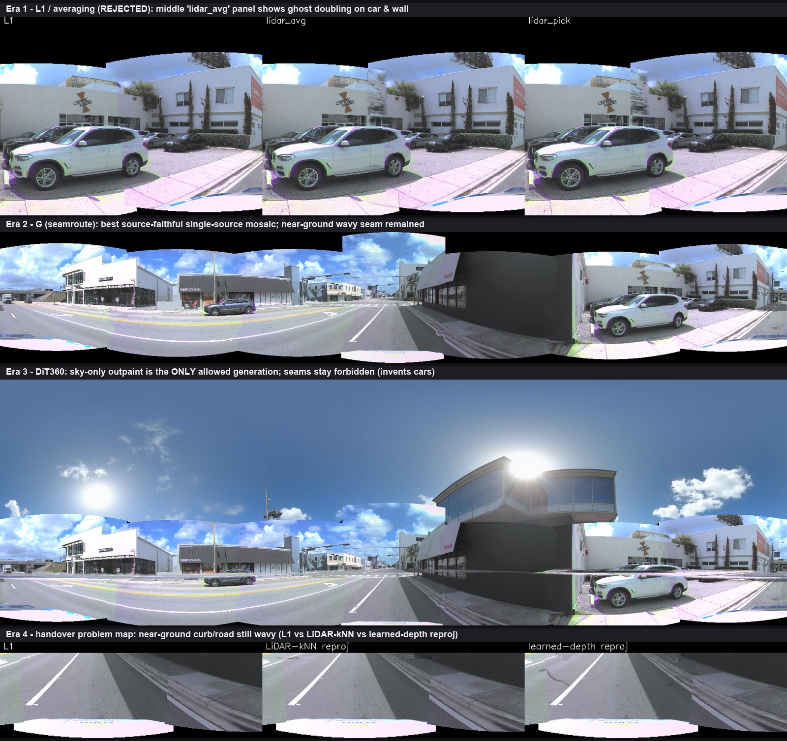
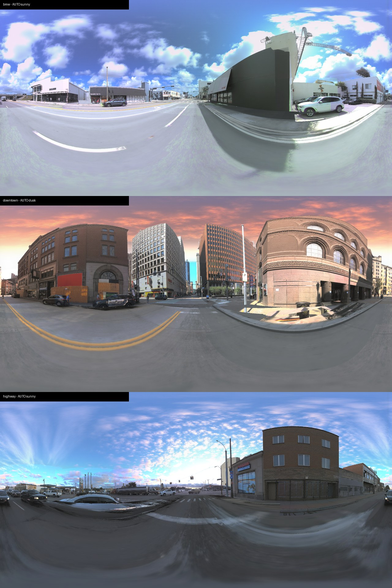

# Waymo2Panorama 一页精简版(给 koi)

**日期** 2026-06-12(更新:完整球面成果)
**定位** 一个 **GENERAL** 的多相机透视图 → 360° ERP 全景算法(1024×2048),原则是 **source-faithful(源忠实)+ evidence-gated(证据门控)+ abstain(无证据则退让)**:能解的接缝干净解,无证据的区域诚实退回 L1/EMC,绝不发明几何。最难验证用例是 AV2 `02a00399`(代号 BMW,含一辆高速行驶车),但**它只是最硬的验证场景,从来不是目标**。

---

## TL;DR

- 最难场景(BMW)**所有用户可见缺陷类已关闭**,残留 3 处经 native-truth 面板裁定为**源数据真实内容**(玻璃幕墙反射、墙根植被),非拼接 bug。
- **零场景参数**:中心由标定算、增益由 LiDAR 算、深度由累积算,无任何逐场景手调(`scripts/phase3/db89_ghost_recovery.py`)。
- **5 场景泛化通过**:同一份代码跑通 bmw / downtown / crowd / clean / highway,无新 artifact 类、优雅降级。
- **无 LiDAR 优雅降级通过**:清空 LiDAR 后全景仍连贯,运动车仍单一完整,OMC 测得相同 du=+6,降级仅为墙面视差软化 + 略强曝光台阶。
- **完整球面突破**:黑色上下半球已补全——天空用 FLUX.1-Fill(mask 条件模型,真实云带无缝延续进补全区)+ auto-prompt 自动判天气(晴/黄昏/阴三模式实测全对);地面用**时间反投影**(车开过前后帧的相机看得到现在脚下的路 → 确定性真实像素,5 场景覆盖 94.5–100%,车道线连续穿天底,自车引擎盖几何移除)。v8 地面层经 9 轮 A/B 推导出三条物理定律级约束(见 outpainting 节),对停车 / 拥堵 / 高速场景全部成立。
- **交付**:5 张 v2.2 最终全景 + 单文件全栈算法 + 12 个 git tag。

---

## 核心战役:跨相机异步快门重影

上 = EMC base(双 A 柱 / 双镜 / 车身 overlap);下 = v2.2 最终(单一完整车)。
根因是**行驶车辆在多相机间异步快门(±22.5ms)**造成的运动视差重影,经**八层栈**(虚拟中心 → EMC → 分割证据 → ECC-OMC → morph → 内容缝)解决。

---

## 完整演进时间线

- **L1 baseline**(tag `v0.1-l1-mvp`)— 球面投影 + multi-band blending 出第一版 360 全景 → 能跑通,但接缝不对齐、近场重影,是基线。
- **L1 hard select(单源)** — 重影根因查实为「对两份未对齐拷贝做 averaging」,改为每像素只取单一相机、从不混合 → 消掉颜色融合鬼影,留下的是结构错位(非颜色跳变)。
- **L2 柱面 baseline** — 试柱面投影替球面:覆盖率 +24.9pp、视觉略好,但 cycle-PSNR 非 win → 与球面同级,仅作论文对照。
- **L3(Pi3 + forward-splat)** — 单目深度 lift 成点云再 forward-splat 到 ERP:**10/10 anchor 全输 L1**(ΔPSNR −3.15dB)→ forward-splat 不是 L3 的正确输出形式,L3 真正产物是 `.ply` 点云供下游消费。
- **ghostkill 系列(GK / 单源 PICK)** — 5-way kill-test + 扰动验证三重确证「ghost = averaging 实现 bug」,single-source PICK 平地消鬼影 → 把「不许平均几何」立为铁律。
- **seamroute / object-moat(SR,即 G 全景)** — `_seamroute.py`:align(warp-to-agree)+ object-moat 最小割接缝 + 虚拟中心选源;产出 `G_bmw_pano`(用户主观排名「最接近目标」),`BEST_bmw_pano` 则是被否的早期 averaging 鬼影版。结论:这是**源忠实天花板**,残留近地 wavy 缝/curb 是物理地基(含 ground-plane IPM 第 4 次否定)。
- **A1(Surround360 风格 overlap-strip 光流 view-interp)** — `run_a1_pipeline --mode view`:在重叠条带上做光流视图插值;`a1_view_none` = 其 `--prealign none` 变体,因 outpaint 补 out-of-FOV/天空最完整,被 DB-77C 选作展示 base(代号含义按档案,细节见 progress.md)。
- **line-snap / Poisson tone / IPM 等地基探索** — line-snap 实测 no-op、Poisson 增量 faint、IPM 重投影 NEG → 证明非生成式手段在近地缝已到天花板(BEV 是上限)。
- **DiT360 生成式修补(db14 trimap / db19 sky)** — 边界清晰:**只许补天**(sky-only outpaint = WIN,gate-clean)、**不许碰缝**(seam-completion 会发明小汽车、融化切口 = NEG)。
- **学习 / 3D 路线(DrivingForward / VGGT / UniDepthV2 / flow view-interp)** — **几何墙三重否定**:learned 单中心更软更碎、curb 是 co-observation 物理地基、VGGT-prior 视觉失败 → 几何墙在默认中心 `c*=ego-origin` 下反复出现。
- **DB-78 flow 定量** — Surround360 光流 view-interp 在 5 场景 A100 跑出定量 abstain 表(结构指标),是非生成路径的「不差」终点。
- **Fable 5 第一性原理重构** — 发现两个被忽略的隐藏假设:**球心从 L1 起就被钉死在 ego 原点**(从不是设计变量,把深度误差放大 5–20×)与**第四个误差源「异步快门」**。据此重做:虚拟中心质心化(DB-80,18–96× 残差下降)→ 颜色/光度层(DB-81)→ 鲁棒化(DB-82)→ **发现 ±22.5ms 异步快门**(DB-84)→ 自运动快门补偿 EMC(DB-86)→ 九连败逼出「缺图像级轮廓」(DB-83/85/87)→ 分割合成(DB-88,运动车首次单一完整)→ 证据演算 + 标注滞后(DB-89)→ ECC-OMC + morph + 内容缝(DB-90)→ 深度门控 + 共识(DB-91)→ 泛化 + 无 LiDAR 优雅降级(DB-92)。
- **完整球面 v2.1/v2.2 → v8** — chroma-fringe 收尾(v2.1/2.2,5 场景成品)→ 完整球面:天空用 FLUX.1-Fill(mask 条件、延续真实云带)+ 地面用**时间反投影**(前后帧真实路面像素);v8 地面层再经 9 轮 A/B 修出几何资格 + 时间偏好选源、双盒自遮挡、分辨率匹配渲染,5 场景 94.5–100% 覆盖定稿。

*各时代的真实输出(BMW `02a00399`,与上方时间线一一对应):**Era 1** L1/averaging——中间 `lidar_avg` 格可见车身与墙面的重影鬼像,正是被否的版本;**Era 2** G(seamroute)——源忠实的单源拼接天花板,近地仍留 wavy 缝;**Era 3** DiT360——只许补天(上半天空由生成模型补全,接缝一律禁止);**Era 4** 接手时的问题地图——近地 curb/路面三种重投影(L1 / LiDAR-kNN / learned-depth)都仍发波。*

每一次转向都由实验否定驱动并完整归档(progress.md 编年史 + 12 git tag),没有一步是凭感觉的。

---

## 场景结果

BMW 场景最终 v2.2 全景:达到**源保真度**,残留经裁定均为源内容。

5 场景零参数泛化全集(bmw / downtown / crowd / clean / highway 竖叠):同一份代码,无崩溃、无新 artifact 类。

---

## 无 LiDAR 消融

north-star 第二半证明:清空 LiDAR 后渲染同一辆完整车,**OMC 测得相同 du=+6**(对象机制按构造只依赖图像 + 标注证据,LiDAR 无关)。

---

## 完整球面:outpainting 成果(v8,2026-06-12 定稿)

上 = 只有场景带的 v2.2(上下半球黑帽 + 自车引擎盖);下 = v8 完整球面(天空生成延续真实云带、地面为前后帧真实路面反投影、自车几何移除)。**分层诚实标注:场景与地面 100% 真实像素,天空是唯一生成区(mask 外字节级锁死)。**

v8 多天气三场景——bmw 晴天积云 / downtown **自动判定黄昏**(暖橙天空与金光砖楼匹配)/ highway 晴天高积云无缝延续。auto-prompt 从可见天空带统计自动选词,5 场景全对。

- 天空:历史上 DiT360 outpaint"补出不相关内容"的根因已定论——文生全景模型无"延续"机制,RF-inversion 全图统一化会整街重画(NEG 已归档);换 FLUX.1-Fill(mask 条件、延续是训练目标)一击解决。

- 地面:重新定义为确定性时间反投影问题。v8 经 **9 轮 A/B(全程眼检)**推导出三条约束并全部内化为零参数算法:① 候选源帧资格由**几何**定(全 log 搜索自车位移 5–58 m;固定时间窗在红灯静止 9.5 s 的 downtown 上产出 0 个候选 = 此前地面糊的根因),桶内按**时间**就近选(保自动曝光一致);② **前 pod 物理约束**:AV2 七相机同装于前挡上方,源车自身引擎盖/座舱遮挡其 0–9 m 前方与近后方视线(精确双盒 slab 光线检验;此前"干净"的填充实为引擎盖天空反光被涂上路面);③ 内圈天底只能以 4–6° 掠射角被观测 → **渲染分辨率诚实降到证据的光学分辨率**(逐行低通,不发明内容)。

- 状态:**v8 全 5 场景定稿**(覆盖 94.5–100%,`low_coverage_warning` 哨兵全绿)。

	

