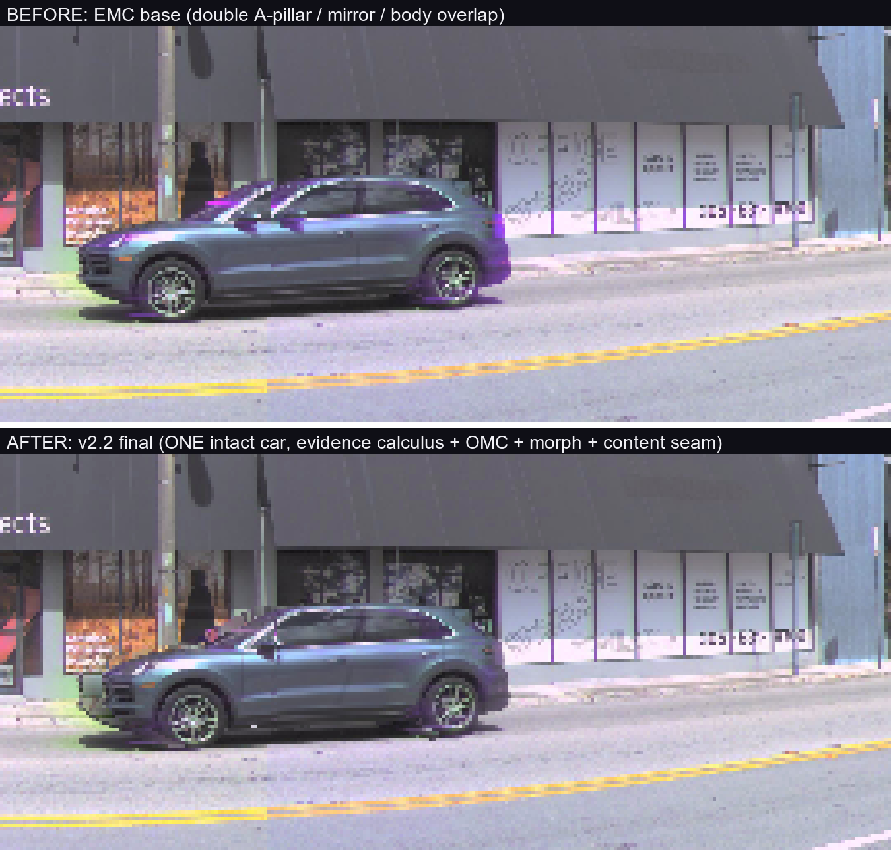
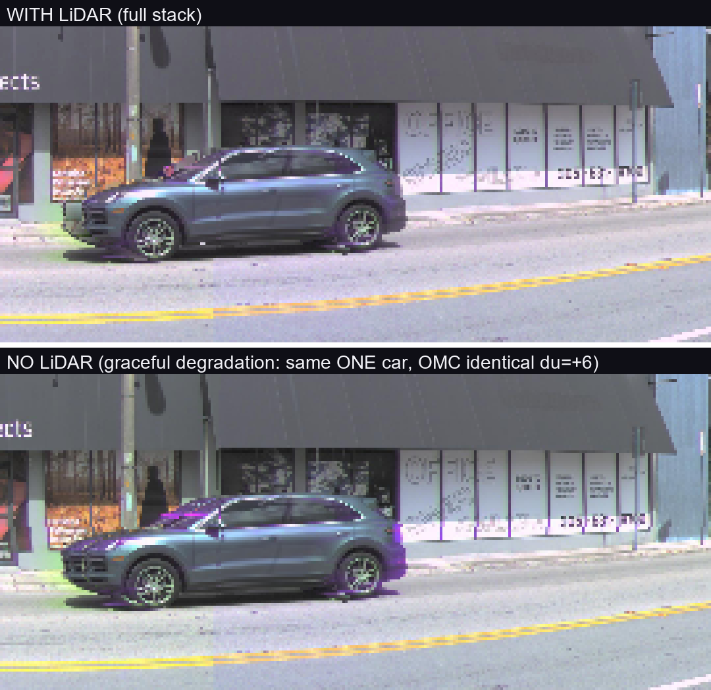

# Waymo2Panorama 一页精简版(给 koi)

**日期** 2026-06-11
**定位** 一个 **GENERAL** 的多相机透视图 → 360° ERP 全景算法(1024×2048),原则是 **source-faithful(源忠实)+ evidence-gated(证据门控)+ abstain(无证据则退让)**:能解的接缝干净解,无证据的区域诚实退回 L1/EMC,绝不发明几何。最难验证用例是 AV2 `02a00399`(代号 BMW,含一辆高速行驶车),但**它只是最硬的验证场景,从来不是目标**。

---

## TL;DR

- 最难场景(BMW)**所有用户可见缺陷类已关闭**,残留 3 处经 native-truth 面板裁定为**源数据真实内容**(玻璃幕墙反射、墙根植被),非拼接 bug。
- **零场景参数**:中心由标定算、增益由 LiDAR 算、深度由累积算,无任何逐场景手调(`scripts/phase3/db89_ghost_recovery.py`)。
- **5 场景泛化通过**:同一份代码跑通 bmw / downtown / crowd / clean / highway,无新 artifact 类、优雅降级。
- **无 LiDAR 优雅降级通过**:清空 LiDAR 后全景仍连贯,运动车仍单一完整,OMC 测得相同 du=+6,降级仅为墙面视差软化 + 略强曝光台阶。
- **交付**:5 张 v2.2 最终全景 + 单文件全栈算法 + 12 个 git tag。

---

## 核心战役:跨相机异步快门重影

上 = EMC base(双 A 柱 / 双镜 / 车身 overlap);下 = v2.2 最终(单一完整车)。
根因是**行驶车辆在多相机间异步快门(±22.5ms)**造成的运动视差重影,经**八层栈**(虚拟中心 → EMC → 分割证据 → ECC-OMC → morph → 内容缝)解决。

---

## 演进(一段话)

起点是 **L1 multi-band blending**,重影根源被定位为**对两份未对齐拷贝做 averaging** → 换成 **hard select**(单源,从不混合)。随后围绕 source-faithful 主线做了 **ghostkill / seamroute / object-moat** 等大量接缝拓扑与对齐变体:对**可判定接缝**是干净的 L1++,但宽基线**近场 doubling** 一律撞**深度精度墙**。再试 **DiT360** 生成式修补,结论边界清晰——**只许补天**(sky-only outpaint = WIN,gate-clean)、**不许碰缝**(seam-completion 会发明小汽车、融化切口 = NEG)。学习/3D 路线(DrivingForward / VGGT / UniDepthV2 / flow view-interp)被**三重否定**——几何墙在 `c*=ego-origin` 这个默认中心下反复出现。**Fable 5 第一性原理重构**发现两个被忽略的隐藏假设:**球心从 L1 起就被钉死在 ego 原点**(从不是设计变量,把深度误差放大 5–20×),以及**第四个误差源「异步快门」**;据此把模糊的"接缝问题"重构为**八层零参数确定性栈**(虚拟中心质心化 → 深度渲染 → 光度增益 → EMC 快门补偿 → YOLO-seg 身份 → ECC-OMC view-morph → 时间共识 → 色度收尾)+ **证据演算八条规则**。

---

## 场景结果

BMW 场景最终 v2.2 全景:达到**源保真度**,残留经裁定均为源内容。

5 场景零参数泛化全集(bmw / downtown / crowd / clean / highway 竖叠):同一份代码,无崩溃、无新 artifact 类。

---

## 无 LiDAR 消融

north-star 第二半证明:清空 LiDAR 后渲染同一辆完整车,**OMC 测得相同 du=+6**(对象机制按构造只依赖图像 + 标注证据,LiDAR 无关)。

---

## 数字一行表

| 指标 | 值 |
|---|---|
| 5 场景合成对象数 | bmw 4 / downtown 7 / crowd 9 / clean 15 / highway 3 |
| unmatched | 全部优雅降级到 EMC base(无崩溃、无新 artifact 类) |
| git 里程碑 tag | 12 个(`v0.1-l1-mvp` → `v2.2-harmonic-fill`) |
| 主交付路径 | `deliverables/db89_ghost_recovery/`(5 张 v2.2 全景)+ `scripts/phase3/db89_ghost_recovery.py`(单文件全栈) |

---

## 下一步

| 项 | 状态 | 说明 |
|---|---|---|
| DB-93 天空 outpaint | queued,**需 A100** | 已验证的 DiT360 sky-only(gate-clean)集成到 5 张 v2.2,补上半球黑带 |
| DB-94 Xinhan 中心契约 | queued,需对接 | 确认下游 Cosmos 点云首帧中心 = 我们的环相机质心,否则偏 0.5–1.5m |
| DB-95 Waymo 迁移 | queued,**the big one** | 仅靠 loader 级改动能否跑通 Waymo(5 相机、不同 stagger);需算法改动则记为数据集特定限制 |
| DB-96 接触阴影 | icebox | 唯一剩余可见 artifact 类(填充带无阴影背景),现由谐和填充缓解,按设计未建模 |

---

*完整版见 `2026-06-11-project-summary-for-koi.md`。*
