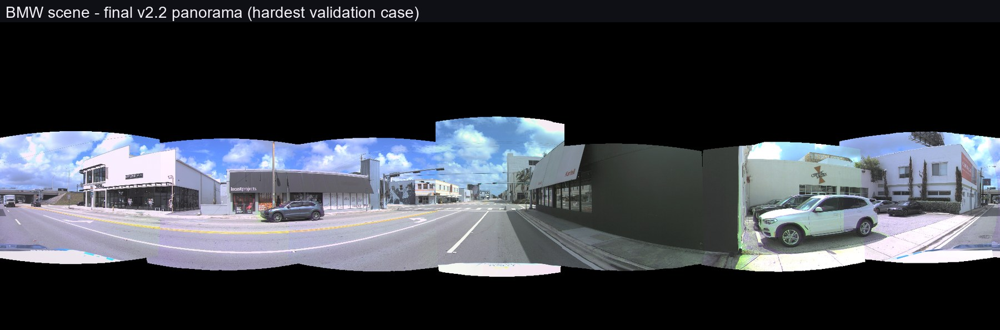
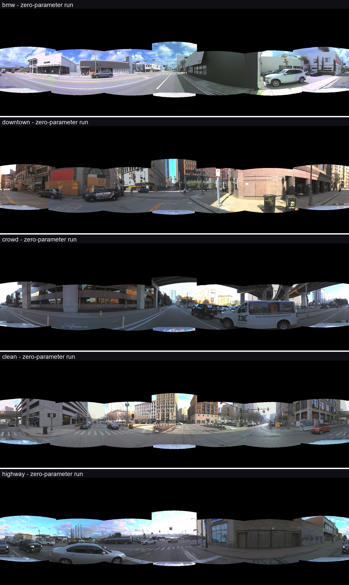
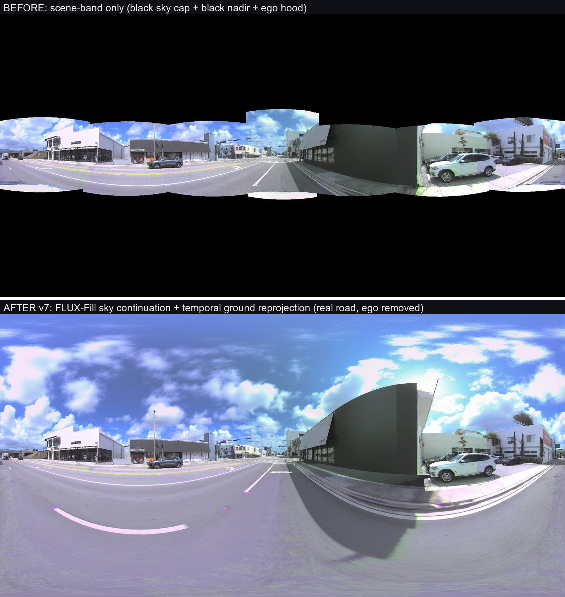

---
# 最好的版本

> 解决了seam问题. 而且试了很多数据场景, 目前看来没问题

下面有一些其他场景的拼接结果

---
## 之前的版本对比

L1 最初的baseline

**L1 baseline 的问题:鬼影 + 接缝错位。** 根因有两个,当时只看见表象:multi-band blending 在相机重叠区**对两份没对齐的拷贝取平均**(→鬼影);所有光线从 ego 原点出发投影(→错位)。
![[../deliverables/gpt_pro_sources/03_L1_baseline_blend_bmw_2048x1024.png]]

固定单一相机的改进L1 baseline

**治了鬼影,但只是治标。** 改成每像素只取单一相机、从不混合——颜色叠影消失,立下"绝不平均几何"铁律。但车身、墙面的**结构性错位还在**:几何还是错的,只是不再两份叠在一起。
![[../deliverables/gpt_pro_sources/04_L1_hard_select_bmw_2048x1024.png]]

A1 view_none,Surround360 风格光流视图插值

**A(光流视图插值)把"可确定的缝"揉顺,摸到了 2D 天花板。** 在重叠条带上做光流插值,静态结构的缝平滑了。但**运动车辆**和大视差遮挡区域,光流没有正确答案——它只能把错的东西揉得不那么扎眼。
![[../deliverables/gpt_pro_sources/01_A1_view_none_bmw_2048x1024.png]]

seamroute:align + object-moat 接缝 + 虚拟中心选源

**G(seamroute)是"源忠实"路线的天花板。** 接缝主动绕开物体(object-moat 最小割)+ 虚拟中心选源,这是当时你主观评的"最接近目标"。但两个残留怎么都治不掉:近地 wavy 缝(4 次实验确认是物理地基)和**行驶中的车被缝切开**。
![[../deliverables/gpt_pro_sources/02_G_bmw_pano_2048x1024.jpg]]

> 目前最好的

- 球心一直钉死在 ego 原点(它其实是设计变量!改成环相机质心后投影残差直接降 18–96×);以及第四个误差源——**七个相机快门相差 ±22.5ms**,行驶车辆在不同相机里根本不在同一位置,这是任何"对齐/揉缝"都治不了的,因为它不是对齐问题,是**时间**问题。
- **对症的八层栈**:EMC 补偿自车运动的快门差(静态世界对齐)→ YOLO 分割给运动物体画出图像级轮廓 → **一体一相机一时刻**(整辆车从单一相机单一时刻渲染,从机制上杜绝缝切车)+ OMC 测量补偿物体自己的运动 → morph + 内容缝收边。①的鬼影、②的错位、③④的切车,在这一层全部闭环。
![[assets/brief version/file-20260611062131811.png]]

---

# 这个是目前用了

最终补全的生成主模型是 **FLUX.1-Fill-dev** 

天空补全由 FLUX.1-Fill(mask 条件补全模型)执行——只在天空 mask 内生成、把真实云带延续进补全区、mask 外字节级锁死;DiT360 本体(文生全景) 在本次outpainting的时候像之前补全的很差,只取其**全景 LoRA** 加载到 FLUX.1-Fill 上,约束生成符合 ERP 球面几何(极点不畸变、左右边界连续)。

outpainting的其他结果
![[../deliverables/complete_pano_v8/v8_five_board.jpg]]