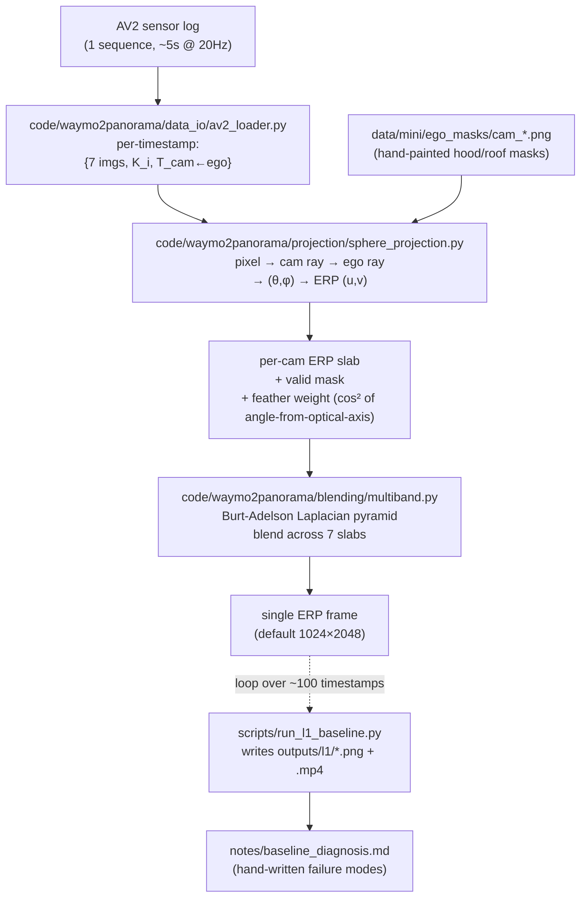

# Waymo2Panorama — Implementation Plan (v2)

Date: 2026-05-16
Status: v2 — restructured around (a) a clear MAIN TRACK as the spine, (b) parallel tracks for Waymo / DVGT eval / OmniStitch / lit-watch / Pantheon integration that can be assigned to separate agents, (c) an explicit Phase 0.5 Spike before Phase 1, and (d) deferred decisions for L3 backbone and paper angle.

Inputs: `2026-05-15-brainstorm-survey.md` (method landscape) + plan v0 (local draft) + plan v1 (v0 + ultraplan synthesis) + brainstorming round 3 (Phase 0.5 spike, D1, D8) + brainstorming round 4 (parallel tracks).

## v1 → v2 deltas (in one paragraph)

Waymo is no longer buried in Phase 4's tail — it's promoted to **Track B**, an independent parallel track with its own "incomplete coverage + diffusion gap-fill" story. A new **Phase 0.5 Spike** (1 day) is inserted before Phase 1 to validate AV2 API assumptions before any L1 code is written. Decision D1 (Pi3 vs DVGT) is now **"Pi3 default, head-to-head on Phase 2 Day 1-2"**. Decision D8 (paper angle) is now **"don't pre-commit; decide at Phase 3 end based on actual results"**. A new §14 lays out the parallel-track and multi-agent orchestration model. The single-route 8-week timeline becomes a **multi-track timeline** where Tracks B-F can run in parallel to the main track once their prerequisites are met.

---

## §1 — Goal Statement

Build a **reproducible pipeline** that takes synchronized multi-camera frames from autonomous-driving datasets (primary: Argoverse 2 Sensor) and produces **equirectangular 360° panoramic video** that:

1. Is geometrically faithful at multiple depth layers (no ghosting on near objects)
2. Is temporally consistent across frames
3. Plugs directly into Pantheon360 / Argus / other 360 downstream consumers
4. Comes with a clean evaluation protocol (so methods are comparable)

Two parallel research outputs are **possible** (not pre-committed):
- **Data**: an "AV2-360" derivative — first public 360° driving dataset stitched with parallax-aware methods
- **Method**: a Pi3/DVGT-based stitching technique (open-source counterpart to LiftProj 2025-12)

Paper angle decision deferred to Phase 3 end.

---

## §2 — Success Criteria

| Tier | Criterion | Verification |
|---|---|---|
| **Spike (Phase 0.5)** | AV2 API works as plan assumed | 7-cam mosaic at 1 timestamp + `spike-report.md` written + go/no-go signal |
| **MVP (Week 1)** | L1 baseline produces 1 ERP video clip (≥3 sec) from 1 AV2 sequence | (a) `outputs/l1/<log_id>/baseline.mp4` plays. (b) Eyeball: front of car at ERP center, rear meeting at left+right edges, horizon mostly continuous. (c) Parallax ghosts visibly present on near objects (this is the point — we documented it). |
| **Phase 2 (Week 3)** | L3 pipeline produces ERP clip with measurably better parallax than L1 | Cycle-consistency PSNR(L3) > PSNR(L1) on held-out reference views |
| **Phase 3 (Week 5)** | OmniStitch baseline + diffusion polish integrated; multi-sequence + cross-dataset | 3-way comparison table (L1 / L2 / L3) on ≥5 sequences + 1 nuScenes-360 cross-reference |
| **Phase 3 end** | Strong enough artifact to make paper angle obvious | Decision doc `notes/paper-angle-decision.md` |
| **Phase 4 (Week 7)** | Pantheon360 ingestion working; (Track B) Waymo gap-fill demo | End-to-end AV2→ERP→Pantheon360 demo; Waymo→360 with Argus fill demo |
| **Final (Week 8)** | Plans for next phase clear | Paper draft outline or follow-up project spec |

---

## §3 — Scope

### In scope (Phase 1–4 main track)
- AV2 sensor data ingestion (7 ring cameras)
- Per-frame ERP rasterization (L1, L3)
- Pi3 / DVGT inference integration
- Confidence-weighted 3D fusion
- Multi-band blending
- Temporal smoothing (cross-frame ego pose)
- Cycle-consistency evaluation
- Mini dataset (~5–10 sequences) curation

### In scope (parallel tracks — see §14)
- Track B: Waymo Perception adaptation + Argus blind-spot fill
- Track C: DVGT vs Pi3 standalone evaluation
- Track D: OmniStitch baseline
- Track E: Continuous literature watch
- Track F: Pantheon360 integration handoff

### Out of scope (deferred)
- Full L4 (per-scene NeRF/3DGS training)
- Custom diffusion model training (use frozen Argus / Percep360 if needed)
- Real-time inference optimization
- Stereo depth fusion (AV2 has 2 stereo cameras, treat as future signal)
- Mass-scale dataset release (>100 sequences)
- Waymo full L3 pipeline (Track B uses main track's L3, doesn't re-derive)

---

## §4 — Main Track Phases

### Phase 0 — Repo bootstrap ✅ DONE
- [x] Scaffold directory tree
- [x] Init git + push to `github.com/QiPan-Ronnie/Waymo2Panorama`
- [x] Brainstorm survey, plan v0, plan v1 committed

---

### Phase 0.5 — Spike (1 day) ⏳ NEXT

**Goal**: Validate AV2 API assumptions before writing any L1 code. Eliminate the "did the API change since the brainstorm doc was written?" risk class entirely.

Tasks:
- [ ] **P0.5.1** Pick one AV2 sensor log (small, daytime, suburban straight-driving). Pin `log_id` in `notes/spike-report.md`
- [ ] **P0.5.2** `pip install av2`; verify `import av2` clean; record installed version
- [ ] **P0.5.3** Write `scripts/spike_av2_probe.py` (≤80 lines): instantiate AV2 sensor dataloader, fetch 1 timestamp, print for each of 7 ring cams: image shape, K, T_ego_cam, timestamp_ns
- [ ] **P0.5.4** Save 7 cam images as a single 2×4 mosaic PNG → `outputs/spike/mosaic.png` (eyeball check: same moment, surrounding visible)
- [ ] **P0.5.5** Verify time-sync: max timestamp delta across 7 cams should be <50 ms
- [ ] **P0.5.6** Write `notes/spike-report.md` covering: actual API class names used, what fields look like, surprises vs plan, **go/no-go signal for Phase 1**

**Go/no-go criteria** (all must be true to proceed to Phase 1):
- ✅ 7 ring cam images loaded
- ✅ Each has K (3×3) and T_ego_cam (4×4 SE(3))
- ✅ Timestamp delta < 50 ms across cams
- ✅ Mosaic looks like surrounding-view (you can recognize the scene)

If no-go: amend plan, re-spike.

---

### Phase 1 — Week 1: L1 baseline (AV2 7 ring cams → ERP video)

**Goal**: Produce a parallax-naïve classical baseline. Its purpose is **not** to be good — it's to be the honest "what does this look like on real driving data?" reference that motivates Phase 2 (3D-lift) and surfaces concrete failure modes for `notes/baseline_diagnosis.md`.

#### Data flow



AV2 imagery is already undistorted (per brainstorm Part 1) — each camera treated as pinhole, no distortion math.

#### Module naming

```
code/waymo2panorama/
├── __init__.py
├── data_io/        # NOT 'io' (would shadow Python stdlib)
├── projection/
├── blending/
└── pipeline/
```

#### Files to create

**Python package skeleton**
- `pyproject.toml` — name `waymo2panorama`, Python ≥3.10, deps: `av2`, `numpy`, `opencv-python`, `scipy`, `imageio[ffmpeg]`, `pyyaml`, `tqdm`. Dev deps: `pytest`, `ruff`.
- Empty `__init__.py` in each subpackage.

**Core modules**
- `code/waymo2panorama/data_io/av2_loader.py` — `class AV2RingLoader`; `iter_synced_frames() -> Iterator[dict[str, FrameSample]]`; uses whatever AV2 class Spike confirmed; pins it in module.
- `code/waymo2panorama/projection/sphere_projection.py` — `def render_camera_to_erp(image, K, T_ego_cam, erp_hw=(1024,2048), ego_mask=None) -> (erp_rgb, erp_alpha, erp_weight)`. Translation **ignored** at L1 (parallax assumption explicitly broken — that's the point of L1).
- `code/waymo2panorama/blending/multiband.py` — `def multiband_blend(slabs, weights, num_bands=5)`. Burt-Adelson Laplacian pyramid. **ERP horizontal wrap-around explicit** (1-pixel column wrap before each conv level).
- `code/waymo2panorama/pipeline/stitch_frame.py` — single entry point for one ERP frame.

**Scripts**
- `scripts/download_av2_sample.py` — wraps `av2` S3 or `s5cmd` instructions; if `s5cmd` missing, print exact command not auto-install.
- `scripts/run_l1_baseline.py` — `--log_dir`, `--out_dir`, `--config`, `--start_sec`, `--duration_sec`. Loops, writes PNGs + `.mp4`.

**Config**
- `configs/l1_baseline.yaml` — erp h/w, num_bands, feather mode, fps, crf.

**Data placeholders**
- `data/README.md` — pinned log id, download command, disk usage.
- `data/mini/ego_masks/.gitkeep` — masks added once first render is viewable.

**Tests (smoke only)**
- `tests/test_sphere_projection.py` — synthetic checkerboard → ERP contains it inside FOV cone.
- `tests/test_multiband.py` — two-color slab average in overlap region.

#### Implementation order

1. `pyproject.toml` + empty subpackages + `data/README.md`
2. `av2_loader.py` (de-risk first — biggest API-match concern, already de-risked by spike but pin it)
3. `sphere_projection.py` + test
4. `multiband.py` + test + longitude wrap fix
5. `stitch_frame.py`
6. `run_l1_baseline.py`
7. Hand-paint 7 ego masks (after first render)
8. Re-render → `notes/baseline_diagnosis.md`
9. `agent/progress.md` updated
10. Commit + tag `v0.1-l1-mvp`

#### Verification gates

1. `pip install -e .` clean on fresh Python 3.10 env
2. `pytest tests/ -q` passes
3. `python scripts/download_av2_sample.py` → log on disk
4. `python scripts/run_l1_baseline.py --duration_sec 5` → `outputs/l1/<log_id>/baseline.mp4` (1024×2048, ~100 frames)
5. **Eyeball gate**: recognizably 360°, front center, rear meeting at edges, parallax ghosts visible (expected)
6. `notes/baseline_diagnosis.md` has annotated screenshots per failure mode

---

### Phase 2 — L3 main line (Weeks 2–3)

**Goal**: Foundation-model-based 3D-aware stitching that visibly fixes parallax issues.

**D1 head-to-head gate (Day 1-2)**:
- Run Pi3X (from `01-pi3/`) on 1 AV2 frame, all 7 cams
- Run DVGT (from `github.com/wzzheng/DVGT`) on same frame
- Compare: point cloud quality, scale consistency, confidence map utility, code maturity, GPU memory
- Decide and write `notes/backbone_decision.md`. **Pi3 is safe default; DVGT must clearly win to displace it.**

Tasks:
- [ ] **P2.1** D1 head-to-head; pick backbone; write decision doc
- [ ] **P2.2** Adapt backbone to AV2 input dimensions (504×504 or tiled higher-res)
- [ ] **P2.3** Sim(3) alignment module if Pi3; identity if DVGT (metric)
- [ ] **P2.4** Write `code/waymo2panorama/alignment/sim3_align.py`
- [ ] **P2.5** Write `code/waymo2panorama/pipeline/lift_and_project.py` — confidence-weighted splatting
- [ ] **P2.6** L1 vs L3 visual gallery
- [ ] **P2.7** Cycle-consistency metric (hold out 1 cam at a time)
- [ ] **P2.8** Temporal smoothing (ego-pose-aligned across 3 frames)
- [ ] **P2.9** Write `outputs/l3_evaluation_report.md`
- [ ] **P2.10** Commit + tag `v0.2-l3-mvp`

---

### Phase 3 — Baselines + diffusion polish + multi-sequence (Weeks 4–5)

**Goal**: Apples-to-apples comparison; produce small curated dataset; **decide paper angle**.

Tasks:
- [ ] **P3.1** Run OmniStitch baseline (delegated to Track D agent if available) on Phase 2 sequences
- [ ] **P3.2** Minimal LiftProj-style MAE hole-completion (their code unreleased)
- [ ] **P3.3** Integrate Argus as optional boundary polish
- [ ] **P3.4** Run on 5 AV2 sequences total
- [ ] **P3.5** Comparison table: L1 / L2 / L3 / L3+polish
- [ ] **P3.6** Cross-dataset: L3 on 1 nuScenes-360 scenario
- [ ] **P3.7** Write `outputs/phase3_report.md`
- [ ] **P3.8** **D8 decision gate**: paper angle? Write `notes/paper-angle-decision.md`
- [ ] **P3.9** Commit + tag `v0.3-phase3`

---

### Phase 4 — Pantheon360 integration (Weeks 6–7)

**Goal**: Close the loop with upstream consumer Pantheon360.

(Note: Waymo blind-spot completion is now Track B, no longer here.)

Tasks:
- [ ] **P4.1** Adapt `04-pantheon360/scripts/pi3_to_cache.py` for our L3 outputs
- [ ] **P4.2** Run Pantheon360 ERP renderer on our 3D cache; verify roundtrip
- [ ] **P4.3** End-to-end demo: AV2 → ERP → Pantheon360 view
- [ ] **P4.4** Coordinate with Track F agent (Pantheon integration handoff) if active
- [ ] **P4.5** Write `outputs/phase4_pantheon_integration.md`
- [ ] **P4.6** Commit + tag `v0.4-pantheon-integration`

---

### Phase 5 — Buffer + paper or follow-up (Week 8)

**Goal**: Either start paper draft (if D8 → paper) or write follow-up project spec.

Tasks:
- [ ] **P5.1** If paper: outline + figures + abstract draft
- [ ] **P5.2** If no paper: write next-phase spec for handoff
- [ ] **P5.3** Final review with Koi
- [ ] **P5.4** Tag `v1.0-phase-completed`

---

## §5 — Decision Register

| ID | Decision | Default | Reason to reconsider |
|---|---|---|---|
| D1 | L3 backbone | **Pi3 default, head-to-head test with DVGT on Phase 2 Day 1-2; switch only if DVGT clearly wins** | DVGT broken or no real improvement |
| D2 | L1 surface | **Sphere → ERP** | — |
| D3 | ERP resolution | **1024×2048 Week 1, scale later** | Compute budget |
| D4 | AV2 sequences in stub | **5 for Phase 3, 10 later** | — |
| D5 | Compute | **Colab A100** primary | Sustained slowness |
| D6 | Self-vehicle | **Hard mask out** Phase 1; inpaint later | — |
| D7 | Temporal | **Per-frame Phase 1; ego-pose-smoothed Phase 2** | — |
| D8 | Paper angle | **Don't pre-commit; decide Phase 3 end** based on artifact strength | If clear signal earlier |
| D9 | License | **Code MIT, data continues upstream NC** | — |
| D10 | Cycle-consistency held-out cam | **Rotate (each cam held out once)** | — |
| D11 | Module naming | **`code/waymo2panorama/data_io/`** — avoid stdlib shadow | — |
| D12 | Track activation | **Track B activates at Phase 2 start; C activates at Phase 1 end; D/E/F as resources allow** | See §14 |

---

## §6 — Risk Register

| Risk | Likelihood | Impact | Mitigation |
|---|---|---|---|
| AV2 SensorDataloader class shift between versions | Medium | Phase 1 day-1 fail | **Phase 0.5 Spike eliminates this risk before Phase 1** |
| DVGT code immature / undocumented | Medium | Phase 2 delay | Pi3 is safe default; D1 head-to-head decides |
| AV2 download slow | Low | Phase 0.5 ± 1 day | Colab disk + s5cmd parallel |
| Pi3/DVGT 504×504 < AV2 2048×1550 resolution gap | Medium | Quality cap | Upsample classically; tile inference if compute allows |
| Per-cam exposure mismatch → visible seams | High | Quality cap | Histogram match + multi-band blend |
| LiftProj has no code | High | Phase 3 partial | Minimal MAE substitute |
| Ego pose drift in temporal smoothing | Medium | Video flicker | Use AV2-provided ego pose (SLAM is solid) |
| Compute quota exhausted | Medium | Phase 2/3 slip | Aggressive caching; Drive workspace |
| nuScenes-360 ERP convention differs | Medium | Cross-dataset eval invalid | Verify yaw=0 convention early |
| 12-hour Colab limit | Low | Long runs interrupted | Checkpointing |
| Stereo cams confuse loader | Low | Hour of debugging | Filter to ring-only at L1 |
| ERP longitude wrap in multi-band skipped | Medium | Vertical seam at θ=π | Explicit wrap padding + smoke test |
| **Parallel track agent diverges from main track**| Medium | Merge conflicts, lost work | Track B-F must branch from main tags; pull main weekly; PRs to main only after Phase 3 end |

---

## §7 — Asset Reuse

| Existing asset | Where | How reused here |
|---|---|---|
| Pi3X inference on Colab A100 | `01-pi3/scripts/run_pi3x_export.py` | Direct import for Phase 2 backbone |
| Pi3 → 3D cache adapter | `04-pantheon360/scripts/pi3_to_cache.py` | Adapt for Phase 4 Pantheon path |
| ViPE pose/intrinsic | `02-vipe/` | Sanity-check AV2 ego pose |
| Argus repo | `05-argus-video-to-360/` | Track B blind-spot fill |
| Pantheon360 ERP renderer | `04-pantheon360/scripts/render_geometry_placeholder.py` | Consumer pattern |
| Drive MCP + Colab MCP workflow | Operational | Same for our outputs |
| Pi3 mini ERP→crops | `04-pantheon360/scripts/make_perspective_crops.py` | Inverse pattern |

---

## §8 — Evaluation Plan

### Quantitative
1. **Cycle-consistency PSNR/LPIPS** — hold out 1 cam, render from other 6, compare. Rotate per cam.
2. **Line consistency** (Argus paper) — straight lines remain straight.
3. **Temporal stability** — frame-to-frame variance in static regions.
4. **Edge sharpness in overlap regions** — should not blur.
5. **Coverage ratio** — fraction of ERP pixels with ≥1 source.

### Qualitative
1. Side-by-side gallery: 7 cams → L1 → L2 → L3 → L3+polish.
2. Manual checklist: ghost / hood / exposure / horizon / pole.
3. Cross-dataset visual vs nuScenes-360.

### Week 1 specific (eyeball gate)
- Recognizably 360° / front center / rear meeting / horizon continuous / ghosts present (expected).

---

## §9 — Compute & Data Budget

| Resource | Phase 0.5 | Phase 1 | Phase 2 | Phase 3 | Phase 4 | Phase 5 |
|---|---|---|---|---|---|---|
| Colab A100 hours | 0 | 2 | 10 | 15 | 8 | 4 |
| Drive storage | 5 GB | 5 GB | 20 GB | 50 GB | 60 GB | 60 GB |
| Local disk | 1 GB | 1 GB | 3 GB | 5 GB | 6 GB | 6 GB |
| AV2 sequences | 1 | 1 | 1 | 5 | 5 | 5 |
| nuScenes refs | 0 | 0 | 0 | 1 | 1 | 1 |
| Waymo segments | 0 | 0 | 0 | 0 | 0 | 0 (Track B) |

Plus per-track budgets — see §14.

---

## §10 — Open Questions

1. Joint vs per-camera Pi3 inference for 7 cams — joint exploits cross-view; per-cam matches Pi3 training regime. **Test in Phase 2.**
2. Tutorial notebook alongside? **Yes, after Phase 2.**
3. Coordinate with Koi's ViPE PR #16 (multi-view SLAM init)? **Yes, when we touch pose problems.**
4. Any near-published competitor on same task? **Lit-watch is Track E.**
5. Motion blur / rolling shutter at high vehicle speed? **AV2 cams are global-shutter — not a concern.**

---

## §11 — Timeline (multi-track)

```
                 W1                W2                W3                W4                W5                W6                W7                W8
MAIN  ──Spike──┬─Phase 1──────────┬─Phase 2─Day1-2──Phase 2────────────┬─Phase 3 part 1──Phase 3 part 2──┬─Phase 4 part 1──Phase 4 part 2──┬─Phase 5
                                                                       │                                                                   │
TRK B                                  ─────(activates)──────Waymo L1───Waymo L3 reuse──Argus fill─────────Track B demo  ──────────────────┤
                                                                                                                                            │
TRK C   ─────(activates: end W1)──DVGT eval──────────(report)                                                                              │
                                                                                                                                            │
TRK D                                  ─────(activates)──OmniStitch setup──run──────────integrate                                          │
                                                                                                                                            │
TRK E   ──────────────────────────continuous lit-watch (weekly notes)────────────────────────────────────────────────────────────────────  │
                                                                                                                                            │
TRK F                                                                                  ─────(activates)──Pantheon integration cleanup     ─┤
```

---

## §12 — Workflow Conventions

- Each main phase ends with a git tag (`v0.X-<name>`).
- Each phase produces `outputs/<phase>_report.md`.
- `progress.md` tracks daily state on main.
- Notes in `notes/`.
- Code mirrors Pi3 style — Python 3.10/3.12 compat; conda env `waymo2pano-py310`.
- Big outputs (>50 MB) live on Drive, not in repo.
- Module naming: `code/waymo2panorama/<subpackage>/`.
- Parallel tracks: see §14.

---

## §13 — Synthesis attribution

| Section | Source |
|---|---|
| §1, §3 (main), §6 (most), §7, §8 (quant), §10 (most), §12 | v0 local |
| §4 Phase 1 detail, §6 wrap/AV2-class risks, mermaid, smoke tests, eyeball gate | ultraplan |
| §4 Phase 0.5 Spike, §5 D1 + D8 rewording, §2 Tier "Strong artifact" | brainstorming round 3 |
| §4 Phase 4 Waymo extraction, §11 multi-track timeline, §14 parallel tracks, §6 last row, §5 D12 | brainstorming round 4 |
| §13, §14 | this synthesis |

---

## §14 — Parallel Tracks & Multi-Agent Orchestration

See `agent/parallel-tracks.md` for per-track mini-plans and `agent/agent-roster.md` for agent slot definitions.

### Quick table

| Track | Owner | Goal | Inputs | Activate when | Branch convention |
|---|---|---|---|---|---|
| **A** (MAIN) | this session / Claude Code | AV2 → 360 spine pipeline | — | now | `main` |
| **B** | future agent (AGT-B-Waymo) | Waymo → 360 with gap-fill via Argus | Track A Phase 2 pipeline + Argus repo | Track A Phase 2 starts | `parallel/waymo` |
| **C** | future agent (AGT-C-DVGT) | DVGT vs Pi3 standalone eval on AV2 frame | Phase 0.5 spike data | Track A Phase 1 ends | `parallel/dvgt-eval` |
| **D** | future agent (AGT-D-OmniStitch) | OmniStitch baseline on Phase 2 sequences | Track A Phase 2 sequence list | Track A Phase 2 starts | `parallel/omnistitch` |
| **E** | continuous (AGT-E-LitWatch) | Weekly arXiv watch for AV→360 / panorama | — | anytime | `parallel/lit-watch` |
| **F** | future agent (AGT-F-Pantheon) | Pantheon360 integration handoff | Track A Phase 3 output | Track A Phase 3 ends | `parallel/pantheon` |

### Rules

1. **Track A is single source of truth.** Other tracks branch from a tagged main commit, pull main weekly, PR back to main **only after Phase 3 end** (avoids early merge conflicts).
2. **Each parallel track has its own progress.md** under `parallel/<track>/progress.md`.
3. **Each parallel agent is given the handoff template** from `agent/agent-roster.md` at startup.
4. **No parallel track may modify** main track's core modules (`code/waymo2panorama/*`) — they may add new submodules but not edit existing ones until merge gate.
5. **Track A reviews all parallel track PRs** before merge.
