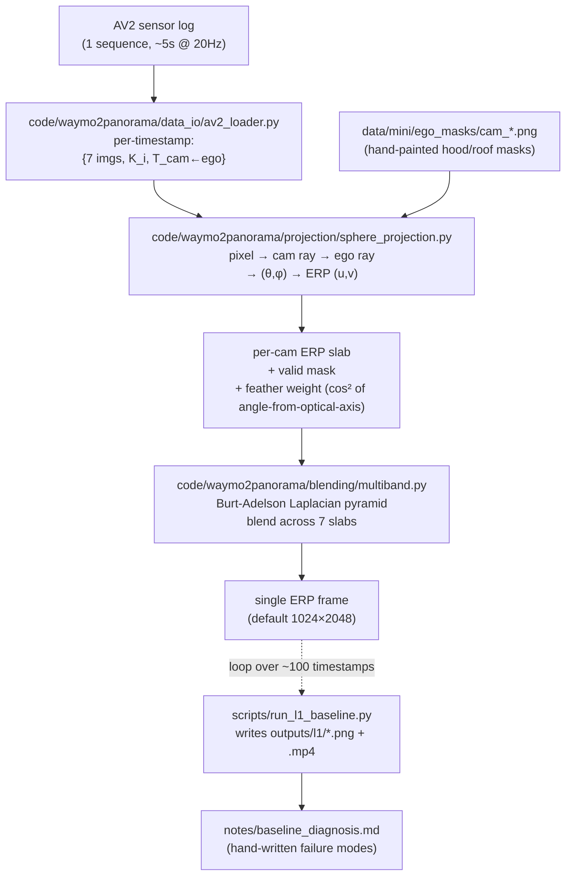

# Waymo2Panorama — Implementation Plan (v1)

Date: 2026-05-15
Status: v1 — synthesis of local Claude Code draft (v0, 2026-05-15 earlier) + cloud `/ultraplan` deep-think output.
Inputs: `2026-05-15-brainstorm-survey.md` (method landscape) + previous v0 + ultraplan Week-1 spec.

## How this v1 was built

The v0 covered an 8-week strategic arc (4 phases) but treated Week 1 at coarse granularity. `/ultraplan` produced a Week-1-only spec at much higher resolution — mermaid data flow, explicit function signatures, implementation order with rationale, smoke tests, six verification gates. v1 merges both: v0's strategic / risk / asset-reuse / paper-angle scaffolding is retained; ultraplan's Week-1 detail replaces v0's Phase-1 entirely (with one module-naming bug from ultraplan's plan corrected — its own implementation noticed it).

---

## §1 — Goal Statement

Build a **reproducible pipeline** that takes synchronized multi-camera frames from autonomous-driving datasets (primary: Argoverse 2 Sensor) and produces **equirectangular 360° panoramic video** that:

1. Is geometrically faithful at multiple depth layers (no ghosting on near objects)
2. Is temporally consistent across frames
3. Plugs directly into Pantheon360 / Argus / other 360 downstream consumers
4. Comes with a clean evaluation protocol (so methods are comparable)

Two parallel research outputs are targeted:
- **Data**: an "AV2-360" derivative — first public 360° driving dataset stitched with parallax-aware methods
- **Method**: a Pi3/DVGT-based stitching technique (open-source counterpart to LiftProj 2025-12)

---

## §2 — Success Criteria

| Tier | Criterion | Verification |
|---|---|---|
| **MVP (Week 1)** | L1 baseline produces 1 ERP video clip (≥3 sec) from 1 AV2 sequence, visually recognizable | (a) `outputs/l1/<log_id>/baseline.mp4` plays. (b) Eyeball: front of car at ERP center, rear meeting at left+right edges, horizon mostly continuous. (c) Parallax ghosts visibly present on near objects (this is the point — we documented it). |
| **Phase 2 (Week 3)** | L3 pipeline produces ERP clip with measurably better parallax than L1 | Cycle-consistency PSNR(L3) > PSNR(L1) on held-out reference views |
| **Phase 3 (Week 5)** | OmniStitch baseline + diffusion polish integrated | 3-way comparison table (L1 / L2 / L3) on ≥5 sequences |
| **Stretch (Week 8+)** | nuScenes-360 cross-validation run; Waymo blind-spot completion via Argus | Cross-dataset numbers + Waymo demo clip |

---

## §3 — Scope

### In scope (Phase 1–3)
- AV2 sensor data ingestion (7 ring cameras)
- Per-frame ERP rasterization (L1, L3)
- Pi3 / DVGT inference integration
- Confidence-weighted 3D fusion
- Multi-band blending
- Temporal smoothing (cross-frame ego pose)
- Cycle-consistency evaluation
- Mini dataset (~5–10 sequences) curation

### Out of scope (deferred)
- Full L4 (per-scene NeRF/3DGS training)
- Custom diffusion model training (use frozen Argus / Percep360 if needed)
- Real-time inference optimization
- Stereo depth fusion (AV2 has 2 stereo cameras, treat as future signal)
- Mass-scale dataset release (>100 sequences)
- Waymo full pipeline (only blind-spot completion demo)

---

## §4 — Phases

### Phase 0 — Repo bootstrap ✅ DONE
- [x] Scaffold directory tree
- [x] Init git + push to `github.com/QiPan-Ronnie/Waymo2Panorama`
- [x] Brainstorm survey written and committed
- [x] Plan v0 → v1 (this file) committed

---

### Phase 1 — Week 1: L1 baseline (AV2 7 ring cams → ERP video)

**Goal**: Produce a parallax-naïve classical baseline. Its purpose is **not** to be good — it's to be the honest "what does this look like on real driving data?" reference that motivates Phase 2 (3D-lift) and surfaces concrete failure modes for `notes/baseline_diagnosis.md`.

#### Data flow



The loader surfaces, per timestamp: `(image: HxWx3 uint8, K: 3x3, T_ego_cam: 4x4)` for each of the 7 ring cams. AV2 imagery is already undistorted (per brainstorm Part 1), so we treat each camera as pinhole and skip distortion entirely.

#### Module naming choice

The L1 implementation uses package `waymo2panorama` under `code/`:

```
code/waymo2panorama/
├── __init__.py
├── data_io/        # NOT 'io' (would shadow Python stdlib)
├── projection/
├── blending/
└── pipeline/
```

Reason: `code/io/` would shadow the Python stdlib `io` module on import. Caught and corrected by ultraplan during scaffolding.

#### Files to create

**Python package skeleton**
- `pyproject.toml` — name `waymo2panorama`, Python ≥3.10, deps: `av2`, `numpy`, `opencv-python`, `scipy`, `imageio[ffmpeg]`, `pyyaml`, `tqdm`. Dev deps: `pytest`, `ruff`. Minimal style (matches Pi3 sibling).
- Empty `__init__.py` markers in each subpackage.

**Core modules**
- `code/waymo2panorama/data_io/av2_loader.py`
  - `class AV2RingLoader(log_dir: Path, cams: list[str] = RING_CAMS_7)`
  - Uses `av2.datasets.sensor.sensor_dataloader.SensorDataloader` (or `av2.datasets.sensor.av2_sensor_dataloader.AV2SensorDataLoader` — verify exact class on installed version; pin in loader file).
  - `iter_synced_frames() -> Iterator[dict[str, FrameSample]]` where `FrameSample` is `(image, K, T_ego_cam, timestamp_ns)`. Sync to ring_front_center timestamps; nearest-neighbor others.
  - ```python
    RING_CAMS_7 = ["ring_front_center", "ring_front_left", "ring_front_right",
                   "ring_side_left", "ring_side_right",
                   "ring_rear_left", "ring_rear_right"]
    ```

- `code/waymo2panorama/projection/sphere_projection.py`
  - `def render_camera_to_erp(image, K, T_ego_cam, erp_hw=(1024,2048), ego_mask=None) -> (erp_rgb, erp_alpha, erp_weight)`
  - Steps:
    1. Build ERP pixel grid → sphere direction `(θ, φ)`, `θ = 2π·u/W − π`, `φ = π/2 − π·v/H`
    2. Rotate sphere direction from ego frame into camera frame via `T_ego_cam`. **Translation ignored at L1 — this is the parallax assumption we are explicitly documenting as broken** (point of L1 baseline_diagnosis).
    3. Project camera-frame direction with `K`; keep only pixels with `z > 0` and `(x,y)` inside image bounds
    4. Bilinear sample with `cv2.remap`
    5. `alpha` = boolean inside-and-in-front; `weight` = `cos²(angle from optical axis) × ego_mask`. cos² gives smooth feathering at FOV edges; multi-band picks up the rest
  - Pure numpy + OpenCV; no torch at L1.

- `code/waymo2panorama/blending/multiband.py`
  - `def multiband_blend(slabs: list[np.ndarray], weights: list[np.ndarray], num_bands: int = 5) -> np.ndarray`
  - Burt-Adelson: Gaussian pyramid of each weight (normalize across slabs at each level), Laplacian pyramid of each slab, blend per level, collapse. Uses `cv2.pyrDown` / `pyrUp`.
  - **ERP horizontal wrap-around** — pad each pyramid level with `np.roll`-style 1-pixel column wrap on the longitude axis before each conv. Trivial but easy to forget; if skipped causes a vertical seam at `θ=π` boundary. (Diagnosis-quality bug we want to avoid intentionally.)

- `code/waymo2panorama/pipeline/stitch_frame.py`
  - `def stitch_frame(frame_sample, erp_hw, ego_masks, num_bands) -> np.ndarray`
  - Per-cam `render_camera_to_erp` → `multiband_blend`. Single entry point shared by `run_l1_baseline.py` and tests.

**Scripts**
- `scripts/download_av2_sample.py` — wraps `av2`'s S3 / `s5cmd` instructions to fetch one log into `data/argoverse2/<log_id>/`. Document the chosen log id in `data/README.md`. If `s5cmd` not installed, **print the exact command** rather than auto-installing.
- `scripts/run_l1_baseline.py` — args `--log_dir`, `--out_dir`, `--config configs/l1_baseline.yaml`, `--start_sec 0 --duration_sec 5`. Loops `iter_synced_frames`, calls `stitch_frame`, writes PNGs + `.mp4` via `imageio` (H.264, 20 fps).

**Config**
- `configs/l1_baseline.yaml`:
  ```yaml
  erp:
    height: 1024
    width: 2048
  blending:
    num_bands: 5
    feather: "cos2"          # cos²(angle from optical axis)
  ego_masks_dir: data/mini/ego_masks
  ffmpeg:
    fps: 20
    crf: 18
  ```

**Data placeholders (committed)**
- `data/README.md` — pinned log id, download command, expected disk usage, gitignore exemptions reminder.
- `data/mini/ego_masks/.gitkeep` — masks added once we eyeball first render.

**Tests (smoke only — L1 is throwaway-grade)**
- `tests/test_sphere_projection.py` — synthetic 100×100 checkerboard, identity extrinsic, front-facing K → ERP must contain checkerboard inside FOV cone, zero alpha outside. One assertion on `erp_alpha.sum()` in plausible band.
- `tests/test_multiband.py` — two solid-color slabs with overlapping unit-weight regions blend to average in the overlap. One numerical assertion.

#### Implementation order (with rationale)

1. **`pyproject.toml` + empty subpackages + `data/README.md`** — so `pip install -e .` works before any code.
2. **`av2_loader.py`** — sanity-check by printing first frame's shapes and 7 timestamps. **This is the single biggest "does AV2 API match what we assumed" risk and is worth de-risking first.**
3. **`sphere_projection.py` + its test** — pure geometry, no I/O risk.
4. **`multiband.py` + its test + the longitude wrap fix** — easy to get the wrap wrong and only see it in final output, so test first.
5. **`stitch_frame.py`** — trivial glue.
6. **`run_l1_baseline.py`** — first end-to-end render. Expect failure modes.
7. **Hand-paint 7 ego masks** — one per cam, after we see what the hood/roof actually look like.
8. **Re-render → `notes/baseline_diagnosis.md`** — screenshots of failure modes (parallax ghosts, ego visibility, exposure mismatch, horizon seam, polar artifacts).
9. **`agent/progress.md` filled in** — daily entries.
10. **Commit + PR** — tag `v0.1-l1-mvp`.

#### Verification gates (all must pass before declaring L1 done)

1. `pip install -e .` clean on a fresh Python 3.10 env
2. `pytest tests/ -q` — both smoke tests pass
3. `python scripts/download_av2_sample.py` — one log on disk in `data/argoverse2/<log_id>/`
4. `python scripts/run_l1_baseline.py --log_dir ... --out_dir outputs/l1 --duration_sec 5` produces `outputs/l1/<log_id>/baseline.mp4` (1024×2048, ~100 frames, ~5 sec)
5. **Eyeball check**: the video must look recognizably 360° — front of car at center of ERP, rear meeting at left+right edges. Parallax ghosts visible on near objects (this is expected and documents the L1 failure mode)
6. `notes/baseline_diagnosis.md` contains at least one annotated screenshot per failure mode

If any of (1)-(5) fails, fix before opening the PR. (6) can land in a follow-up commit if mask edits require re-rendering.

---

### Phase 2 — L3 main line (Weeks 2–3)

**Goal**: Foundation-model-based 3D-aware stitching that visibly fixes parallax issues from Phase 1.

Decision gate at start of phase: **Pi3 vs DVGT** (see Decision Register §5, D1).

Tasks:
- [ ] **P2.1** Decide backbone (Pi3 vs DVGT) — write `notes/backbone_decision.md`
- [ ] **P2.2** If Pi3: reuse `01-pi3/scripts/run_pi3x_export.py`, adapt for AV2 input (resize to 504×504, batch 7 cams)
- [ ] **P2.3** If DVGT: clone `github.com/wzzheng/DVGT`, run on AV2 frames, verify metric-scaled outputs
- [ ] **P2.4** Write `code/waymo2panorama/alignment/sim3_align.py` (Pi3 path) — solve Sim(3) per camera using known ego extrinsics + LiDAR median depth
- [ ] **P2.5** Write `code/waymo2panorama/pipeline/lift_and_project.py` — `(points, conf, color) → ERP` via confidence-weighted splatting
- [ ] **P2.6** Visual L1 vs L3 gallery
- [ ] **P2.7** Cycle-consistency metric: hold out 1 camera, render from other 6, compute PSNR/LPIPS
- [ ] **P2.8** Temporal smoothing: ego-pose-aligned blend across 3 adjacent frames
- [ ] **P2.9** Write `outputs/l3_evaluation_report.md`
- [ ] **P2.10** Commit + tag `v0.2-l3-mvp`

**Deliverable**: `outputs/l3_stitch_demo.mp4` + cycle-consistency table + tag

---

### Phase 3 — Baselines + diffusion polish + multi-sequence (Weeks 4–5)

**Goal**: Apples-to-apples comparison against deep baselines; produce a small curated dataset.

Tasks:
- [ ] **P3.1** Set up OmniStitch (`github.com/tngh5004/Omnistitch`); adapt for AV2
- [ ] **P3.2** Run OmniStitch on Phase 2 sequences
- [ ] **P3.3** Implement LiftProj-style MAE hole-completion (their code unreleased — minimal reproduction)
- [ ] **P3.4** Integrate Argus (`05-argus-video-to-360/`) as optional ERP-boundary polishing pass
- [ ] **P3.5** Run on 5 AV2 sequences total; produce `outputs/sequence_gallery/`
- [ ] **P3.6** Comparison table: L1 / L2 (OmniStitch) / L3 / L3 + diffusion polish
- [ ] **P3.7** Cross-dataset: L3 on 1 nuScenes-360 reference scenario
- [ ] **P3.8** Write `outputs/phase3_report.md`
- [ ] **P3.9** Commit + tag `v0.3-phase3`

**Deliverable**: comparison table + 5-sequence gallery + cross-dataset proof point

---

### Phase 4 — Pantheon360 integration + Waymo blind-spot extension (Weeks 6–8)

**Goal**: Close the loop with upstream consumer; tackle Waymo's harder case.

Tasks:
- [ ] **P4.1** Adapt `04-pantheon360/scripts/pi3_to_cache.py` for our L3 outputs
- [ ] **P4.2** Run Pantheon360 ERP renderer on our 3D cache; verify roundtrip
- [ ] **P4.3** Download 1 Waymo Perception segment; produce L1 + L3 stitch (130° rear gap)
- [ ] **P4.4** Run Argus on the gap → demo Waymo→360 with generation
- [ ] **P4.5** Write `outputs/phase4_pantheon_integration.md`
- [ ] **P4.6** Decide paper angle (data / method / combined) — discuss with Koi
- [ ] **P4.7** Commit + tag `v0.4-integration`

**Deliverable**: end-to-end pipeline from AV2 → ERP → Pantheon360 + Waymo gap-fill demo

---

## §5 — Decision Register (lock during execution)

| ID | Decision | Default | Reason to reconsider |
|---|---|---|---|
| D1 | L3 backbone: Pi3 vs DVGT | **DVGT primary, Pi3 fallback** | If DVGT code immature or outputs poor on AV2 |
| D2 | Sphere vs cylinder for L1 surface | **Sphere** (→ ERP) | Cylinder simpler; cleaner for driving (no poles) |
| D3 | Output ERP resolution | **1024×2048** (Week 1), scale later | Pantheon360 uses 512×1024 in prototype |
| D4 | Number of AV2 sequences in dataset stub | **5 for Phase 3, scale to 10** later | Time/storage |
| D5 | Compute platform | **Colab A100** (matches Pi3 workflow) | AutoDL fallback for longer runs |
| D6 | Self-vehicle handling | **Hard mask out** Phase 1; inpaint later | Inpainting adds dependency |
| D7 | Temporal consistency strategy | **Per-frame Phase 1; ego-pose-smoothed Phase 2** | Video diffusion later if needed |
| D8 | Paper angle: data, method, benchmark? | **Combine S1 + S2 narrative** | Decompose if too broad after Phase 3 |
| D9 | License | **Code MIT, data respect upstream NC** | None |
| D10 | Cycle-consistency reference cam | **Rotate (each cam held-out once)** | Statistical robustness |
| **D11** (new from ultraplan) | Module naming under `code/` | **`code/waymo2panorama/` package, `data_io/` subpackage** | Avoid Python stdlib shadow |

---

## §6 — Risk Register

| Risk | Likelihood | Impact | Mitigation |
|---|---|---|---|
| DVGT code immature / undocumented | Medium | Phase 2 slip | Fall back to Pi3 (we own this) |
| AV2 download too slow on local | Low | Phase 1 day-2 slip | Use Colab disk + s5cmd parallel; pre-stage |
| Pi3/DVGT outputs at 504×504 too low-res vs 2048×1550 AV2 | Medium | Quality cap | Upsample with classical method; tile inference if time allows |
| Per-camera exposure mismatch creates visible seams | High | Quality cap | Histogram match pre-blend; multi-band already mitigates |
| LiftProj has no code → reproduction risk | High | Phase 3 partial | Core idea is simple; minimal MAE substitute |
| Ego pose drift in temporal smoothing | Medium | Video flicker | Use AV2-provided ego pose (their SLAM is solid) |
| Compute quota exhausted | Medium | Phase 2/3 slip | Cache aggressively; Drive workspace per Pi3 pattern |
| nuScenes-360 has different ERP convention than ours | Medium | Cross-dataset eval invalid | Verify yaw=0 convention early |
| 12-hour Colab limit | Low (known) | Long runs interrupted | Checkpointing; same as Pi3 workflow |
| Stereo cams confuse the loader | Low | Hour-of-debugging | Explicitly filter to ring-only at L1 |
| **AV2 SensorDataloader class name shift between versions** | Medium | Phase 1 day-1 import fail | Pin loader file to specific version; check installed version on first import |
| **ERP longitude wrap in multi-band skipped → vertical seam at θ=π** | Medium | Looks like a bug forever | Explicit wrap padding in multiband.py; smoke test catches |

---

## §7 — Asset Reuse

| Existing asset | Where | How reused here |
|---|---|---|
| Pi3X inference on Colab A100 | `01-pi3/scripts/run_pi3x_export.py` | Direct import for backbone path |
| Pi3 → 3D cache adapter | `04-pantheon360/scripts/pi3_to_cache.py` | Adapt for AV2 → Pantheon360 path |
| ViPE pose/intrinsic | `02-vipe/` | Sanity-check AV2-provided pose |
| Argus repo + paper | `05-argus-video-to-360/` | Optional final polishing/completion |
| Pantheon360 ERP renderer | `04-pantheon360/scripts/render_geometry_placeholder.py` | Consumer pattern |
| Drive MCP + Colab MCP workflow | Already operational | Same workflow for outputs/logs |
| Pi3 mini ERP→crops | `04-pantheon360/scripts/make_perspective_crops.py` | Inverse pattern we now implement |

---

## §8 — Evaluation Plan

### Quantitative
1. **Cycle-consistency PSNR/LPIPS** — held-out camera, render from other 6, compare. Repeat per cam.
2. **Line consistency** (Argus paper's metric) — lane markings, building edges should remain straight in ERP.
3. **Temporal stability** — frame-to-frame pixel variance in static regions (sky, distant buildings).
4. **Edge sharpness in overlap regions** — should not blur (sign of bad blending).
5. **Coverage ratio** — fraction of ERP pixels with ≥1 source observation.

### Qualitative
1. Side-by-side gallery: input 7 cams → L1 → L2 → L3 → L3+polish
2. Manual checklist: near-object ghosts, hood visibility, exposure seams, horizon discontinuity, polar artifacts
3. Cross-dataset visual vs nuScenes-360 same-style scene

### Week 1 specific (Phase 1 only)
- **Eyeball gate** (from ultraplan): video must look recognizably 360°; front of car at ERP center; rear meeting at left+right edges; horizon mostly continuous; parallax ghosts visible on near objects.

### Downstream
- Feed L3 outputs into Pantheon360 renderer; verify scene viewable from any user-defined camera
- Train tiny Argus on our outputs as sanity check (optional)

---

## §9 — Compute & Data Budget

| Resource | Phase 1 | Phase 2 | Phase 3 | Phase 4 |
|---|---|---|---|---|
| Colab A100 hours | 2 | 10 | 15 | 8 |
| Drive storage | 5 GB | 20 GB | 50 GB | 60 GB |
| Local disk (D:) | 1 GB | 3 GB | 5 GB | 6 GB |
| AV2 sequences | 1 | 1 | 5 | 5 |
| nuScenes refs | 0 | 0 | 1 | 1 |
| Waymo segments | 0 | 0 | 0 | 1 |

---

## §10 — Open Questions (for next /brainstorming round)

1. Should we treat this primarily as a **data paper** (NeurIPS D&B) or **method paper** (CVPR/ICCV)? Or both?
2. Is **DVGT actually a better backbone than Pi3** for our use case? DVGT is 4 days old; need code-quality verification.
3. **Joint vs per-camera Pi3 inference** for the 7 cams — joint exploits cross-view; per-cam matches training regime.
4. Evaluate against nuScenes-360 existing stitchings, or only against held-out cameras?
5. Release a **tutorial notebook** alongside (like Pi3)?
6. **Coordinate with Koi's ViPE PR #16** (multi-view SLAM init) — likely yes.
7. Any **published or near-published competitor** on exact same task (AV multi-cam → 360)?
8. Motion blur / rolling shutter at high vehicle speed?

---

## §11 — Timeline summary

```
W1  Phase 1 — L1 baseline (this week)
W2  Phase 2 part 1 (Pi3/DVGT inference)
W3  Phase 2 part 2 (3D fusion + cycle eval)
W4  Phase 3 part 1 (OmniStitch baseline)
W5  Phase 3 part 2 (multi-seq + cross-dataset)
W6  Phase 4 part 1 (Pantheon360 integration)
W7  Phase 4 part 2 (Waymo extension)
W8  Buffer / paper draft start / Koi review
```

---

## §12 — Workflow Conventions

- Each phase ends with a git tag (`v0.X-<short-name>`)
- Each phase produces `outputs/<phase>_report.md`
- `progress.md` tracks daily state
- Notes go into `notes/`
- Code mirrors Pi3 style — Python 3.10/3.12 compat; conda env suggestion `waymo2pano-py310`
- All big outputs (>50 MB) live on Drive, not in repo
- Module naming: `code/waymo2panorama/<subpackage>/` to avoid stdlib shadows

---

## §13 — Synthesis attribution (for traceability)

| Section | Source | Notes |
|---|---|---|
| §1, §3, §5–§11 (most), §12 | v0 local | Strategic / multi-phase / risk / asset / paper-angle scaffolding |
| §4 Phase 1 entire | ultraplan | Module signatures, mermaid, impl order, smoke tests, eyeball gate, longitude wrap callout |
| §2 Tier "MVP (Week 1)" | merged | v0 gave the tier; ultraplan gave the eyeball criteria |
| §5 D11 | ultraplan | Module naming bug caught and fixed |
| §6 last 2 rows | ultraplan | AV2 class shift risk + multi-band wrap risk |
| §10 | v0 | All carried forward; some answered by ultraplan implicitly |
| This §13 | this synthesis | Audit trail |
