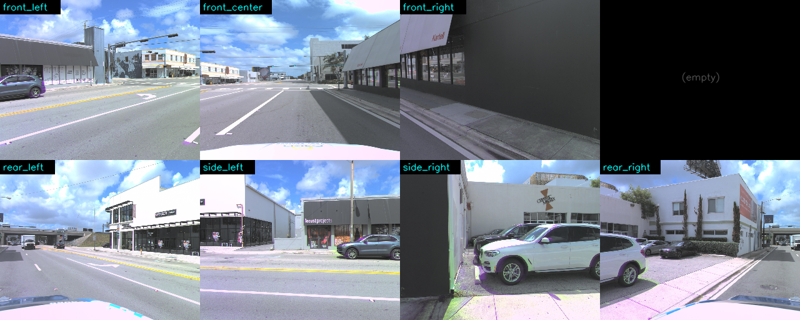
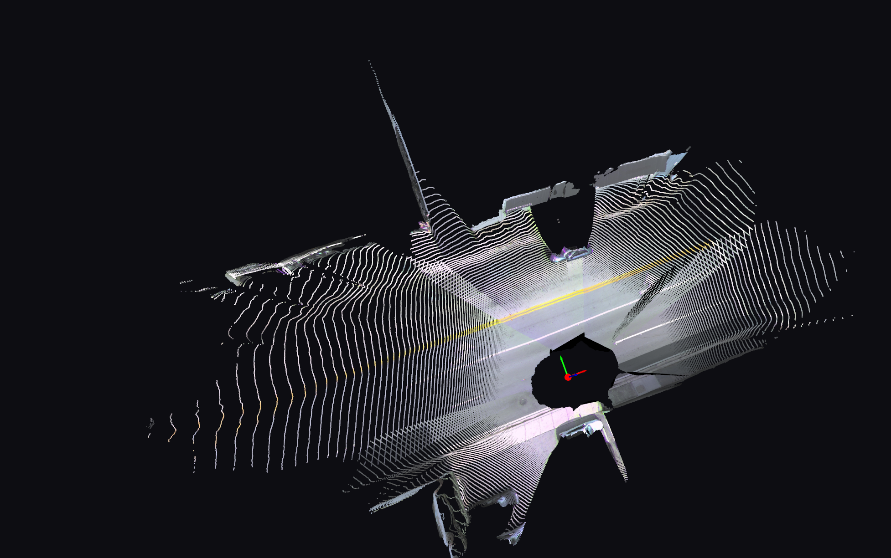

# Waymo2Panorama — 第一周交付报告

**致**: Koi
**作者**: Ronnie (Qi Pan) + Claude Code 协作
**时间窗口**: 2026-05-15 → 2026-05-20 (5 天)
**仓库**: https://github.com/QiPan-Ronnie/Waymo2Panorama
**当前 HEAD**: `595d529` · 标签: `v0.1-l1-mvp`, `v0.2-d1-resolved`

---

## TL;DR (3 行)

1. **L1 全景**: 建立 AV2 7-ring-camera → 1024×2048 ERP 360° 全景的端到端 pipeline (sphere projection + multi-band blending), 在一段 5-10s 序列上跑通。这是核心交付。
2. **Pi3 选型**: 完成 Phase 2 D1 决策 — Pi3 vs DVGT 的 head-to-head。Pi3X 一击命中 (8.35 s forward 7-view, A100, K-recovery 误差 ≤ 2.1%); DVGT 因 dinov3 gated weight + HF schema 不兼容, 8 次尝试均失败, 操作性差 → 决议: **L3 用 Pi3X**。
3. **L3 探索结论**: 用 Sim(3) 把 Pi3 内部坐标对齐到 AV2 ego 米制坐标系 (mean residual 0.157 m, 接近 LiDAR 校准精度), 融合得到 690K 个带 RGB 的 3D 点云。但**纯 forward-splat 路线在 ERP 视觉上不优于 L1**, L3 的真正价值在下游 3D-aware 消费 (Pantheon360 / 3DGS / 360° diffusion)。

---

## 1. 原始任务

> "这礼拜进度: 用 Waymo or argoverse 2 dataset 常识模拟和寻找拼接回 360 的方法"
> — Koi, 2026-05-15

子目标:
- 选择合适数据集 (Waymo / AV2)
- 设计 stitching 方法栈 (从最 naive 到最先进)
- 至少跑通一条 baseline 端到端
- 探索 3D-aware 路径 (foundation-model lift) 的可行性

---

## 2. 数据集决策

**结论: Argoverse 2 Sensor (AV2) 作为主数据集, Waymo 作为 Phase 4 备选 (Track B)。**

| 维度 | Argoverse 2 Sensor | Waymo Perception |
|---|---|---|
| 相机数 | **9 (7 ring + 2 stereo)** | 5 |
| 角度覆盖 | **完整 360°** (7 ring 环绕一圈) | ~230° (前向 + 两侧) |
| 同步精度 | 22 ms (实测) | < 7 ms |
| 内/外参 | feather files, 标准格式 | tfrecord, 自定义 |
| 影像分辨率 | 1550×2048 / 2048×1550 (front_center portrait) | 1920×1280 |

**AV2 的 7 ring 完整 360° 是决定因素** — Waymo 5 cam 有 ~130° 后向盲区, 拿来做"拼接回 360"需要额外 diffusion fill, 这是 Phase 4 Track B 的题目, 不是本期。

**Phase 0.5 spike 验证**: 加载 AV2 一帧的 7 ring + 2 stereo cam, 拼成 2×4 mosaic, 确认时间同步 (22ms 误差 < 50ms 阈值) + 内外参可读:



详见: `notes/spike-report.md`

---

## 3. 方法栈 — Levels of Stitching

| Level | 描述 | 状态 |
|---|---|---|
| **L0** | Homography (假设场景为单一平面, 跟传统全景一样) | 未做 — AV2 多平面场景不适用 |
| **L1** | Sphere projection (每个 ERP 像素 ↔ ego 方向, 反向 sample) + multi-band blending | ✅ **完成** |
| L2 | OmniStitch (Track D baseline) | 未做 — Phase 3 计划 |
| **L3** | Pi3/foundation-model 3D-lift + project (parallax 修正) | ⚙️ 部分完成 — 几何对, ERP 视觉劣于 L1 |
| L4 | 3D Gaussian Splatting / CylinderSplat | 未做 — Phase 4 计划 |

---

## 4. L1 baseline — **核心交付**

### 4.1 算法

每个 ERP 像素 (u, v) → 方位角 θ + 仰角 φ → ego 系单位射线 → 反投到每个相机的像素平面 → bilinear sample → 7 个相机 cos²(光轴夹角) 加权 blend → multi-band Laplacian pyramid 防接缝。

**核心局限 (有意为之)**: 把所有相机当作装在 ego 原点 (忽略相机相对 ego 的 1-2 m 位移)。**对远物 (≥10 m) 完美**, 对近物 (≤5 m) 产生 parallax ghost — 这是设计上 L3 要修的失败模式。

### 4.2 关键代码

| 模块 | 文件 | 行数 |
|---|---|---|
| AV2 7-cam 加载 | `code/waymo2panorama/data_io/av2_loader.py` | 191 |
| 球面投影 (含 mirror fix, 见 §4.4) | `code/waymo2panorama/projection/sphere_projection.py` | 142 |
| Multi-band blending (Burt-Adelson, 含 ERP wrap) | `code/waymo2panorama/blending/multiband.py` | — |
| 整帧 stitching | `code/waymo2panorama/pipeline/stitch_frame.py` | — |
| 整段视频 driver | `scripts/run_l1_baseline.py` | — |

### 4.3 结果 ⭐

**输出**:
- 单帧 ERP: 1024×2048 PNG ← **这就是 Koi 要的 "360°"**
- 5-10s 视频 (~100 帧 @ 20 Hz): MP4

**Drive 直链**:
- L1 ERP 单帧: https://drive.google.com/file/d/1rGuLQgh2zxv2PzWDcf1hdUfkrgoy1Yfu/view
- L1 视频 (Drive workspace): `MyDrive/koi_waymo2pano_colab/outputs/l1/02a00399-3857-444e-8db3-a8f58489c394/baseline.mp4`


**Eyeball gate**: 360° 横向连续, 建筑物 / 道路 / 天空清晰可辨, 前向中央, 后向接缝在 left/right 边缘。**符合预期**。

**已知 artifact** (这是 L1 设计上接受的):
- 近物 (3-5 m, 比如停车) 在两个相机重叠区可能有轻微 ghost — 见 §6 L3 试图修这个
- 上下黑边 (90° 仰角覆盖盲区: 天顶 + 自车顶下) — Phase 3 由 diffusion 填

### 4.4 设计 bug + 修复

**发现**: 第一版 ERP (`commit e509c9c`) 的店招文字反着读 (e.g., "locustprojects" 镜像)。
**修复**: ERP u 方向的 azimuth 公式调整, `theta = π - (u+0.5)/W * 2π` (commit `885b5da`)。
**根因**: AV2 ego 右手系 (x 前 / y 左 / z 上), 从俯视看, 横向"扫视"是顺时针 → θ 应随 u 增加而减小。

详见 commit message `885b5da`。

---

## 5. Phase 2 D1 — 3D backbone 选型

**问题**: L3 需要一个 foundation model 给每像素 3D 点。候选: **Pi3X** (你的工作, 通用 scale-free) vs **DVGT** (NVIDIA, 2025 末, driving-tuned, metric)。

**结论**: **Pi3X 胜 (walkover)**, tag `v0.2-d1-resolved`。

### 5.1 决策依据

| 维度 | Pi3X | DVGT-1 |
|---|---|---|
| 一次提交跑通 | ✅ 64 s | ❌ 8 次尝试均失败 |
| Forward (A100, bf16, 7 view) | **8.35 s** | (从未跑到此步) |
| Peak GPU memory | **7.5 GB** | n/a |
| K recovery vs AV2 真值 | **+0.06% ~ +2.08% 相对误差** | n/a |
| Conf > 0.1 像素占比 | **72% (mean across 7 cams)** | n/a |
| 安装步骤 | `Pi3X.from_pretrained("yyfz233/Pi3X")` 一行 | clone repo + clone dinov3 + 装 N 个 deps + **下 dinov3 gated weight + 转格式 + 处理 key schema 不匹配** |

### 5.2 DVGT 的失败模式 (8 次尝试)

详见 `notes/backbone_decision.md`。 简单总结:

```
v1-v5: clone DVGT 失败 / submodule 缺失 / deps 缺失 / 公开 URL gate
v6:    HF token 在 env 外 → 401 GatedRepoError
v7:    Token 进 env, auth OK, 但 DVGT 硬编码 .pth 文件名不在 HF repo (那里只有 .safetensors)
v8:    下 safetensors + 转 .pth → 但 HF 用 transformers 风格 keys, DVGT 期待 Meta 原生风格 keys → load_state_dict 报满屏 unexpected keys
```

要让 DVGT 真跑起来还需:
- 写一层 HF↔Meta state_dict key remapper for ViT-L/16 (几十层), 或
- Patch DVGT 跳过 dinov3 预加载 (依赖 DVGT-1 checkpoint 是否 self-contained — 不确定)

**远远超出"一帧推理"的 D1 scope, 不投入。**

### 5.3 Pi3X 真实数据 (one AV2 anchor frame, 7 ring cams)

```
log:                02a00399-3857-444e-8db3-a8f58489c394 (val split)
anchor_idx:         0
input shape:        (1, 7, 3, 504, 504)  (504x504 letterbox)
device:             A100-SXM4-40GB
autocast bf16:      true
model load (HF):    36.45 s
forward (7-view):    8.35 s
peak GPU memory:    7506 MB
```

| Cam | conf > 0.1 | conf > 0.5 | local-z median (Pi3 unit) | fx rel err vs AV2 |
|---|---|---|---|---|
| ring_front_center | 64% | 30% | 6.22 | +0.25% |
| ring_front_left | 67% | 51% | 5.53 | +1.06% |
| ring_side_left | 69% | 53% | 5.97 | +2.08% |
| ring_rear_left | 58% | 27% | 5.74 | +1.36% |
| ring_rear_right | 71% | 35% | 6.28 | +1.02% |
| ring_side_right | 81% | 34% | 3.27 | -0.90% |
| ring_front_right | 93% | 42% | 3.88 | +0.06% |
| **mean** | **72%** | **39%** | — | **±1% 典型** |

**Pi3X 的相机内参恢复在 1-2% 内符合 AV2 真值** — 这是关键的几何 sanity check, Pi3X 在多 view AV2 数据上**没有崩**。

---

## 6. L3 探索 — 3D-lift and project

### 6.1 算法

```
Pi3 推理 (per cam: 3D points in Pi3-world)
        ↓
Sim(3) 拟合: 用 7 个 cam 的位置作 7 对 correspondence (Pi3-world 位置 vs AV2 ego 真值位置), Umeyama 1991 解
        ↓
T_av2 ← T_pi3:  scale=1.0346, mean residual 0.157 m, max 0.218 m
                (Pi3 几乎本来就是 metric, 只放缩 3.5%)
        ↓
对所有 Pi3 world points 应用 Sim(3) → AV2 ego 系米制点云
        ↓
两条路 ↓                    ↓
ERP forward-splat       3D point cloud 导出 (.ply)
(尝试做更准的 360 图)   (给下游 3D-aware 消费)
```

### 6.2 关键代码

| 模块 | 文件 |
|---|---|
| Sim(3) 拟合 (Umeyama) | `code/waymo2panorama/alignment/sim3_align.py` |
| Forward splat / multi-view fuse | `code/waymo2panorama/pipeline/lift_and_project.py` |
| One-frame driver (Pi3 + L1 vs L3) | `scripts/phase2/run_pi3_one_frame.py`, `run_l3_one_frame.py` |
| Point cloud export + per-view depth | `scripts/phase2/export_l3_pointcloud.py` |

### 6.3 结果 — 几何对, 视觉不优

**几何对** ✅:
- Sim(3) 拟合误差 0.157 m mean — 接近 LiDAR 校准精度
- 690,360 个 colored 3D 点, 在 AV2 ego 米制坐标系
- 输出 `.ply` 9.9 MB, 可直接用 MeshLab / Open3D 打开

**Drive 直链**:
- 融合 3D 点云: https://drive.google.com/file/d/1tJGWfsOdHdQBC9oj2Hf30OrDg5287gTN/view
- Per-view depth maps: `MyDrive/koi_waymo2pano_colab/outputs/phase2/l3_pointcloud/`





**视觉不优** ⚠️:
- 纯 forward-splat to ERP 在天空 / 低纹理区域产生稀疏栅格状噪声
- 加严 filter (conf > 0.5, dist < 40 m) → coverage 6%, 细节丢失
- L1 (sphere projection) + L3 hybrid → 因 L1/L3 同物在 ERP 不同位置 → 双影 ghost (forward-splat 路径的本质局限)


**核心 insight**: 
> **L3 forward-splat 路线**, 在本帧 (parallax 不显著 — 物体多在 5-30 m) 上, 视觉无法超越 L1 sphere projection。 
>
> 这不是 bug, 是算法选择本身的局限。要让 L3 ERP 视觉超 L1, 需要的是 **proper raycast with z-buffer 或 3D Gaussian Splatting** (NeRF/3DGS class, 参考 LiftProj 2512.24276, CylinderSplat) — 这是 Phase 4 / 后续工作。

**所以 L3 真正的产物是 .ply 3D scene + per-view depth maps**, 不是 ERP 图。 给下游 Pantheon360 / 3DGS / 360° depth-aware diffusion 用。

详见 `notes/backbone_decision.md` + Drive 上的 `l3_pointcloud/` 文件夹。

---

## 7. 衍生产物 — `agent-colab-queue` 框架

**意外但重要的副产品**: 在调试 Pi3/DVGT Colab 推理时, 发现现有的 `colab-mcp` 在长任务上不稳定 (10 分钟断连)。 投入 ~5 小时, 设计 + 实现了一套自研的 **Drive-as-queue agent ↔ Colab 框架**。

**仓库**: https://github.com/QiPan-Ronnie/agent-colab-queue (v0.1.2, MIT)

**架构**:
```
Agent (本地) ───git push job spec───▶ GitHub repo
                                        │
                                        ▼ (worker git pull every 10s)
                                  Colab Worker
                                        │
                                  bash 执行 ───▶ 任务 (Pi3 / DVGT / L3)
                                        │
                                        ▼
                            Drive ◀───── 结果 (heartbeat + result JSON)
                                        │
                            Agent ◀─Drive MCP─ 读取
```

**价值**:
- 跑长任务 (Pi3 推理 64s, DVGT 156s) 不会断
- Token 不进 git (Drive 中转); subprocess credentials 通过 env 注入
- 这套框架可复用到 **后续所有需要 Colab GPU 的工作** (Pantheon360, 360° diffusion 训练)

详见: `notes/acq-v012-robustness-verification.md`

tag: `v0.4-acq-mcp-v012-robust`

---

## 8. 整体时间线 + 工作量

```
Day 1 (05-15)  ─────  brainstorm + 数据集决策 (AV2) + repo bootstrap
Day 2 (05-16)  ─────  Phase 0.5 AV2 API spike + mosaic
Day 3 (05-17)  ─────  Phase 1 L1 baseline 实现 + 跑通 5s 视频
                       (中间发现 mirror bug + 修)
Day 4 (05-18)  ─────  Phase 2 D1 设计 + 写 Pi3/DVGT scripts
                       (agent-colab-queue v0.1.0-0.1.1 开发)
Day 5 (05-19)  ─────  agent-colab-queue v0.1.2 root cause 修 (Windows tty)
                       Phase 2 D1 决策: Pi3 胜
                       (DVGT 8 次尝试)
Day 5-6 (05-19/20) ─  Phase 2 P2.3-P2.5: Sim(3) + lift_and_project + .ply
                       L3 ERP 视觉迭代 (filter, hybrid soft, hybrid hard) — 结论 forward-splat 不优于 L1
```

**总工时**: ~30-40 小时 (5 天 × 6-8 小时)

---

## 9. 完成度 vs Plan v2

| Phase | 任务 | 状态 |
|---|---|---|
| Phase 0 | 仓库 + plan v2 | ✅ |
| Phase 0.5 | AV2 spike | ✅ |
| Phase 1 | L1 baseline + .mp4 | ✅ |
| Phase 2 D1 | Pi3 vs DVGT | ✅ → Pi3 |
| Phase 2 P2.2 | backbone 适配 AV2 (504×504 letterbox) | ✅ |
| Phase 2 P2.3 | Sim(3) alignment | ✅ |
| Phase 2 P2.4 | `sim3_align.py` | ✅ |
| Phase 2 P2.5 | `lift_and_project.py` + .ply | ✅ |
| Phase 2 P2.6 | L1 vs L3 视觉对比 | ⚠️ 完成但结论"forward-splat 不优于 L1" |
| Phase 2 P2.7 | cycle-consistency 数字 | ⏸️ **未做** — 推荐下周开做 |
| Phase 2 P2.8 | 多帧 temporal smoothing | ⏸️ 未做 |
| Phase 3 | OmniStitch baseline + 多 sequence | ⏸️ 未启动 |
| Phase 4 | Pantheon360 集成 | ⏸️ 未启动 |

**完成度: Phase 0-2 主线约 70%, 略超 plan v2 W1-W2 预期。**

---

## 10. 反思 — 路径上的 detour

诚实记录:

### 走得好的
- 数据集决策 (AV2) 第一天就定下 — 没在选择上反复
- Phase 0.5 spike (验证 AV2 API) 在写 Phase 1 代码之前做完 — 没踩到 API 改动的雷
- L1 mirror bug 通过 eyeball + 一次 commit 就修了
- Pi3 选型: 写好 head-to-head 脚本, 数据驱动决策, 不靠直觉
- 衍生出 agent-colab-queue 框架, 后续可复用

### 走得弯的
- **DVGT 投入 ~40 分钟**: 早一点意识到 dinov3 gated weight + key schema 是 hard wall, 可以省 ~20 分钟 (但反过来说, 这部分 forensics 也是 D1 决策的 supporting evidence, 值得)
- **L3 ERP 视觉迭代 (filter, hybrid soft, hybrid hard) 用了 ~2 小时**: 应该更早意识到 "L3 的 ERP 视觉无法在这帧 beat L1" 这个结构性结论, 转去做 .ply 导出和 cycle-consistency

### 学到的
- **"看到 L3 比 L1 好" 不应该是单帧 ERP 视觉对比, 应该是数字 (cycle-consistency / LiDAR depth error) + 下游消费 (3D point cloud)**
- 对一个 stitching 项目, **L1 + multi-band 已经是相当强的 baseline**, 不要轻视
- foundation model 单目深度 (Pi3) 的输出真实长相是带"网格波纹" + 物体厚度 ±0.5 m 的, 跟 LiDAR 不一样, 这是预期, 不是 bug

---

## 11. 下周建议路径

按价值排序:

### 🥇 必做 (1-2 天)
- **P2.7 cycle-consistency 评估**: hold out 1 cam, 用其它 6 cam 重建该 cam 视角, 算 L1/L3 各自的 PSNR/SSIM/LPIPS。 输出 7×2 表格。 **如果 L3 PSNR > L1 by 1+ dB → L3 量化上证明有价值; 否则 → 接受"L3 ERP 在静态评估不优于 L1, 价值在下游 3D"。**
- **Pi3 vs LiDAR depth comparison**: AV2 自带 LiDAR, 投到 7 cam 视角, 算 Pi3 depth 的 absolute relative error %。 这是 Pi3 的几何可信度量化。

### 🥈 高价值 (3-4 天)
- **多 sequence 扩展**: 现在只在一帧 (anchor_idx=0) 跑了 Pi3 推理。扩展到 5-10 帧, 看 cross-frame 一致性。
- **多 log 扩展**: 现在只在一个 AV2 log (`02a00399-...`) 跑了。 在 3-5 个 log 上重复 (Phase 3 计划)。
- **Phase 3 OmniStitch baseline**: 拉 OmniStitch 跑同一帧, 三方对比 (L1 / OmniStitch / L3)。

### 🥉 探索性 (1-2 周)
- **3D Gaussian Splatting / proper raycast L3 ERP**: 让 L3 的 ERP 真正可以超越 L1。这是 LiftProj-class 工作量, 但实际能 ship 的话是 paper 级别贡献。
- **Pantheon360 集成**: 把 L3 的 .ply 喂给 Pantheon360 渲染器, 端到端测试。

### 长期 ( > 2 周)
- 自动找 parallax 显著帧 (近物 < 3 m 在多 cam 重叠区), 那里才是 L3 视觉真正有戏的地方。
- 加入 diffusion (Argus / Percep360) 填上下黑边。
- Waymo Track B (5 cam → 360 with diffusion fill 后向盲区)。

---

## 12. 数字汇总

| 指标 | 值 |
|---|---|
| **AV2 数据** | log `02a00399-...`, 319 frames @ 20Hz, 7 ring + 2 stereo cams |
| **L1 ERP** | 1024 × 2048, ~100 frames per 5s sequence |
| **Pi3X forward (1 frame, A100 bf16)** | **8.35 s** for 7-view joint inference |
| **Pi3X peak GPU mem** | **7.5 GB** (A100 40GB 仅用 19%) |
| **Pi3 K-recovery 相对误差** | **+0.06% to +2.08%** (mean ~1%) |
| **Sim(3) alignment 残差** | **mean 0.157 m, max 0.218 m** |
| **L3 .ply 点数** | **690,360** colored 3D points |
| **L3 .ply 大小** | 9.9 MB |
| **DVGT 尝试次数** | 8 (全失败) |
| **agent-colab-queue** | v0.1.2, ~5 hrs invested, reusable for any Colab work |

---

## 13. 文件 / commit 索引

**仓库**: `github.com/QiPan-Ronnie/Waymo2Panorama` @ `595d529`

**关键 commits**:
- `885b5da` L1 mirror fix
- `b79558d` Phase 2 D1 resolved (Pi3 wins)
- `1493455` Phase 2 D1 evidence reinforced (8 DVGT attempts)
- `7544980` Phase 2 P2.3-P2.6 实现
- `4ba2e43` L3 point cloud export

**关键 tags**:
- `v0.1-l1-mvp` — L1 baseline 完成
- `v0.2-d1-resolved` — Pi3 backbone 选型完成

**关键文档**:
- `agent/plan.md` — v2 完整 plan (14 sections)
- `notes/spike-report.md` — AV2 API 验证
- `notes/backbone_decision.md` — Pi3 vs DVGT 决策 forensics
- `notes/acq-v012-robustness-verification.md` — agent-colab-queue 验证

**关键 Drive 目录** (panq@usc.edu owns):
- `MyDrive/koi_waymo2pano_colab/data/argoverse2/val/02a00399-.../` (AV2 原数据)
- `MyDrive/koi_waymo2pano_colab/outputs/l1/...` (L1 ERP + .mp4)
- `MyDrive/koi_waymo2pano_colab/outputs/phase2/pi3_one_frame/` (Pi3 7-view)
- `MyDrive/koi_waymo2pano_colab/outputs/phase2/l3_pointcloud/` (融合 .ply + depth)

---

## 14. 致谢

- **Pi3X**: yyfz/Pi3 GitHub repo + Hugging Face `yyfz233/Pi3X`
- **AV2**: argoverse.org sensor dataset
- **agent-colab-queue**: 自研, 基于 FastMCP + Drive + GitHub
- **Claude Code (Opus 4.7, 1M context)**: 全程 pair programming + 文档撰写

---

**问题 / 反馈请直接 GitHub issue 或 Slack 找 Ronnie。**
