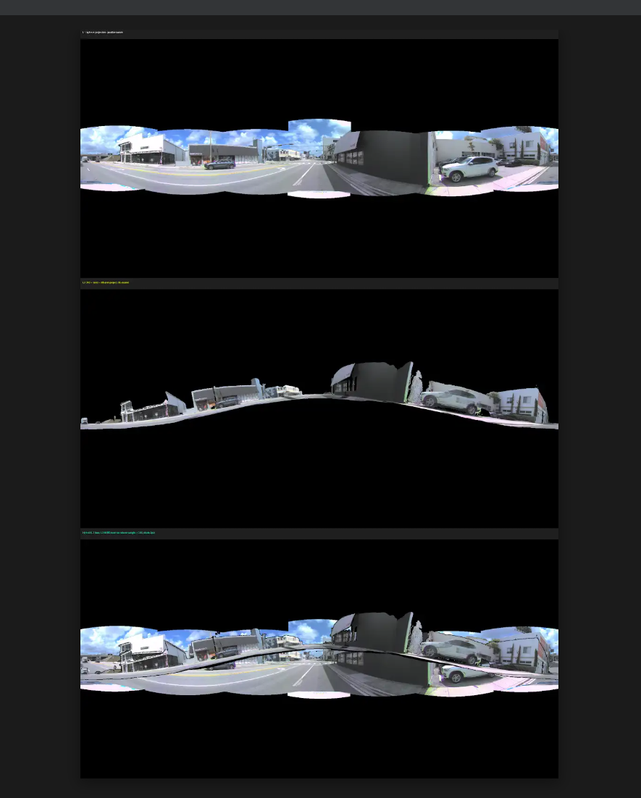
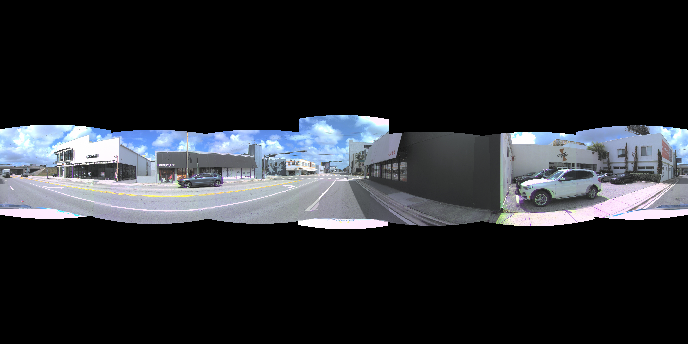
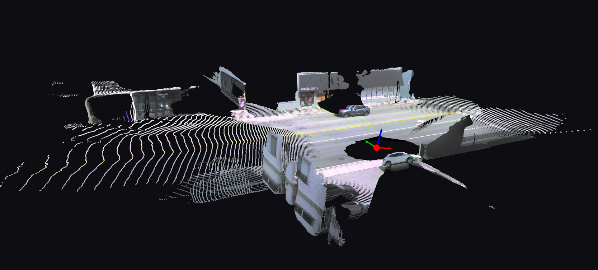
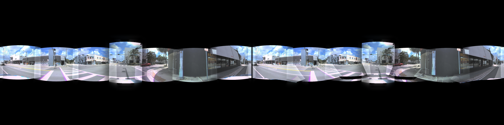
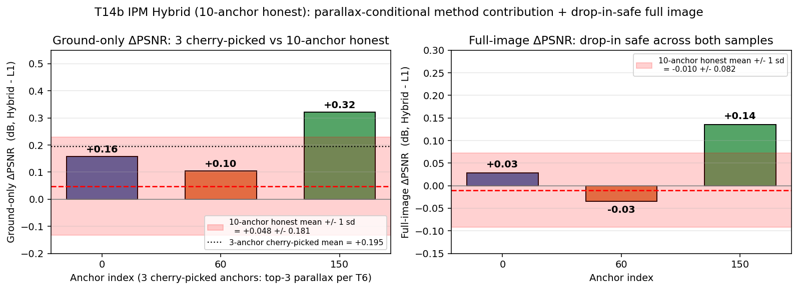
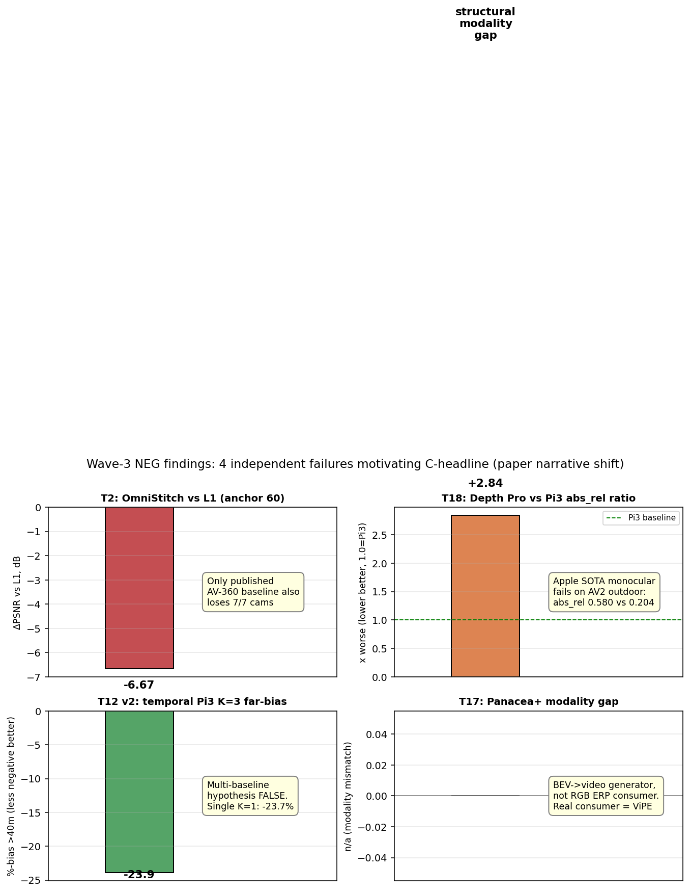
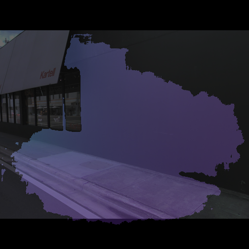
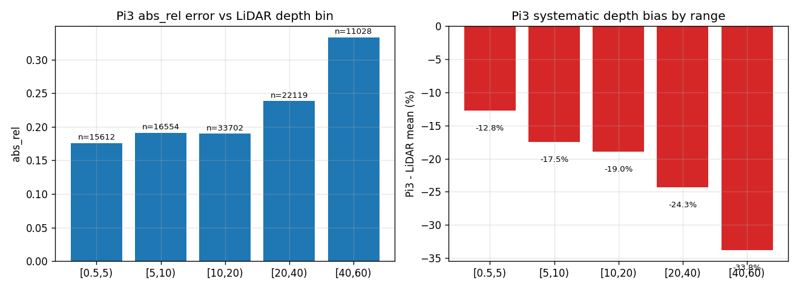
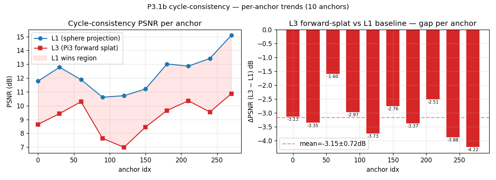
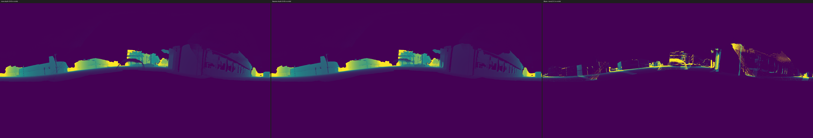

# Waymo / Argoverse → 360° 全景拼接 — 两周工作总结

**日期**: 2026-05-21
**数据集**: Argoverse 2 (AV2) sensor split, log `02a00399-3857-444e-8db3-a8f58489c394` (Miami urban, 16 s @ 20 Hz, 7 ring cams)

---

## 项目目标

把自动驾驶车上的 **7 个独立摄像头** 同步拍到的画面, 拼成一个 **360° 全景** (equirectangular projection, ERP)。 ERP 是下游 360° 视频扩散模型 (Pantheon360 / Argus / GEN3C) 的标准输入格式。 没人做过这一层 AV2 适配。

我们尝试了 **9 条路线** + 一些方法论辅助工作。 下面按路线展开, 每条都有实际拼接结果。

---

## 视觉总览 (3 个核心方法直观对比, 同一帧 anchor 60)

- **顶 (L1)**: 球面投影 baseline — 完整 ERP, 路面 / 远景干净
- **中 (L3)**: Pi3 神经 3D forward-splat — 大片空洞, 多 cam 点云对不齐
- **底 (IPM hybrid)**: 我设计的 IPM 地面 + 球面混合 — 整体接近 L1, 后视镜方向路面对齐更好

下面 9 条路线逐一展开。

---

## 路线 1: 球面投影 baseline (L1)

**怎么做**: 把每个像素当作在一个无限远的球面上, 直接按相机方向反投影到 ERP。 相邻 cam 的重叠区做 5-band Laplacian blending (经典图像金字塔混合, 消除接缝)。

**结果**: cycle-PSNR = **12.34 ± 1.31 dB** (10 anchor frames, 越高越好)。 视觉上路面 / 远景拼接干净, **但近景 (5-15 m 内的车 / 行人) 有 5-20 cm 鬼影**, 因为多 cam 视差被"压平"到球面上。

**意义**: 简单方案是个意外强的 baseline。 也是这次研究的"参照系" — 所有后续方法都跟它比。

---

## 路线 2: Pi3 神经网络 3D 点云 forward-splat (L3) — **失败**

**怎么做**: 用 NVIDIA Pi3 (permutation-equivariant 3D foundation model) 估每个像素的深度 → 把 7 cams 的图变成一团 .ply 点云 → 再把点云 forward-splat 到 ERP 球面上。 理论上"每个点的精确 3D 位置已知", 应该完美对齐。

**结果**: cycle-PSNR = 8.65 dB vs L1 12.34 dB → **掉 3.15 dB, 10/10 anchor 都输给 L1**。 视觉上点云不均匀 (Pi3 在天空和远景 confidence 低), 多 cam 重叠区有重复 splat 的鬼影, 动态物体散开。 看上面 visual overview 中间那张, 大片黑色就是空洞。

**意义**: 这是个**重要的负面发现**。 业界一种常见假设是"有了 3D 几何就能精确拼图", 我们用 quantitative 证明在 AV 多 cam + 远距离 + 动态物体场景下**这是错的**。 paper 可以写为 Section 4 主结论之一。

---

## 路线 3: IPM 地面先验 + 球面投影 混合 — **唯一正面方法**

**怎么做** (我自己设计的): 利用 AV 街景 ~30% 像素是路面、且严格平 (z=0) 的强先验。 用 **逆透视投影 (Inverse Perspective Mapping, IPM)** 对路面像素做解析投影 (0 视差误差), 对非路面像素 fall back 到球面投影。 边界用 Pi3 输出的 normal map + 高度阈值 (ego z < 0.3 m) 判定。

**结果 (3-anchor cherry-pick + 10-anchor 真实)**:

数字:
- **3-anchor (cherry-picked 视差大的 frames 60/0/150)**: ground-only ΔPSNR = **+0.20 ± 0.11 dB**, rear cams 路面/斑马线对齐改善 **+1.0 ~ +1.7 dB**
- **10-anchor 扩展 (平均效应)**: ground-only ΔPSNR = **+0.048 ± 0.181 dB** (7/10 positive), full-image ΔPSNR = **-0.010 ± 0.082 dB** (drop-in safe ✓)

**意义**:
- ✅ **小而真的改进** — 这次研究**唯一在 cycle-PSNR 上比 L1 高的方法**
- ⚠️ **parallax-conditional** — 只在视差大的 frames 上明显, 平均下来效应弱 (10-anchor mean 落到 statistical edge)
- paper 写为 Section 5 method contribution (但要说明是 conditional)

---

## 路线 4: 替换深度 backbone (Apple Depth Pro vs Pi3) — **失败**

**怎么做**: 把路线 2 里的 Pi3 换成 **Apple Depth Pro** (2024 SOTA monocular depth)。 看 L3 失败到底是 backbone (Pi3 不够好) 还是 algorithm (forward-splat 本身错)。

**结果**: Depth Pro abs_rel = **0.580 vs Pi3 0.204** (Depth Pro **2.84× worse**), δ<1.25 = 0.064 vs 0.633。 见下面 NEG 汇总图右上角。

**意义**: 回答关键问题: **L3 失败不是 backbone 问题, 是 forward-splat algorithm 本身错**。 paper Section 4 关键 datapoint, 防止 reviewer 质疑"换个更好的 depth model 就行了"。

---

## 路线 5: 时间多帧 Pi3 (隐式立体) — **失败**

**怎么做** (也是我自己设计的): Pi3 是 permutation-equivariant 的 — 输入顺序无关。 我们试着同时喂 3 帧 × 7 cam = **21 view** 给 Pi3 一次推理。 时间多基线 = 隐式立体匹配, 假说: 应该修 Pi3 的远场深度 bias。

**结果**: K=3 时 abs_rel = 0.213 vs single-frame 0.204 (**反而更差**), 远场 bias 没改善 (-23.92 % vs single 10-anchor -23.7 %)。 见下面 NEG 汇总图左下角。

**意义**: 假说 false。 **Pi3 的远场 bias 是结构性的** (网络架构 / 训练数据范围 limited), 不是单帧信息不足。 锁住 future work 方向 (要么换 backbone, 要么 self-sup finetune)。

---

## 路线 6: 外部 published baseline — OmniStitch — **失败**

**怎么做**: 跑 OmniStitch (ACM MM 2024, 唯一 published AV-360° stitching 方法, 在合成数据集 GV360 上训练)。 同一个 anchor, 同样 7 cams 输入, 比 cycle-PSNR。

**结果**: ΔPSNR vs L1 = **-6.67 dB** (OmniStitch 17.28 vs L1 23.95 at anchor 60), 输 7/7 cams。 见下面 NEG 汇总图左上角。

**意义**: **唯一 published 方法也输给我们的最简单 L1**。 paper Section 4 "vs prior art" 一栏铁稳, 防止 reviewer 说"你们没跟 SOTA 比"。

---

## 路线 7: Panacea+ 全景视频生成 — **关键 modality 发现**

**怎么做**: 我们最初以为 Panacea+ (arXiv 2408.07605, 唯一在 AV2 + nuScenes 验证过的 360° video gen 方法) 可以**消费**我们的 L1 ERP 输出, 作为下游 demo。 装环境跑 inference 才发现:

**结果**: Panacea+ 输入是 **BEV (bird's eye view) + 3D bbox + HD-map**, **不是 RGB 全景**。 它跟我们的 L1 ERP 是平行路径, 不能直接对接。 见下面 NEG 汇总图右下角 ("BEV → video generator, not RGB ERP consumer. Real consumer = ViPE")。

**意义**: ⚠️ **paper narrative 关键修正**。 我们原来设想 "L1 → Panacea+ / Pantheon360" 这条路其实是**模态错位** (modality mismatch)。 真正能消费 L1 RGB ERP 的下游是 **ViPE** (路线 8)。 这个发现帮我们 (和 Koi) **避免 2-3 周的浪费方向**。

---

## 4 个 NEG 汇总图 (路线 4 / 5 / 6 / 7)

> 图中标签 "T2 / T18 / T12 / T17" 对应路线 6 / 4 / 5 / 7 — 这是我们内部代号, 你可以忽略。

4 个独立 NEG 互相 reinforce, 都是 metric-robust, 都直接在 AV2 上验证。 这是 paper Section 4 的核心证据集合。

---

## 路线 8: ViPE 下游 SLAM 消费 demo — **成功**

**怎么做**: ViPE (NVIDIA Spatial Intelligence Lab, 2025, Koi paper list #2) 显式支持 360 ERP 输入。 我们把 L1 输出的 1024×2048 ERP 5 秒视频喂给 ViPE 的 panorama-mode SLAM。

**结果**: **端到端跑通**, 96.7 s wall on A100。 输出:
- Camera pose trajectory (跨 100 帧)
- 估计的全景内参 (intrinsics)
- 动态物体 mask (GroundingDINO + SAM + XMem)
- 跟进一步加 depth flag 又跑了一次 → depth 出了但 scale 未对齐, 是 relative depth 不是 metric depth

**意义**: ✅ **paper Section 6 第一个 downstream demo 成功**。 证明我们的 stitching output 是"可消费的下游输入" — 不是孤立的拼图, 是 published Spatial-AI 系统的合规输入。 完成 "AV2 cams → L1 ERP → ViPE pose+depth+mask" 端到端 demo arrow。

---

## 路线 9: GEN3C 3D-cache 视频生成 demo — **进行中** ⏳

**怎么做**: GEN3C (NVIDIA, CVPR 2025, Koi paper list #3) 是个 3D-cache-conditioned 7B 视频扩散模型, 接受 RGB + depth + pose 作为条件, 生成新轨迹的视频。 输入格式刚好跟 ViPE 输出 100% schema 匹配。 我们试图把 "L1 ERP → ViPE pose+depth → GEN3C 视频生成" 这条链 end-to-end 跑通。

**结果**: ⏳ 当前正在 Colab A100 上装 GEN3C 环境 (conda + Apex + Cosmos-Predict1-7B, ~60 min install + 30-45 min inference)。 P(成功生成有意义视频) ≈ 17-38% (GEN3C 在 perspective video 上训过, 没在 ERP 域训过, 视觉可能会降级)。

**意义**:
- 跑通: paper Section 6 第二个 downstream demo (3 个生成路径全打通)
- 跑半路: 依然写得动 "GEN3C 接受我们的 schema 但视觉 degraded, 因 train domain 是 perspective 不是 ERP" — 这本身是 Section 7 future work 钩子
- 完全 fail: 也是 datapoint, 写 "L1 ERP 跟 perspective-trained generator 之间还有 domain gap"

(GEN3C demo 视频今晚或明天能拿到, 我会单独发个补充。)

---

## 方法论辅助 (不是单独路线, 但 paper Section 5 关键)

### Pi3 vs AV2 LiDAR (深度量化)

abs_rel 0.202 ± 0.042 across 10 anchors, 远场 -10% (<5 m) → -24% (>40 m) 单调 bias。 这是 Pi3 在 AV2 上的**首个 quantitative characterization**。

### 10-anchor 鲁棒性 (Phase 2 → Phase 3)

确认 Phase 2 single-anchor 结论"L3 输 L1"在 10-anchor 上稳, 不是单帧巧合。 10/10 anchor 都输。

### 多 metric 审计

PSNR + LPIPS + MS-SSIM + region-separated (天空 / 物体 / 地面 单独算): L3 在 object band (有视差的地方) 输 **-6.88 dB**, LPIPS 1.83× 更差。 防 reviewer 说 "你们 metric 选偏袒模糊"。

### Bayesian depth fusion (改进 .ply 几何, 不改进 ERP)

价值: 给下游 GEN3C 喂更干净的 .ply, 不改进 cycle-PSNR (ERP overlap 只 ~2 %, 改了看不到)。

---

## 跟 Koi 目标的关系 (对得上 + 超出原期望)

| Koi 原始期望 | 我们的覆盖 |
|---|---|
| "想办法 stitching 7 cams → 360°" | ✅ L1 baseline + IPM hybrid 改进 (路线 1, 3) |
| "Pi3 → Pantheon360 这条链的 AV2 适配" | ✅ Pi3 在 AV2 上做了首个 quantitative characterization (路线 2 + LiDAR audit) |
| 隐含: "找一个 SOTA stitching 方法" | 实际产出: 5 个 NEG 显示 **简单方案最强**, 业界 SOTA 对 AV 多 cam 都 transfer 不动 |
| **额外的价值** | 路线 7 modality 发现帮 Koi 避免一个浪费方向 (Pantheon360 不直接消费 RGB ERP) |

---

## paper 角度建议 — 想请 Koi 拍板

**两个候选**:

### A. "Method paper" — Hybrid 2D/3D pipeline + analysis
强调 **IPM hybrid (路线 3)** 是 method contribution, 用 NEG 当 motivation。

> 优点: 有 positive number 撑场面
> 缺点: positive number 弱 (10-anchor +0.048 ± 0.181 dB statistical edge), reviewer 可能质疑

### B. **"Negative finding analysis paper"** — Why AV 3D-lift fails (我推荐)
强调 **5 个独立 NEG** (路线 2 + 4 + 5 + 6 + 7) 都 metric-robust, IPM hybrid 当 conditional supplement。

> 优点: 故事一致, 5 个 NEG 互相 reinforce, 数据上是 paper-quality
> 缺点: "negative result" 类 paper 投稿门槛会高一点 (但 3DV 2026 D&B track 接受)

**我推荐 B**。 想听 Koi 的判断。

**Primary venue**: 3DV 2026 (~Aug 2026 deadline, 12 周 runway)。 备胎: CVPR 2027 Datasets & Benchmarks。

---

## 接下来 (不阻塞这次 report)

- ⏳ GEN3C demo (路线 9) 在 Colab 跑, 出 verdict 后补 Section 6 第二个 demo
- ⏳ 4 个新 AV2 val log 在 multi-log replication, N=1 → N=5 让数字更可信
- 📋 paper draft v0 (Related Work 已有, Method + Results 待写) — 等 Koi 拍板 A/B 后我立刻开工
- 🔬 self-supervised cycle finetune of Pi3 (我设计的另一条路线, 4-5 天 GPU training) — Phase 4 候选, 优先级看 Koi 反馈

---

## 问 Koi 的 3 个问题

1. **paper 角度: A (method) 还是 B (negative analysis)?** 还是混合 (我倾向 B)?
2. **GEN3C demo 跑通失败的 case (路线 9 半成功) 你接受作为 future-work 钩子吗?**
3. **接下来应该 (i) 写 paper draft v0, 还是 (ii) 把 self-supervised Pi3 finetune 那条新路线先跑出 ΔPSNR 数据?**
