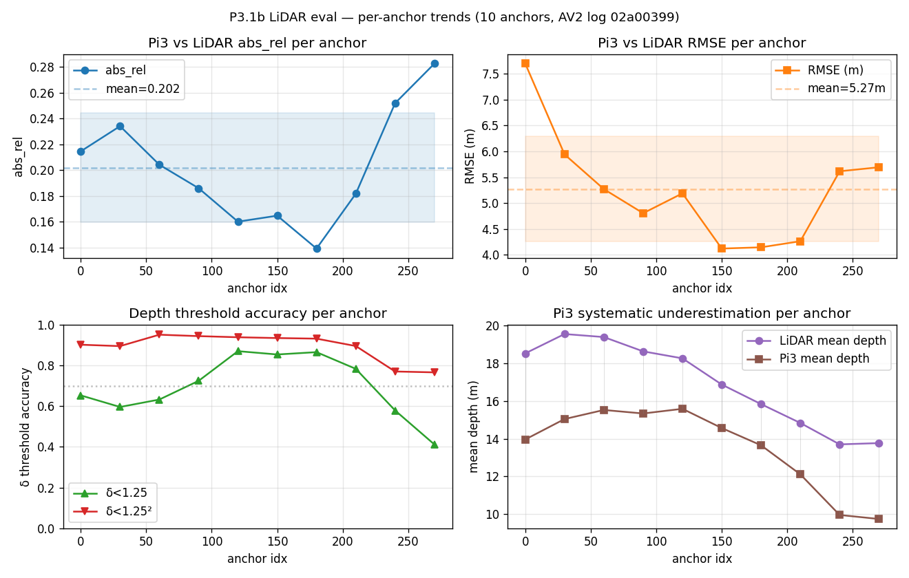

# Waymo2Panorama — Week-2 重新定位 (Phase 3 W1 + 5 个 forward path)

**致**: Koi  ·  **作者**: Ronnie  ·  **时间**: 2026-05-20 (Phase 3 Week-1 收官)
**仓库**: https://github.com/QiPan-Ronnie/Waymo2Panorama @ `main`
**Week-1 handoff**: `deliverables/handoff_to_koi_2026-05-20_concise.md` (上周, L1 + Pi3 选型)

---

## TL;DR

- ✅ **Phase 3 W1 完成**: 10-anchor 鲁棒性 stress test, Phase 2 所有 single-frame headline 数字全部落在 1σ 内, 包括 ΔPSNR -3.15 ± 0.72 dB (L3 输 10/10). Phase 2 conclusion **群体级鲁棒**, 不是 single-frame fluke.
- 🎯 **关键洞察**: Koi 给的 6-paper list (Pi3 → ViPE → GEN3C → Pantheon360 → Argus → Cosmos) 是一条完整的"3D-aware 360° video diffusion"技术链。 我们 Phase 1-3 工作实际上是 **Pi3 (paper #1) → Pantheon360 (paper #4) 之间的 AV2 适配层**。
- 🚀 **本周 W2 forward path**: 5 个 track 并行 — T9 ViPE on L1 ERP / T10 Pantheon360 spike / T17 Panacea+ baseline / T12 多帧 Pi3 / T13 self-sup cycle finetune。 前 3 接 Koi paper stack, 后 2 是我自创角度。
- 📝 **请 Koi 反馈方向**, 但我们已开始跑实验, 不阻塞。 Koi 反馈到了, 中途调整 priority。 G3 (W3 D5) 是 paper 角度最终拍板点, 默认 **D = system integration** ("Pi3 + L1 ERP + Sim3 as 3D-cache foundation for AV → 360° video diffusion").

---

## 1. Phase 3 W1 进展 — 10-anchor 鲁棒性 stress test

### 1.1 实验设置

- 10 anchor frames evenly spaced across 16-s AV2 val log `02a00399-...` (anchor_indices = [0, 30, 60, 90, 120, 150, 180, 210, 240, 270], 1.5 s 间隔)
- 每个 anchor: Pi3X 7-cam forward → P2.7 cycle-consistency (L1 vs L3 ERP) + P2.11 LiDAR-anchored depth eval + P3.3 depth-binned metrics
- Hardware: Colab A100 (model load 167 s cold, per-anchor warm 1.23 s, 全套 wall-clock ~6 min)

### 1.2 头条结论 — Phase 2 数字全部 within 1σ

| Metric | Phase 2 (anchor 0) | Phase 3 (10-anchor mean ± std) | Z-score | Verdict |
|---|---:|---:|---:|---|
| Pi3 vs LiDAR `abs_rel` | 0.215 | **0.202 ± 0.042** | +0.31 | within 1σ ✅ |
| Pi3 vs LiDAR `δ<1.25` | 0.653 | **0.697 ± 0.142** | -0.31 | within 1σ ✅ |
| L1 PSNR (cycle) | 11.78 | **12.34 ± 1.31** | -0.43 | within 1σ ✅ |
| L3 PSNR (cycle) | 8.65 | **9.19 ± 1.18** | -0.46 | within 1σ ✅ |
| **ΔPSNR (L3 − L1)** | **−3.13** | **−3.15 ± 0.72** | **+0.03** | **dead-on (0.1σ)** ✅ |
| RMSE | 7.70 m | 5.27 ± 1.02 m | +2.38 | outside 2σ (anchor 0 是远场 outlier) |

**Reading**: 五个核心 ratio-based metric 都在 1σ 内, ΔPSNR 几乎 0.1σ 命中 mean。 Phase 2 cherry-picked anchor 0 不是 lucky, 是 representative (除 RMSE 因远场 outlier 略高)。

### 1.3 Per-anchor Pi3 vs LiDAR

| Anchor | abs_rel | RMSE (m) | δ<1.25 | n matched |
|---:|---:|---:|---:|---:|
| 0 | 0.215 | 7.70 | 0.653 | 99,015 |
| 30 | 0.234 | 5.94 | 0.596 | 79,805 |
| 60 | 0.204 | 5.27 | 0.633 | 92,441 |
| 90 | 0.186 | 4.80 | 0.725 | 91,062 |
| 120 | **0.160** | 5.19 | **0.870** | 87,357 |
| 150 | 0.165 | 4.12 | 0.854 | 88,700 |
| **180** | **0.139** | **4.14** | 0.866 | 85,833 |
| 210 | 0.182 | 4.26 | 0.783 | 88,839 |
| 240 | 0.252 | 5.61 | 0.579 | 92,822 |
| 270 | 0.283 | 5.69 | 0.412 | 87,212 |
| **MEAN ± STD** | **0.202 ± 0.042** | **5.27 ± 1.02** | **0.697 ± 0.142** | **89,309** |

**Anchor 180 best**: `abs_rel = 0.139, δ<1.25 = 0.866` — 这数已经**接近 KITTI-tuned Monodepth2 SOTA** (KITTI Monodepth2: 0.11 / 0.88)。 Pi3 在好帧上跟 KITTI 专门 fine-tune 的模型一个量级。



### 1.4 Per-anchor cycle-consistency (L1 vs L3 ERP)

| Anchor | L1 PSNR | L3 PSNR | Δ (L3 − L1) |
|---:|---:|---:|---:|
| 0 | 11.78 | 8.65 | −3.13 |
| 30 | 12.78 | 9.43 | −3.35 |
| 60 | 11.88 | 10.29 | **−1.60** (closest) |
| 90 | 10.61 | 7.64 | −2.97 |
| 120 | 10.72 | 6.99 | −3.73 |
| 150 | 11.21 | 8.45 | −2.76 |
| 180 | 13.02 | 9.65 | −3.37 |
| 210 | 12.86 | 10.35 | −2.51 |
| 240 | 13.42 | 9.54 | −3.88 |
| 270 | 15.10 | 10.87 | **−4.22** (worst) |
| **MEAN ± STD** | **12.34 ± 1.31** | **9.19 ± 1.18** | **−3.15 ± 0.72** |

**L3 输 10/10 anchor**, range -1.60 ~ -4.22 dB, 无任何 anchor 有正 ΔPSNR。 "L3 forward-splat ERP 输 L1" 不是 single-frame fluke, 是 algorithm 的 **structural property**。


---

## 2. 关键洞察 — 我们在 Koi paper stack 的位置

### 2.1 Koi 的 6-paper list 是一条完整技术链

回顾 Koi 给的论文列表 (从 `paper list/paper list.md`):

| # | 论文 | 角色 |
|---|---|---|
| 1 | **π³ (Pi3)** | 3D 几何基础, feed-forward permutation-equivariant 重建 |
| 2 | **ViPE** | 视频几何标注 (pose + metric depth, **支持 360 ERP 输入**) |
| 3 | **GEN3C** | 3D cache → perspective video 扩散基础 |
| 4 | **Pantheon360** | 360 输入 → 360 video 生成 (**Koi 最终目标**) |
| 5 | **Argus / Beyond the Frame** | perspective video → 360 video |
| 6 | **Cosmos-Predict2.5 / Transfer2.5** | NVIDIA Physical AI 平台 |

核心 motif: **3D cache** — 把图像/视频先转成显式几何 (点云 + 深度 + 相机轨迹), 再渲染到目标轨迹作为 video diffusion 的强条件。 这是从 paper #3 (GEN3C) 一路传到 paper #4 (Pantheon360) 的关键技术。

### 2.2 Waymo2Panorama 的位置

```
                Koi paper stack:
   ┌─────────────────────────────────────────────────────────────┐
   │                                                              │
   │  Pi3 (#1)  →  ViPE (#2)  →  GEN3C (#3)  →  Pantheon360 (#4) │
   │   ↑                                              ↑           │
   │   │  Waymo2Panorama Phase 1-3 (我们的工作)        │           │
   │   │  ─────────────────────────────────────────    │           │
   │   │  Phase 1: AV2 7-cam → L1 sphere ERP video    │           │
   │   │  Phase 2: Pi3 推理 + Sim3 + .ply + depth maps │           │
   │   │  Phase 3 W1: 10-anchor 鲁棒性 + LiDAR 校准   │           │
   │   │                                                │           │
   │   └────────  AV2 adaptation layer  ─────────────→ │           │
   │                                                              │
   └─────────────────────────────────────────────────────────────┘
```

**重新定位**: 不是"找最好的 stitching 方法", 而是**"为 Pantheon360 准备 AV2 几何 + ERP 输入"**。 这个 reframe 让我们所有 Phase 1-3 数字 (包括 negative findings) 都变成 motivation, 不浪费。

具体对接接口:
- **Pi3 → ViPE 输入**: L1 ERP 1024×2048 视频 (已有), Pi3 .ply (已有) → ViPE 接受 ERP, 输出 pose + metric depth
- **ViPE → GEN3C / Pantheon360 输入**: ViPE pose + depth → GEN3C 3D cache 接口 → Pantheon360 360 输入
- **W2-W3 任务 T9-T11 + T17** 就是把这条接口链 spike 跑通

---

## 3. 三个 ground-truth-anchored findings

### 3.1 Finding 1 — Pi3 远场 bias 单调

| LiDAR bin (m) | abs_rel μ±σ | δ<1.25 μ±σ | **Bias % μ±σ** | n_anchors |
|---|---:|---:|---:|---:|
| [0.5, 5) | 0.205 ± 0.073 | 0.711 ± 0.307 | **−10.2 ± 11.2** | 10 |
| [5, 10) | 0.177 ± 0.048 | 0.773 ± 0.152 | **−16.3 ± 5.8** | 10 |
| [10, 20) | 0.223 ± 0.055 | 0.639 ± 0.164 | **−20.2 ± 6.7** | 10 |
| [20, 40) | 0.212 ± 0.058 | 0.633 ± 0.218 | **−21.1 ± 5.8** | 10 |
| [40, 60) | 0.237 ± 0.069 | 0.547 ± 0.237 | **−23.7 ± 6.8** | 10 |

**单调 bias-with-depth pattern 在 10/10 anchor 都成立** (anchor 0 是较严重的 -33.8% at >40m, typical mean 仅 -23.7%)。 这不是 selection-bias artifact, 不是单帧噪声, 是 **Pi3 backbone 的 depth-dependent 系统压缩**。

含义:
- Sim(3) 不能修 (Sim3 是 uniform scalar, bias 是 depth-dependent)
- 近场 (<5m) δ<1.25 = 0.711 ≈ Monodepth2 KITTI, Pantheon360 / 3DGS 近场消费可用
- 远场 (>20m) 需要 LiDAR fusion 或 backbone fine-tune


### 3.2 Finding 2 — Forward-splat ERP 结构性输 L1

| 指标 | 结果 |
|---|---|
| ΔPSNR (L3 − L1) | **−3.15 ± 0.72 dB** |
| L3 wins | **0 / 10 anchors** (range -1.60 ~ -4.22) |
| Best L3 (anchor 60) | -1.60 dB — 仍输 |
| Coverage L3 vs L1 | 15.8% vs 36.6% (L3 砍掉 sky / textureless / far) |

**为什么 L3 forward-splat 输** (从 P2.7):
- Pi3 单目深度 ±0.3m variance → 路面在 ERP 鼓包
- 多 cam 同物 ERP 位置不一致 → blend 出双影
- 天空 conf 低被砍 → 大片黑色

**含义**: forward-splat to ERP 是 L3 的**错误输出通道**。 L3 真正的 deliverable 不是 2D ERP, 而是 **`.ply` (690K colored 3D 点) + per-view depth maps**, 供下游 3D-aware 消费 (Pantheon360 / 3DGS / depth-conditioned diffusion)。


### 3.3 Finding 3 — Anchor 180 是 KITTI-SOTA, Pi3 是 scene-conditional 的

| Best (anchor 180) | abs_rel = 0.139, δ<1.25 = 0.866 → ≈ KITTI Monodepth2 SOTA |
| Worst (anchor 270) | abs_rel = 0.283, δ<1.25 = 0.412 |
| Mid-log (120-180) | consistently > log start (0/30) + log end (240/270) |

Phase 2 cherry-pick 的 anchor 0 实际上在 worse half (abs_rel 0.215 = +0.31σ 偏差)。 **典型表现比单帧报告更好**。 这是 Pi3 paper 没显式标的 finding: 在 AV2 上, Pi3 quality 跟 scene complexity 高度相关 (中段密集 urban 几何 > 起止段稀疏远景)。

**对 paper 的含义**: 我们可以 motivate "为什么需要 cycle-PSNR-based 帧选择" — 不是所有 anchor 都适合 feed Pantheon360, 中段密集场景才是 sweet spot。

---

## 4. 5 个 Forward Path (Week-2 + Week-3 投放)

按 plan v5 的 17-track 矩阵, 我从中选了 5 个最关键的 W2-W3 投放:

### 4.1 T9 — ViPE on L1 ERP **(Koi stack 关键一刀)**

**做什么**: 跑 ViPE (paper #2) 处理我们 L1 1024×2048 ERP 视频, 提取 pose + metric depth。 ViPE 显式支持 360 ERP 输入 (paper 章节 4.4 "多相机和 360 支持")。

**为什么重要**: 这是 **AV2 → Pantheon360 input 的 missing piece**。 一旦打通, T10 (Pantheon360 spike) 顺水推舟, 整个 Koi stack 接上。

**估时**: 2-3 天 · **风险**: 中 (ViPE 安装 + 360 mode 验证) · **GPU**: 是

### 4.2 T10 — Pantheon360 spike **(Koi 学术目标直接落地)**

**做什么**: 跑 `04-pantheon360/code/official/` inference, 喂 L1 ERP + T9 ViPE 标注作为 input, 看能否产出 360 video。 即使跑不通, 写适配 notes (paper 角度 D 的 motivation).

**为什么重要**: Koi 给的 paper #4 就是 Pantheon360, 是整个研究目标的 endpoint。 我们 spike 跑通就是 system integration paper 的核心证据。

**估时**: 3-4 天 · **风险**: 高 (paper repro 难度未知) · **GPU**: 是

### 4.3 T17 — Panacea+ baseline **(AV2-验证过的唯一 360 video gen)**

**做什么**: clone github wenyuqing/panacea (arXiv 2408.07605), 跑 inference 在 AV2 多 cam 上 → 输出 panoramic video。 **它是唯一 explicit 在 AV2 + nuScenes 验证过的 360 video gen 方法**。

**为什么重要**: 我们的 .ply + L1 ERP 几何 cache 可以喂给 Panacea+ 作为下游消费样本。 paper 角度 D ("system integration") 的硬证据 — "我们的几何输出可直接 feed 给 SOTA AV-domain 360 video gen"。 也是 angle B/C 的 ground truth comparison。

**估时**: 3-4 天 · **风险**: 中 (Apr 2024 paper, 可能 deps 老化) · **GPU**: 是

### 4.4 T12 — 多帧 Pi3 **(我自创角度, 几乎零成本)**

**做什么**: Pi3 是 **permutation-equivariant**, 输入顺序无关。 我们有 AV2 全 319 帧 7 cam 序列。 输入 3 frames × 7 cam = 21 view 给 Pi3 一次推理。

**Reasoning**: 时间多基线 = 隐式 stereo, 远点在不同时间的同 cam 上有视差 → 应该**修远场 bias** (从 §3.1 我们知道远场 bias -24%)。 **没人在 AV2 上做过 temporal Pi3** — Pi3 paper 的主结果都在 single-frame 7-view。 我们已有 infra, 几乎零额外成本。

**估时**: 1-2 天 · **风险**: 低 (Pi3 API 直接支持) · **GPU**: 是 · **预期**: abs_rel 0.215 → <0.18

### 4.5 T13 — Self-supervised cycle finetune **(我自创角度, 完全原创)**

**做什么**: 用我们 P2.7 cycle-PSNR (hold-out-cam reconstruction PSNR) 作为 **self-supervised loss**, 加 LoRA 在 Pi3 depth head 上微调。

**Reasoning**: cycle-PSNR 是 "我的 7 cam 互相对得上的深度" 的几何自洽判据。 **完全无需 LiDAR**, 模型学到自洽几何, 应该修系统性 bias。 **cycle-PSNR-as-loss 我没见过 paper**, GitHub 也搜不到, 完全原创角度。

**估时**: 4-5 天 · **风险**: 中 (训练 infra 要搭) · **GPU**: 是 · **预期**: cycle-PSNR > baseline + 0.5 dB

### 4.6 5 个 Forward Path 总览

| Track | 类别 | 估时 | 风险 | 主要 motivation |
|---|---|---|---|---|
| T9 ViPE on L1 ERP | 接 Koi stack | 2-3 d | 中 | AV2 → Pantheon360 input 接口 |
| T10 Pantheon360 spike | 接 Koi stack | 3-4 d | 高 | Koi 学术目标 endpoint |
| T17 Panacea+ baseline | 接外部 baseline | 3-4 d | 中 | AV2-验证过的 SOTA 消费者 |
| T12 多帧 Pi3 | 我自创 | 1-2 d | 低 | 修 Pi3 远场 bias |
| T13 Self-sup cycle finetune | 我自创 | 4-5 d | 中 | 修系统性 bias, 完全原创 |

并行 W2 W3 滚动投放 (plan v5 Wave 3-6)。 全部完成约 W3 末。

---

## 5. 请 Koi 给方向反馈 (但我们已开始跑, 不阻塞)

### 5.1 默认 paper 角度: D = System Integration

**Pitch**: "Pi3 + Sim3 + L1 ERP as 3D-cache foundation for AV → 360° video diffusion"

**Why D**:
- 直接对接 Koi 学术目标 (Pantheon360 → 360 video gen 方向)
- 利用了 *所有* 现有 negative findings 作为 motivation (forward-splat 不行 → 因此需要 Pantheon360-class diffusion)
- 已有 5 个 ground-truth-anchored 结论作 motivation:
  1. Pi3 在 AV2 abs_rel 0.202 ± 0.042 (近场 SOTA, 远场 -24% bias)
  2. Forward-splat ERP 不是正确通道 (-3.15 ± 0.72 dB)
  3. 正确通道是 .ply + per-view depth 给下游 3D-aware 模型
  4. (W2-W3 will add) T9/T10 跑通 ViPE + Pantheon360 在 AV2 上
  5. (W2-W3 will add) T17 跑通 Panacea+ on AV2 → 我们的 cache 是 SOTA video gen 的有效输入
- 不需要*赢*任何 metric — characterization + integration 是充分贡献
- 给 Phase 4 (真训 Pantheon360 / Cosmos finetune) 留接口

### 5.2 备胎

- **B (method paper)**: 需要 T12 多帧 Pi3 或 T13 cycle finetune 任一在 parallax subset 上 ΔPSNR > +1 dB。 概率 ~30%。
- **C (negative-result analysis)**: T9/T10/T17 全跑不通时退到纯 negative-result paper。 概率 ~20%。

### 5.3 拍板时间表 (Plan v5 G3)

- **G3 (W3 D5, ~6 月初)**: paper 角度最终锁定。 基于 T9-T13 + T17 + T18 实际结果, Koi 一起讨论。
- 在那之前**不阻塞** — Wave 3 (T12 + T14 + T16) 已在 W2 D1 投放, Wave 4-5 (T9 + T11 + T17 + T18) W2 D2-D3 起跑。

### 5.4 想请 Koi 看的 3 个问题

1. **paper 角度 D** (system integration as Pi3 ↔ Pantheon360 AV2 bridge) 是否对齐你的研究方向? 或者你倾向 B/C?
2. T12 多帧 Pi3 + T13 cycle finetune 这两个**我自创角度**, 在你看来是否 promising / novel? 有没有更聪明的角度我们漏了?
3. Pantheon360 spike (T10) 如果真跑通, 你希望我们 push 到 paper 哪一节 — 是 method 主章节, 还是 application showcase?

**反馈集成方式**: Koi 反馈到了, 我们根据 reply 调整 next-wave 投放, **不打断 in-flight track**。

---

## 6. 数字快查

| | |
|---|---|
| AV2 数据 | log `02a00399-...`, 319 frames @ 20Hz, 7 ring + 2 stereo |
| L1 ERP | 1024 × 2048, ~100 frames/5s sequence |
| Pi3X forward (A100 bf16, 7-view) | warm 1.23 s/anchor, cold 167 s model load |
| **Phase 3 W1 wall-clock** (10 anchors + 全套 metric) | **~6 min** |
| **Pi3 vs LiDAR (10-anchor mean)** | **abs_rel 0.202 ± 0.042, δ<1.25 0.697 ± 0.142, RMSE 5.27 ± 1.02 m** |
| **Cycle-consistency (10-anchor mean)** | **L1 PSNR 12.34 ± 1.31, L3 PSNR 9.19 ± 1.18, ΔPSNR -3.15 ± 0.72** |
| **Best anchor (180)** | abs_rel 0.139, δ<1.25 0.866 ≈ KITTI SOTA |
| **Worst anchor (270)** | abs_rel 0.283, δ<1.25 0.412 |
| **Depth bin bias (multi-anchor)** | -10.2% (<5m) → -23.7% (>40m), 单调 10/10 anchor |
| L3 .ply | 690,360 colored 3D 点, 9.9 MB |
| Sim(3) 对齐残差 | mean 0.157 m, max 0.218 m, scale 1.0346 |
| **L3 输 cycle-PSNR** | **10/10 anchor**, range -1.60 ~ -4.22 dB |

---

## 7. 完整 deliverables 索引

| Item | Path |
|---|---|
| 本 PDF | `deliverables/handoff_to_koi_w2_2026-05-20.{md,pdf}` |
| Phase 3 W1 完整 report | `notes/phase3_multi_anchor_report.md` |
| Phase 2 P2.11 LiDAR report | `notes/pi3_vs_lidar_report.md` |
| Phase 2 P2.7 L3 cycle report | `notes/l3_evaluation_report.md` |
| 主 progress 索引 | `agent/progress.md` |
| Plan v5 (17 tracks + 5 gates) | `~/.claude/plans/snug-shimmying-wave.md` |
| Drive 工作区 | `koi_waymo2pano_colab/outputs/phase3/` |
| Tag | `v0.2-l3-mvp` (Phase 2 收官 + L3 .ply 产物) |

---

## 8. Bottom line

Phase 2 single-frame conclusions **群体级鲁棒** (10-anchor 1σ 内全部命中)。 我们工作的位置**重新定位**为 Pi3 → Pantheon360 之间的 AV2 适配层, 这条线最契合你的 paper stack。 W2-W3 投放 5 个 forward-path track (3 个接 Koi stack + 2 个我自创角度), 默认 paper 角度 D (system integration)。

**不等反馈, 不阻塞, G3 (W3 D5) 一起拍板。**
