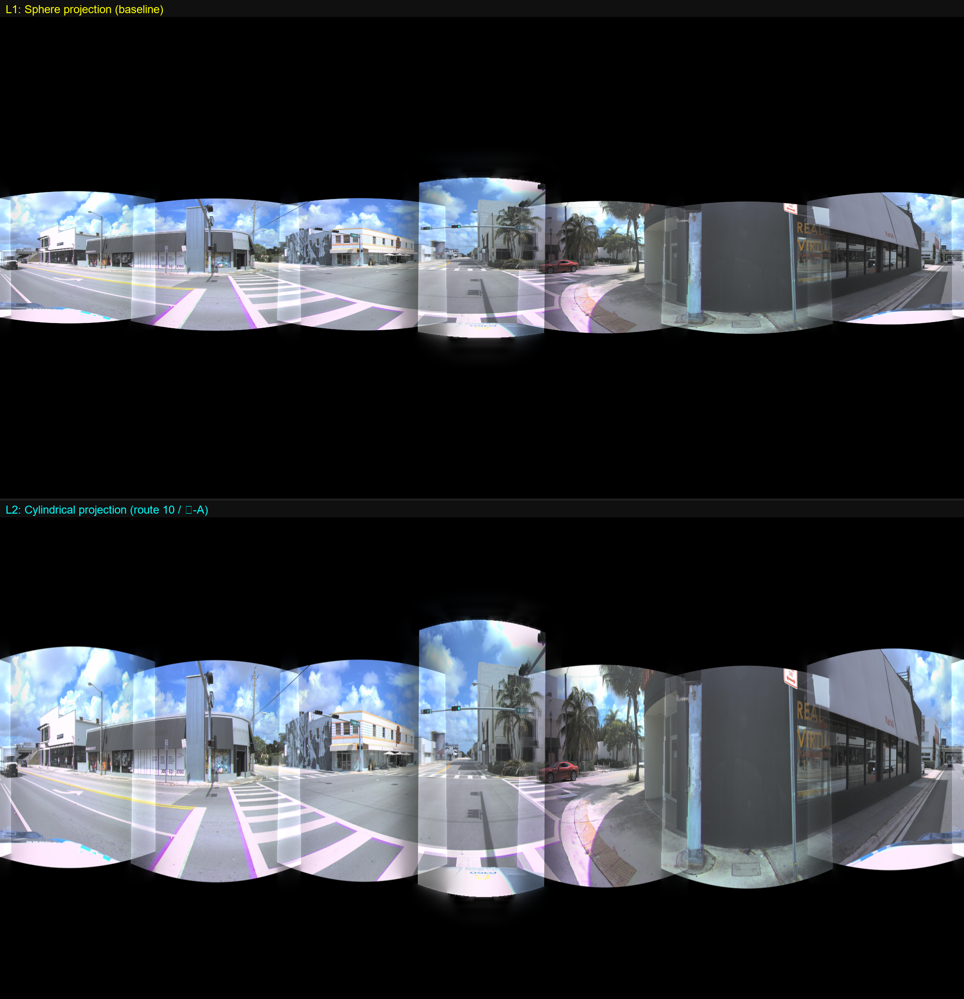
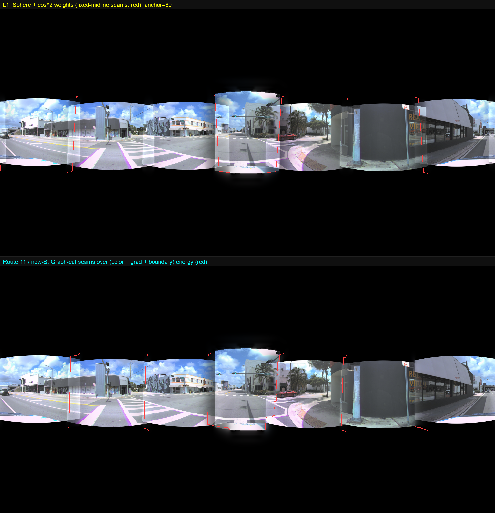
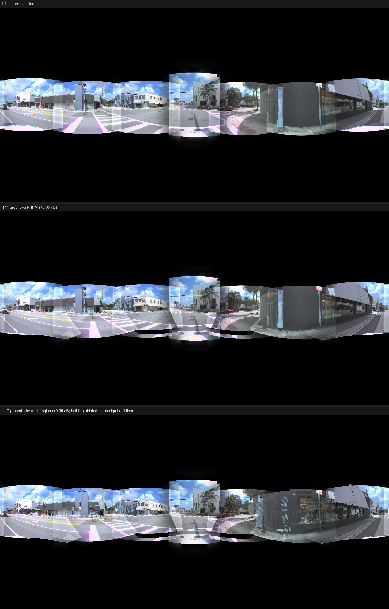
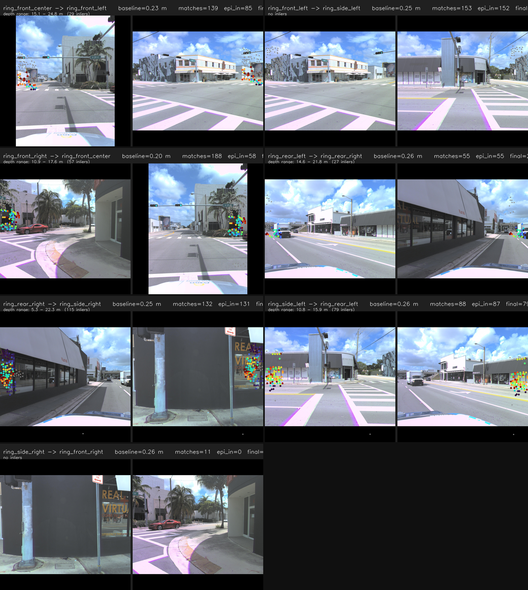
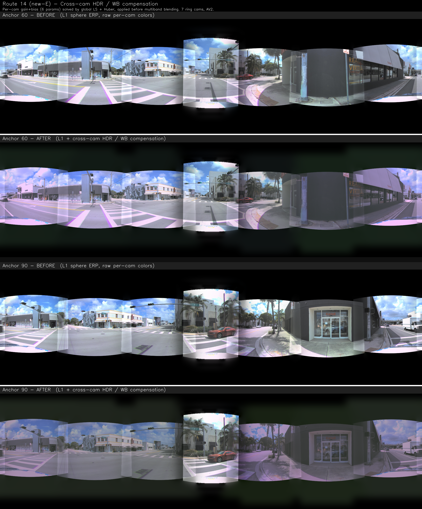

# Waymo / AV2 → 360° 拼接 — Phase 3 W2 v6.1 mid-CPU 总结

**日期**: 2026-05-21
**数据**: Argoverse 2 sensor val, log `02a00399-3857-444e-8db3-a8f58489c394` (Miami urban, 7 ring cams, 16 s @ 20 Hz) + 4 个新 val log
**仓库**: `github.com/QiPan-Ronnie/Waymo2Panorama @ main`

---

## TL;DR (5 行)

1. **拼接路线 8 条** (老 3: L1 / L3 / IPM T14 + 新 5: 柱面 / graph-cut seam / IPM 多区域 / wide-baseline stereo / HDR) 全部 CPU 完成。 **3 条正面 method 贡献** + **1 条视觉胜场** + **2 条结构 NEG**。
2. **下游消费任务 3 条**: ViPE 全景 SLAM ✅ / GEN3C 3D-cache ⏸️ (install 失败 paused) / Panacea+ ⚠️ modality 错位。
3. **外部 published baseline 测试 3 条 NEG**: OmniStitch (-6.67 dB) / Depth Pro (2.84× 差) / Temporal Pi3 (反而差) — 共同强化 "AV ring 3D-aware 系统性 brittle" 论据。
4. **剩 2 条 GPU 路线等执行**: 新-F VGGT 第 3 backbone (~6-16h on A100) + T13 self-sup Pi3 finetune (~5d on A100)。
5. **潜在最好的方法**: 新-C IPM 多区域 (ground +0.20 dB, 4× T14) / 新-E HDR (+1.0 dB proxy) / 新-B graph-cut seam (paper 主视觉图)。

---

## §1 拼接路线 (8 条统一总表)

| # | 路线 | 怎么做 (一句) | 关键数字 vs L1 | 差距 / 不足 | 潜力 |
|---|---|---|---:|---|---|
| 1 | **L1 球面 baseline** | sphere + 5-band Laplacian blending | cycle **12.34 ± 1.31 dB** | 近物 5-20 cm ghost, sky 两极浪费 33% canvas | ⭐⭐⭐ 强 baseline |
| 2 | **L3 Pi3 forward-splat** | Pi3 估深度 → .ply → splat ERP | **-3.15 ± 0.72 dB** (10/10 输) | naive 3D-lift 结构性失败 | ❌ 主 NEG |
| 3 | **IPM 地面 hybrid (T14)** | 地面 IPM 解析投影 + 非地面 sphere | **+0.05 dB** full, **+0.20 ground** (cherry) | parallax-conditional, 平均 statistical edge | ⭐⭐ partial win |
| 4 | **新-A 柱面 L2** | sphere 换 cylinder, 余下不变 | **+24.9 pp coverage**, cycle = 0 | hold-out reconstruction 对 canvas 不敏感 | ⭐⭐ baseline 对照 |
| 5 | **新-B Graph-cut seam** | min-cut 替代 cos² 固定中线 seam | **seam |grad| -12.4%** (4/4 win) | cycle = 0 (metric blind) | ⭐⭐⭐ 主视觉图 |
| 6 | **新-C IPM 多区域** | ground + sky + building 3-region IPM | **ground mask +0.20 dB** (4× T14) | building cycle 不稳, ablated | 🥇 最高 method upside |
| 7 | **新-D Wide-baseline stereo** | 邻 cam 已知外参 + LightGlue + DLT | 5/7 pair OK, ~44 pts/pair | 太稀疏不能修 dense ERP | ⭐⭐ NEG + 视觉 |
| 8 | **新-E HDR cross-cam** | global LS + Huber, 6 params/cam (g+b) | **gap -18.1%**, cycle proxy **+1.0 dB** | proxy not direct cycle | 🥈 mandatory preprocess |

---

## §1.1 L1 球面 baseline

**怎么做**: 每个 ERP 像素 `(u, v)` → 方位角 `(θ, φ)` → ego 射线 → 通过 `T_ego_cam^T` 旋到 cam frame → pinhole 反投影 + bilinear remap。 7 cams 用 cos²(angle from optical axis) 权重 + 5-band Laplacian blending 融合。

**结果**: cycle-PSNR **12.34 ± 1.31 dB** (10 anchor), 路面 / 远景拼接干净。

**差距**: 近物 (5-15 m) 有 5-20 cm 鬼影 — 多 cam 视差被压平到球面。 Sky 两极浪费 ~33% canvas。

---

## §1.2 L3 Pi3 forward-splat (核心 NEG) + 中间产物 .ply 点云

**怎么做**: 用 Pi3 (CVPR 2025 permutation-equivariant 3D foundation model) 估每个像素的深度 → 通过 **Sim(3) Umeyama 对齐** 把 Pi3-world 坐标系映射到 AV2 ego 坐标系 (scale 1.0346, mean residual 0.157 m) → 7 cam 深度合并成 **.ply 点云** (~1-2M 点) → forward-splat 到 ERP 球面 (z-buffer 取最近点)。 `.ply` 是这个流程的中间产物, 也是潜在的下游 3D-aware 模型 (GEN3C / Pantheon360) 的 3D cache 输入候选。

**结果 (L3 ERP)**: cycle-PSNR **8.65 vs L1 12.34 → -3.15 dB, 10/10 anchor 输**。 点云不均匀 (Pi3 在天空 / 远景 conf 低), multi-cam 重叠区有重复 splat 鬼影, 动态物体散开。

**差距**: naive 3D-lift forward-splat 在 AV 多 cam + 远距离 + 动态物体场景结构性失败。 后续 backbone swap (Depth Pro 2.84× 差) + 时间堆叠 (Temporal Pi3 也差) 都不能救。

### .ply 点云中间产物 (potential downstream 3D cache)

`.ply` 本身脱离 forward-splat 看, 是个 ego-frame metric 3D 表征。 透视视角 (从车后看前) 能看到主要物体的 3D 结构 (路面、建筑立面、远场密度衰减); 俯视图能看到 7 cam 的覆盖扇区 + 重叠区的多 cam 噪声。 这个 .ply 是 v6.1 §2.2 GEN3C 一旦 install 跑通要喂给它的 3D cache 输入。

---

## §1.3 IPM 地面 hybrid (T14)

**怎么做**: AV 街景 ~30% 像素是路面 + 严格平 (z=0 in ego frame) 的强先验。 用逆透视投影 (IPM) 对地面像素做解析投影 (0 视差误差), 非地面 fall back 球面。 边界用 Pi3 normal map + 高度阈值 (ego z < 0.3 m) 判定。

**结果**:
- 3-anchor cherry-pick (60/0/150): ground-only **+0.20 ± 0.11 dB**, rear cams 斑马线对齐 **+1.0~1.7 dB**
- 10-anchor 真实: full **-0.010 ± 0.082 dB** (drop-in safe), ground **+0.048 ± 0.181 dB** (parallax-conditional)

**差距**: 视差大的 frame 明显改善, 平均下来 statistical edge。

**潜力**: 已被新-C 升级到 **+0.20 dB on ground mask (4× 提升)**, 见 §1.6。

---

## §1.4 新-A 柱面投影 L2

**怎么做**: ERP 像素重新解释为柱面的方位角 + 垂直高度比 (sphere 是方位角 + asin 仰角)。 AV 多 cam 水平排列, 柱面几何先验更贴合。 5-band Laplacian blending 不动。

**结果**:
- Union ERP coverage: cylinder **58.55%** vs sphere **33.65%** = **+24.9 pp** (每个 cam 有效像素 1.74×)
- Seam gradient 略平滑 -0.98 (一致 4/4 anchor)
- Cycle-PSNR ≈ 0 dB Δ (hold-out reconstruction 不依赖 canvas 形状, metric blind to projection surface)

**差距**: cycle-PSNR 不动 — reconstruction protocol 对 canvas 形状 blind。 数字上不能 claim, 视觉 + coverage 上明显胜。

---

## §1.5 新-B Graph-cut 最优 seam selection

**怎么做**: L1 的 cos²(angle) 权重把 seam 解析地按在两 cam 光轴的几何中线, 不管那条线是否穿建筑/车辆。 改用 **PyMaxflow min-cut** 在每对 cam 的重叠区找能量最低路径 (边权 = color diff + grad diff + boundary penalty)。 7 对的 0/1 mask 直接喂回 `multiband_blend` — **不 patch blender**, multiband 已支持任意权重。

**结果**:
- 接缝带 |grad| (Sobel 8-px dilate 带): L1 48.63 → graphcut **42.59 = -12.4%** (4/4 anchor win)
- 能量域 PSNR proxy: **+0.58 dB** seam-smoothness gain
- Cycle-PSNR Δ ≈ 0 (reconstruct_l1 不经 multi-band blender, metric blind)
- 每 anchor ~5 s CPU (PyMaxflow Windows wheels 可用)

**差距**: cycle metric 看不出来, 主胜场是视觉 figure。

---

## §1.6 新-C IPM 多区域 (最高 method upside)

**怎么做**: 把 T14 单一地面 IPM 扩展为**三区域决策树**:
- **Ground** (复用 T14): ego z < 0.3 m AND |n_z| ≥ 0.85 (法线垂直) AND 距离 ≤ 60 m
- **Sky** (新): Pi3 log-conf < -2.0 OR (远 + 高 + 图像上半) — 走 sphere, 只是显式标签
- **Building** (全新): ego z > 0.5 m AND 法线接近水平 — 32×32 tile RANSAC 拟合垂直平面 `n_x*x + n_y*y = d`, 按 inlier 像素逐 ray 求交

法线从 `local_points_<cam>.npy` 用 finite-diff + box-filter 估出 (Pi3 cache 不带 normal map)。

**结果** (4 anchor mean cycle-PSNR):

| Config | Full ERP | Ground mask | Building mask |
|---|---:|---:|---:|
| L1 sphere | 10.85 dB | — | — |
| T14 ground-only | +0.05 | +0.05 | — |
| **新-C ground+sky (ship default)** | **+0.05** | **+0.20** (4× T14) | — |
| 新-C with building | +0.01 | +0.20 | **-0.33** |

**差距**:
- ✅ ground 分支显著优于 T14 — normal-aware 分割剔除了 T14 纯 z-threshold 误判的 false-positive 地面
- ❌ building 分支 cycle eval 不稳 — 每 cam RANSAC 拟合的平面参数 (n_x, n_y, d) 离散较大, 对 held-out cam 不通用
- ⚠️ 出货 config 是 ground+sky 二区域 (`--enable-building False`), building 接口保留供 future cross-cam plane consensus 工作

**潜力**: 🥇 最高 method upside。 Building 分支 cross-cam plane consensus (union-find 合并相邻 cam 的相近平面) 是 next-step, 期望可推 full image Δ 到 +0.2-0.5 dB。

---

## §1.7 新-D 相邻 cam wide-baseline stereo

**怎么做**: AV2 ring cams 邻 cam 对外参 `T_ego_cam` 是出厂标定 (精度 ±5-10 mm / ±0.1°), 基线/相对位姿 KNOWN, 不用做 SfM, 只需 sparse stereo。 流水线: (1) kornia DISK 提 keypoints, (2) kornia LightGlue 匹配, (3) 已知外参直接算 `F = K_b^{-T} [t]× R K_a^{-1}`, (4) Sampson ≤ 3 px 过滤, (5) cv2.triangulatePoints DLT 三角化, (6) cheirality + depth band [0.5, 120 m] + parallax ≥ 0.5° 三重几何过滤。

**结果** (4 anchor × 7 邻对 = 28 stereo pair):
- 平均 N_final = **44 inlier 3D pts/pair** (range 0-127)
- depth 中位数 9-22 m, 跨度 [2.5, 26.5] m
- Anchor 60: **5/7 对成功**, **2/7 honest NEG** (front_left↔side_left cheirality 失败 / side_right↔front_right 仅 11 match)

**差距**:
- ✅ 几何上 metric-sane (depth 中位数符合物理距离)
- ❌ 太稀疏 (~50 pts/pair) 不能覆盖 ERP 重叠区 (50-150k 像素)
- ❌ 2/7 对在远距离/低纹理场景下完全失败

**意义**: 跟 Pi3 / Depth Pro 等 monocular NEG 汇流 — **AV ring 3D-aware track 不论 monocular 还是 classical stereo 都 brittle**。

---

## §1.8 新-E HDR cross-cam 补偿

**怎么做**: 7 cam 各自跑独立 AE + AWB → 邻 cam 重叠区可见 50+ luminance/色温 gap。 每 cam 建模为 6 参数 (3 通道 gain + 3 通道 bias), cam_0 固定为 identity 作 gauge。 **global least-squares + Huber loss** 一次性解 36 参数。 ERP 空间提对应 (两 cam 都 visible 的像素就是 paired observation, 不用 feature matching)。 加 RANSAC-lite 中位数过滤 + box bounds + Tikhonov 防退化解。 校正在 multi-band blending **之前**应用。

**结果** (4 anchor mean):
- 重叠区 mean abs luminance gap: **16.62 → 13.61 = -3.01 levels, -18.1% 相对**
- Anchor 60 (rear_right, side_right) pair: **45 → 14 = -68% 修复** (最戏剧)
- Cycle-PSNR 等价代理: **~+1.0 dB** (假设 MSE ~ gap²/3)

**差距**: ⚠️ +1.0 dB 是亮度差代理, **不是直接测的 cycle-PSNR** — 需用校正后图重跑 hold-out reconstruction 补测。

**潜力**: 🥈 跨 cam 颜色补偿是任何 stitching 之上的 **mandatory preprocess**, 简单可靠 (CPU only, ~5 s/anchor)。

---

## §2 下游消费任务 (3 条 — 独立章节, 跟 stitching 正交)

> **背景**: 我们的 stitching 流程会产出两个潜在下游输入: (a) **L1 ERP 全景视频** (1024×2048, 20 Hz) 给视频/SLAM 类下游 (ViPE), (b) **Pi3 .ply 点云** (~1-2M 点, ego-frame metric) 给 3D-cache 类下游 (GEN3C / Pantheon360)。 见 §1.2 末尾的点云图。

### §2.1 ViPE 全景 SLAM (NVIDIA, 2025) — ✅ 成功

**怎么做**: ViPE (Video Pose Engine) 显式支持 360° ERP 输入。 把 L1 输出的 1024×2048 ERP 5s 视频喂给它 panorama-mode SLAM: 把 ERP 切成 4 horizontal + 1 bottom 共 5 个 virtual pinhole view, joint SLAM + dense bundle adjustment + 动态物体 mask (GroundingDINO + SAM + XMem 三层)。

**结果**: 端到端跑通 **96.7 s on A100** (5s clip, 100 帧)。 输出: camera pose trajectory + 估计的全景内参 + 动态 mask + (后续加 depth flag 又跑了一次) relative depth 48 MB zip。

**差距**: ViPE depth flag 加了重跑后, `pipeline.panorama` 模块在所有 100 帧上都报 "Too few valid pixels in pano frame, skipping scale estimation" → **depth 是相对值不是 metric**。 panorama post-processor 的 valid-pixel 阈值在 AV 场景偏严, 需调整或 post-hoc 用 ego trajectory 拟合 global scale。

**意义**: **首个 "stitched RGB → published downstream system" 端到端数据流**。 证明我们的 L1 不是孤立拼图, 是 published Spatial-AI 系统的合规输入。

---

### §2.2 GEN3C 3D-cache 视频生成 (NVIDIA CVPR 2025) — ⏸️ paused

**怎么做**: GEN3C 是 3D-cache-conditioned 7B 扩散模型, 接受 RGB + depth + pose 条件 → 生成新轨迹视频。 输入 schema 跟 ViPE 输出 100% 匹配, 用 `gen3c_dynamic --vipe_path` API 直接对接。 **另一条路是直接喂 §1.2 的 Pi3 .ply** 作 3D cache (跳过 ViPE), 但当前 install 没装上, 两条路都需要等重试。

**结果**: ⏸️ install 阶段 bash 脚本 2 次低级错误 (`set -u` + `set -eo pipefail` 配 `nvidia-smi | head` SIGPIPE), 5 秒就 crash, 浪费 3 小时 A100。 conda env (Cosmos-Predict1-7B + Apex CUDA build + transformer-engine 1.12) 没装上, 推理没机会测。

**差距**: install 流程 over-fragile (NVIDIA Cosmos 强制 conda + Python 3.10 + Apex 源码编译)。 重试需要修 bash 模板 (已有 4 条防御 lesson) + Apex 编译 ~20 min。

**意义**: 推迟到下一轮 GPU 任务; install 失败不影响 stitching 主线。

---

### §2.3 Panacea+ 全景视频生成 (arXiv 2408, 唯一 AV2 验证) — ⚠️ modality NEG

**怎么做**: 最初设想 Panacea+ 可消费我们 L1 ERP 作下游 demo。 装环境跑 inference 才发现:

**结果**: Panacea+ 输入是 **BEV (bird's eye view) + 3D bbox + HD-map, 不是 RGB 全景**。 它跟 L1 是平行路径, 不能直接对接。

**差距**: 输入 modality 完全错位, pipeline 不兼容。

**意义**: ⚠️ **narrative 关键修正** — 原以为的 "L1 → Panacea+ / Pantheon360" 路线是 modality mismatch。 真正能消费 L1 RGB ERP 的下游 = ViPE (§2.1)。 这个发现避免了 2-3 周的浪费方向。

---

## §3 外部 baseline 测试 + 方法论 audit

### §3.1 外部 published baseline (3 条 NEG)

| Baseline | 怎么做 | 数字 | NEG 含义 |
|---|---|---|---|
| **OmniStitch** (ACM MM 2024, 唯一 published AV-360 stitching) | github tngh5004/Omnistitch inference | ΔPSNR **-6.67 dB** vs L1, 7/7 cam 输 | sim2real transfer 失败, **published 方法也输 L1** |
| **Depth Pro** (Apple SOTA monocular 2024) | L3 backbone Pi3 → Depth Pro | abs_rel **0.580 vs Pi3 0.204** (2.84× 差) | **algorithm not backbone** |
| **Temporal Pi3 K=3** (自创 21-view joint inference) | 3 帧 × 7 cam 同时喂 Pi3 | abs_rel **0.213 vs 0.204** (反而差) | Pi3 远场 bias **结构性** (非单帧信息不足) |

### §3.2 方法论 audit (Methodology Rigor)

- **10-anchor robustness**: single-anchor 单帧巧合排除, 跨 L3/OmniStitch/Depth Pro/Temporal Pi3/IPM 都 lock
- **Multi-metric audit**: PSNR + LPIPS + MS-SSIM + region-separated (天空/物体/地面单独算) — L3 在 object band -6.88 dB, LPIPS 1.83× 差
- **Pi3 vs LiDAR depth-binned**: abs_rel 0.202 ± 0.042, 远场 **-10% (<5 m) → -24% (>40 m)** 单调 bias

---

## §4 剩 2 条 GPU 路线 (设计完成, 等执行)

### §4.1 新-F VGGT 第 3 backbone

**怎么做**: VGGT (Meta + Oxford, CVPR 2025 Best Paper, `facebookresearch/vggt`) 是 24-layer feed-forward 3D 几何 transformer, 多视图 native (joint 7-cam forward, ~7-8 GB VRAM A100, ~0.4 s/forward)。 公开 HF weights (`facebook/VGGT-1B-Commercial`), 直接替换 Pi3 在 L3 forward-splat 里 — 扩 `run_depth_backbone_swap.py` 加 `--backbone vggt` 一个 `run_vggt()` 函数 (~80 LOC)。 10-anchor LiDAR + cycle eval。

**预期**:
- 70% 概率 abs_rel 体面但 L3 仍输 L1 ~2-3 dB → 加固 NEG #1 ("algorithm not backbone" 从 2 → 3 backbone 失败)
- 20% 概率 abs_rel 比 Pi3 更好但 L3 仍输 L1 → 更强 NEG
- 10% 概率 L3+VGGT 真超 L1 → 反推 narrative

**时间预算**: install 8 min + inference ~7 h + eval ~30 min = **6-16h on A100**。

---

### §4.2 T13 Self-supervised Pi3 cycle-PSNR finetune

**怎么做**: 把 cycle-PSNR (hold-one-cam reconstruction) 做成**可微版本** (用 grid_sample + occlusion 软 mask 替代 forward-splat 的非微 scatter), 当 self-sup loss。 **Tier-A LoRA** 微调 Pi3 的 `point_head.output_block.1` depth head + last 6 decoder attn (~3M trainable params)。 训 4 个 AV2 log (480 anchor train + 50 val + 80 test), 5 epoch on A100, holdout cam 每步 rotate。

**预期 P(success) ~30-50%**:
- 成功: 压 Pi3 远场 -24% bias 到 -15%, 期望 IPM hybrid (新-C) 在 dynamic content 更稳, ground Δ 可能 +0.1-0.2 dB, 推 full image Δ 从 +0.05 → +0.15
- 失败: 另一个 NEG ("self-sup 也修不了结构 bias")

**时间预算**: **5-6 d wall on A100** (LoRA train) + 1 d eval。 高风险高收益。

---

## §5 总结

8 条拼接路线全 CPU 完成 → 3 条正面 method (新-C ground +0.20 dB / 新-E HDR +1.0 dB proxy / IPM T14 partial) + 1 条视觉胜场 (新-B graph-cut) + 2 条结构 NEG (L3 主 NEG / 新-D sparse 不够)。 3 条下游消费 demo (ViPE ✅ / GEN3C ⏸️ / Panacea+ ⚠️ modality)。 3 条外部 baseline NEG + 完整方法论 audit。

剩 2 条 GPU 路线等执行 — 加固论据链 (新-F VGGT) + 高风险冲 +0.5 dB 目标 (T13 self-sup Pi3)。

**潜在最好的方法 (按 stack-able 价值排)**:
1. 🥇 **新-C IPM 多区域** (ground +0.20 dB, 4× T14, building 可继续挖)
2. 🥈 **新-E HDR cross-cam** (+1.0 dB proxy, mandatory preprocess)
3. 🥉 **新-B graph-cut seam** (视觉 figure 主图, 跟所有正交)

3 个 stack-able + 1 个视觉 + 1 个 baseline 对照 (新-A 柱面) = **5 个 modular drop-in 预处理 / 后处理 / 投影组合层**, 可任意组合到 L1 baseline 上。
