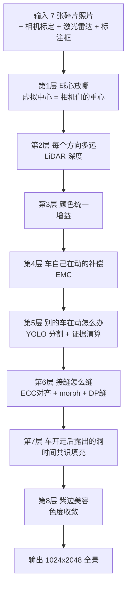

# Waymo2Panorama 算法傻瓜式教程

> 写给完全零基础的人：没学过计算机视觉也能看懂。我们会把每个术语第一次出现时都用生活里的比喻讲一遍，慢慢来，不着急。
>
> 事实来源：`agent/2026-06-11-project-summary-for-koi.md`(技术总结)和 `scripts/phase3/db89_ghost_recovery.py`(算法源码)。本教程里出现的函数名都真实存在于那份源码里。

---

## 第 0 章：这个项目在做什么

> **这章解决的疑问**：我们到底想要什么东西？做出来长什么样？有什么用？

想象一辆自动驾驶汽车，头顶装了一圈相机——一共 **7 台**，每台朝一个方向：正前方、左前、右前、左侧、右侧、左后、右后。它们就像一个人头上长了 7 只眼睛，每只盯着一个角度。

每台相机各拍各的，于是我们得到 7 张"碎片照片"。每张只看到世界的一小块。

我们要做的事，一句话：

> **把这 7 张碎片照片，缝成一张完整的 360° 环视大图。**

这就像你手里有 7 块瓷砖，每块画着环形壁画的一段，你要把它们拼成一整圈连续的壁画——站在中间转一圈，墙上的画是连贯的，看不出是 7 块拼的。

这张拼好的环形大图，专业叫法是 **全景图(panorama)**，更具体是 **ERP 全景**(ERP = Equirectangular Projection，等距柱状投影)。你可以把 ERP 想成"把地球仪摊平成世界地图"那种做法：球面上的东西，按经度纬度铺到一张矩形图上。我们的成品固定是 **1024 像素高 × 2048 像素宽** 的矩形。

成品长这样：


**这玩意儿有什么用？**

它要去喂给一个叫"世界模型"的 AI(项目里对接的是 Cosmos 风格的世界模型，负责人 Xinhan)。世界模型是一种能"想象未来会发生什么"的 AI——你给它看现在这一刻的样子，它能脑补出接下来几秒的画面。而我们这张 360° 全景图，就是喂给它的"第一帧"——相当于给它看的开场画面。开场画面越干净、越完整、越没有破绽，世界模型脑补得越靠谱。

所以我们的任务就是：**把开场画面做到尽量完美。**

---

## 第 1 章：为什么不能直接拼

> **这章解决的疑问**：7 张照片摆在一起不就行了吗？为什么还要写一大堆算法？

直觉上你会想：把 7 张照片边对边一摆，不就拼好了？现实里有三个朴素但致命的问题，我们一个个看。

### 问题 1：7 台相机不在同一个点上

7 台相机装在车顶不同位置，彼此相差几十厘米。这会带来一个叫 **视差(parallax)** 的麻烦。

什么是视差？做个小实验：伸出一根手指放在鼻子前，先只用左眼看，再只用右眼看。你会发现手指相对背景"跳"了一下。这就是视差——**同一个东西，从不同位置看，在画面里的位置不一样**。而且越近的东西跳得越厉害，越远的东西几乎不跳(看远处的山，换只眼睛它不动)。

```
        近处的灯柱                远处的大楼
            |                        ▓▓▓
   左相机看： 灯柱在大楼左边
   右相机看： 灯柱在大楼右边     ← 同一根灯柱，两台相机里位置不同！
```

后果：如果两台相机都拍到了同一根近处的灯柱，硬拼起来，灯柱会出现在两个不同的位置——要么变成两根(**重影**)，要么被接缝切断。

### 问题 2：7 台相机不是同一瞬间按的快门

你可能以为 7 台相机"咔嚓"是同时的。**不是。** 它们的快门时刻是错开的，最多相差约 **45 毫秒**(0.045 秒)。这叫 **异步快门(asynchronous shutter)**。

45 毫秒听起来短得可以忽略？对静止的世界确实可以。但路上有别的车在跑。一辆车以每秒 17.7 米的速度行驶(项目里 BMW 场景那辆车的真实速度),45 毫秒就跑了约 0.6 米。于是：

- 左前相机在第 0 毫秒拍到那辆车，它在 A 位置；
- 右前相机在第 35 毫秒才拍，那辆车已经跑到 B 位置。

两张照片拼起来，**同一辆车出现在两个地方 → 重影**。看下图，上半是没修好的旧版本，那辆 Porsche 明显是"两辆"叠在一起的：


上=有重影的旧版，下=修好的最终版。

### 问题 3：每台相机的曝光和白平衡不一样

每台相机自己决定"这张该多亮""偏暖还是偏冷"。于是 7 张照片亮的亮、暗的暗、有的偏黄有的偏蓝。拼起来就是一块一块的，像没调色的拼贴画——尤其黄昏场景，能拼出 7 块明显色差。

---

**小结**：三个问题分别来自**空间**(相机位置不同→视差)、**时间**(快门不同步→运动重影)、**颜色**(曝光不同→色块)。整套算法就是为了系统地干掉这三类问题。

---

## 第 2 章：把大问题拆成 8 个小问题

> **这章解决的疑问**：这么多麻烦，从哪下手？

工程师的通用智慧是：**别想一口吃成胖子，把大问题拆成一串小问题，每个小问题单独打。** 我们把"拼全景"这件事拆成 **8 层**,像流水线一样，照片从一头进去，8 个工位依次加工，全景从另一头出来。



下面用大白话把 8 层各讲两三句，让你先有个全貌(第 3 章再逐层深挖)。这 8 层对应技术总结里的"八层确定性栈"。

| 层 | 它解决什么 | 一句话比喻 |
|---|---|---|
| **1. 球心放哪** | 全景是画在一个虚拟球面上的，球心选错会放大一切误差 | 全班合影，站在**班级正中心**拍变形最小；站墙角拍人就歪 |
| **2. 每个方向多远** | 要把照片"贴"到球面上，得知道每个方向的东西有多远 | 贴墙纸前，先用**激光尺**量好墙离你多远 |
| **3. 颜色统一** | 7 台相机色调不一 | 把 7 台相机的"滤镜"统一调成一个 |
| **4. 车自己在动的补偿** | 我们自己的车也在跑，快门错开时连"自己"都位移了 | 跑步时拍照，每张都把"自己跑过的距离"扣回去 |
| **5. 别的车在动怎么办** | 路上别的车跨相机会重影 | 把运动的车整个"剪下来"，只从**一台相机、一个瞬间**整体贴上去 |
| **6. 接缝怎么缝** | 两张照片对接处有 1~9 像素错位 | 拼图块先**磨边对齐**,再在花纹一致的地方**下剪刀** |
| **7. 车开走后露出的洞** | 运动的车挪走后，它原来挡住的背景是空的 | 翻**前后几秒的录像**，找"车不在时"的那块背景补上 |
| **8. 紫边美容** | 高反差边缘有紫色镶边(源相机自带的) | 只给紫边像素**做个淡化**,别的不动 |

注意第 1、3、4 层是**整体打底**(球心、颜色、自运动补偿，决定整张图的基底),第 5~8 层是**局部修补**(运动车、接缝、空洞、紫边)。

---

## 第 3 章：逐层深入

> **这章解决的疑问**：每一层的物理直觉是什么？算法到底怎么做的？代码在哪？
>
> 每一小节固定四块：**为什么有这问题(物理)→ 我们怎么解(人话)→ 代码在哪(真实函数名)→ 这层修好了什么(历史 DB 编号)**。DB 是 "decision brief / debug" 的编号，是项目里一次次实验的流水号，你不用记，看到就知道"这是第几次实验定下来的"。

### 第 1 层：球心放哪(虚拟中心)

**为什么有这问题。** 全景图本质是"把世界画到一个球的内壁上，再摊平"。那么这个球的**球心**放在哪？这是个必须回答的问题。早期版本(从最初的 L1 baseline 起)把球心**钉死在汽车的原点**(ego 原点，大致是后轴中心)。所有人都默认这是对的，**几十次渲染没人质疑过**。

这是个隐藏的大坑。回到合影比喻：全班合影，摄影师站班级正中心，每个人变形最小；如果摄影师站在教室墙角，离他近的同学被拉得很大、远的很小。球心选错，就等于摄影师站错了位置，它会**把第 2 层深度的每一点误差放大 5 到 20 倍**。

**我们怎么解。** 第一性原理重新审计(项目里叫 Fable 5 重构)发现：7 台相机其实挤在车顶一小块区域。它们距汽车原点有 1.8~2.2 米，但距**这 7 台相机自己的几何重心**只有 0.27~0.30 米！

> 把球心从"汽车原点"挪到"7 台相机的重心"——就这一个改动。

为什么这么神？因为深度误差的放大倍数正比于一个叫 **b_perp(垂直基线)** 的量——粗略说就是"相机偏离视线方向的横向距离"。球心放到相机重心后，相机们到球心的距离极小，b_perp 缩到 0.01~0.06 米。实测 5 个场景，深度误差直接缩小 **18 到 96 倍**(BMW 场景从 84 像素缩到 4.7 像素)。

**代码在哪。** `run_case()` 函数里这两行就是它：
```python
cents = np.stack([... T_ego_cam ...])   # 取出 7 台相机各自的位置
C = cents.mean(axis=0)                   # C 就是球心 = 7 台相机位置的平均(重心)
```
之后整份代码里那个大写的 `C`,就是这个虚拟球心，处处都用它。

**修好了什么。** 对应 **DB-80**。这是整个重构的转折点——之前所有"深度解决不了接缝"的悲观结论，被重新定性为"那是球心选错时的性质，不是深度本身的性质"。

### 第 2 层：每个方向多远(深度)

**为什么有这问题。** 要把一张平面照片"贴"到球面上正确的位置，光知道方向不够，还得知道**那个方向上的东西离球心多远**(这个距离叫 **深度 / depth**)。深度错了，贴上去的位置就偏，近处尤其明显(又是视差)。

**我们怎么解。** 车上有 **激光雷达(LiDAR)**——一种发射激光、靠回波测距的设备，能直接量出周围每个点有多远，像一把扫描整个空间的激光尺。我们把前后若干帧的激光点**累积**起来(单帧点太稀疏),铺到球面的每个方向上，缺的地方用"最近邻"补满。

但这里有个微妙的坑：最近邻是**单样本估计器**——它对每个像素只看最近的那**一个**激光点。在细长结构上(电线杆、玻璃幕墙的竖条),最近的点会在"前景"和"背景"之间**逐像素来回跳**,跳一次就错一截，肉眼看就是一层**沙砾噪点(grain)**。修法是给深度图做一次**中值模糊**:用邻域里的中位数代替单点，保住真实边缘又压住抖动。这条经验后来升华成贯穿全项目的铁律——**绝不让渲染穿过单样本估计器，永远用邻域/时间中值**。

还有更狠的地方：**玻璃幕墙**。激光打到玻璃，要么穿过去、要么镜面反射，量出来的深度是**整片垃圾**。所以我们加了一道 **深度证据门控**(第 8 条规则):只有当深度"可信"(附近有激光支撑、且和大尺度中值一致)时，才逐像素精细贴；不可信的地方退回到"大尺度鲁棒深度"(类似最早 L1 的局部平面),宁可位置差几像素，也要**连贯**——专业话叫 "coherence over absolute position"(连贯压倒绝对位置)。

**代码在哪。** 全在 `depth_field()` 函数里：
- `distance_transform_edt(...)` 做最近邻补全；
- `cv2.medianBlur(Zf, 5)` 就是治 grain 的中值模糊；
- `plane_t` 那段是地面平面填充；
- 最后 `conf = (dist_px <= 4) & (...)` 和 `Zf = np.where(conf, Zf, Zsmooth)` 就是深度证据门控。

没有 LiDAR 时怎么办？`run_case()` 里有 `if len(lidar) < 1000:` 分支：增益设为不变、深度退化成"地面平面 + 远处壳层"。这就是**优雅降级**(后面第 4 章会专门讲)。

**修好了什么。** 对应 **DB-80 / DB-91**。

### 第 3 层：颜色统一(增益)

**为什么有这问题。** 第 1 章问题 3：7 台相机曝光/白平衡各管各的，拼起来一块亮一块暗一块偏色。

**我们怎么解。** 关键洞察：**激光雷达的同一个 3D 点，常常被两台相邻相机同时拍到。** 那么这个点在相机 A 里的颜色，和在相机 B 里的颜色，理论上应该一样——不一样的部分，就是两台相机"滤镜"的差异。

我们对每个被 ≥2 台相机共看的激光点，取出它在各相机里的 RGB，列成一堆"A 比 B 亮多少"的方程，在对数域用最小二乘解出**每台相机的增益**(一个让它和邻居对齐的亮度/颜色校正系数),渲染时施加上去。因为相机围成一圈，方程组是"环闭合"的(ring-closed),解出来全局一致。实测跨相机色差削减 **58~88%**,黄昏 highway 场景从 7 块拼贴变成色调统一。

**代码在哪。** `solve_gains_for()` 函数。里面 `li = np.log(...)`、`lj = np.log(...)`、`np.linalg.solve(A, b)` 就是对数域最小二乘解增益；渲染时各处的 `np.exp(gains[ci])` 就是把增益乘回去。

**修好了什么。** 对应 **DB-81**。顺带一提：DB-81 还诚实地否定了一个假设——团队本以为紫边是镜头的"横向色差(CA)",但实测 AV2 图像**根本没有可测的横向色差**,紫色是源相机 ISP 本身的阴影色噪。这种"诚实承认不是我们的 bug"也是项目风格。

### 第 4 层：车自己在动的补偿(EMC)

**为什么有这问题。** 第 1 章问题 2 讲了异步快门让**别的车**重影。但这里有个更隐蔽的版本：快门错开时，**我们自己的车也在跑**,连"自己"都位移了。

这个 bug 藏了几十次渲染都没被发现，直到一次关键观察:用户在一辆**静止**的 X3 车上也标出了重影。如果只是"别的车在动",静止的车不该重影啊!这就证伪了"纯物体运动"假说,把矛头指向"**我们自己**在动"。算一下:车速 7.66~9.22 m/s,±22.5ms 的快门错开,每台相机真实的光心相比它"标定时假设的位置"最多差 **22.7 厘米**——和相机之间的间距是同一量级,当然会重影。

更讽刺的是：管线**从一开始就对激光雷达做了逐点的时间补偿**,却**从来没对相机曝光时刻做补偿**。一个隐藏了几十次的不对称。

**我们怎么解。** 这叫 **EMC(Ego-Motion shutter Compensation,自运动快门补偿)**。修复只有概念上的一行：

> 不再假设每台相机都在"标定时刻"的位置，而是把车的位姿**插值到每台相机真正曝光的那一刻**,算出它真实的光心位置再渲染。

公式形态是 `T_cam(t_i) = T_ego(t_i) · T_ego_cam`——把"车在 t_i 时刻的位姿"乘上"相机相对车的固定安装"。

**代码在哪。** `run_case()` 里构造 `poses_emc` 的循环：
```python
for cam in ring_cams:
    Ri, ti_ = cte(cam_ts[cam])    # cte = 把车的位姿插值到这台相机的曝光时戳
    poses_emc.append((... Ri ..., ... ti_ ...))
```
`cte` 是位姿插值函数(在 `load_all()` 里定义),`cam_ts[cam]` 是这台相机的实际拍摄时戳。

**修好了什么。** 对应 **DB-86**——是 DB-80 之后单笔最大的近场修复。静止 X3 的尾部重影消失,行驶 Porsche 的头尾重影基本消失。从此 EMC 成为标准打底组件。

### 第 5 层：别的车在动怎么办(YOLO 分割 + 证据演算)

**为什么有这问题。** 即使做了 EMC(补偿了我们自己的运动),路上**别的运动车**仍然会在不同相机的不同时刻被拍到不同位置——这是物体自己的运动,EMC 管不着。一辆横穿两台相机视野的车,左半边来自相机 A(某时刻)、右半边来自相机 B(另一时刻),硬拼就在视野边界处被"撕开"一道(撕开的宽度 = 车速 × 时差)。

**我们怎么解(这是全项目最精巧的一层)。** 核心思想：

> **把每辆运动车整个"剪下来",只从一台相机、一个瞬间,整体贴上去。**

怎么"剪"？用 **YOLO 分割**(YOLOv8x-seg)——一个 AI 模型，能在照片里把每辆车、每个人**逐像素**圈出轮廓(叫 **mask / 掩膜**,像给车描了个精确的边)。注意：YOLO 在这里**只负责认领归属(ownership),绝不生成任何新内容**。

然后是一套精心设计的规则,叫 **证据演算(evidence calculus)**,决定每辆车该信哪台相机、贴在哪。这套规则后面第 3 章末尾会用"法庭"比喻专门讲透。这里先说几个关键决策:

1. **选哪台相机当"车主"(c_own)?** 不是选最正对车的那台,而是选 **EMC-Voronoi 占优** 的那台——即在车这个方向上 b_perp 最小的相机。为什么?这样车身和它周围的背景残留**共享同一个拍摄时刻**,衔接最自然。
2. **完整性优先(completeness-first)。** 优先选"这台相机看到了整辆车"(mask 没被图像边缘截断)的相机——因为一旦要把车拆给两台相机,就必然在视野边界撕开。
3. **没有任何一台相机看全整辆车怎么办?** 用 **OMC(Object-Motion shutter Compensation,物体侧快门补偿)**——EMC 是补偿我们自己的运动,OMC 是补偿物体自己的运动,对称的一招。具体做法:从两台相机重叠带里**同一个物理部位的两份 mask** 测出物体的位移,把次相机的贡献平移到主相机的时刻,再拼。

**代码在哪。**
- YOLO 分割：`run_case()` 里 `model = YOLO("yolov8x-seg.pt")` 那段,产出 `seg_masks`(整张图的运动物掩膜)和 `seg_insts`(每个实例的框+掩膜)。
- 身份匹配：`track_pose_at()`(算物体在某时刻的位姿)、`box_img_bbox()`(把标注框投影到相机)、`iou()`(算框的重叠度)。
- 三趟分配:pass 1 收集候选、pass 2 一对一贪心匹配 + 标出歧义(`ambiguous`/`poison_masks`)、pass 3 选 c_own(那段 `complete = ...` 和 `neg_bperp` 就是"完整性优先 + Voronoi 占优")。
- `close_region()` 用拓扑闭合(`binary_fill_holes`)把 mask 漏掉的暗结构(如 A 柱)补回车体内部。
- OMC：那个 `du_best, dv_best` 的双重 `for` 循环,在重叠带里滑动对齐两份 mask。

**修好了什么。** 对应 **DB-88 / DB-89**。DB-88 是 7 次尝试中第一次把行驶车渲染成"单一且完整"。DB-89 则发现了一个**数据集级**的大坑:**AV2 的标注框滞后图像约 4 米 / 0.2 秒**!这解释了之前一连串失败——所有靠"标注框"定位的工具都在用一个滞后 4 米的框。修正后架构收敛成那套证据演算:**框只做身份匹配,几何全靠图像 mask**。

### 第 6 层：接缝怎么缝(ECC 对齐 + view-morph + DP 缝)

**为什么有这问题。** 上一层把运动车拼好了,但当一辆车不得不由两台相机各贴半边时,对接处(butt-joint)还是有 **1~9 像素的错位**。错位虽小,但人眼对"连续的长线在接缝处突然错台 1~2 像素"极其敏感——会读成"两辆车"。用户在 16 倍放大下抓到:屋顶线、门槛线、肩线都在接缝处阶梯状错开。

**我们怎么解。** 关键分工——**选择(selection)回答 WHO/WHERE,插值(morph)回答 HOW**:
- 上一层的证据演算已经决定了"哪块归谁"(WHO/WHERE);
- 这一层负责"怎么平滑过渡"(HOW):先用 **ECC 仿射配准**测出两半的精确错位(测出过高达 9 像素的仿射错配)并去掉错切,再用 **Beier-Neely view-morph**(一种几何变形插值)在重叠带上做 alpha 渐变过渡。

还有第 7 条规则的微妙之处:**混合只在"视角一致"处合法**。玻璃幕墙的反射是**视角相关**的——反射像的视差由反射源(20 米外的店面)的深度决定,而不是车身(13 米)的深度,根本配不准,任何混合都会重影。所以反射处不混合,而是用 **最小差异 DP 缝**(动态规划找一条"两边最像"的缝合线)做**赢家通吃**——在缝两边各取一边的原内容,不平均。

**代码在哪。** "STAGE 3.5: VIEW-MORPH" 那一大段(`morph_jobs` 循环):
- `findTransformECC(..., MOTION_AFFINE, ...)` 是 ECC 仿射配准;
- `_cv.remap(...)` 配 `alpha_col` 渐变是 Beier-Neely morph;
- 后面那段 `D`/`back`/`s_col` 的动态规划是 **DP 内容缝**(沿"两视图最一致"的路径走缝)。

**修好了什么。** 对应 **DB-90**。它的根本洞察:mask 级的 OMC 对 5~15 像素的位移是"盲"的(粗糙轮廓位移一点 IoU 几乎不变),所以必须上 ECC 这种亚像素级的图像配准。

### 第 7 层：车开走后露出的洞(时间共识填充)

**为什么有这问题。** 运动的车被我们"挪"到正确位置后,它在别的相机里**原本所在的地方**就空了一块——而且那块背景在当前这一刻**任何相机都没拍到**(真正的互相遮挡,叫 disocclusion)。这是个真实的"洞"。

**我们怎么解。** 既然空间上没人看到,就**到时间里找**:

> 翻前后几秒的录像,找"那辆车还没开到这里 / 已经开走了"的帧,那时这块背景是露出来的,把它借过来填。

但单帧借过来有风险:数据集标注滞后(~0.2 秒)可能让单帧里**漏掉一个还没走的运动物**,把别的车也借进来(用户就抓到过 Porsche 车顶上方冒出一块绿色)。所以用 **3 源时间共识**:挑 3 个最好的、互相独立的(帧, 相机)源,逐通道取**中位数**。3 个里混进 1 个异常,中位数投票就把它否决了——又是"中值压抑异常"的铁律。

填完还有两道保险:
- **邻域一致性 abstain(弃权)**:如果填进来的色块和它四周的环境差太多(比如玻璃反射这种视角相关内容),说明这块填得不可信→**退回原状,宁可不填也不乱填**。这呼应了项目的灵魂原则——**abstain(无证据则退让)**:不知道就说不知道,绝不编造。
- **谐和光度偏移(harmonic-lite Poisson)**:借来的背景几何对、但光照可能不对(尤其车的投射阴影不在任何证据里),所以让每个填充像素继承它**最近的环境像素**的光度偏移并平滑过去——车底继承阴影的暗、外圈保持阳光的亮。

**代码在哪。** "GHOST-ZONE TEMPORAL RECOVERY" 那一大段:
- `ghost_zone` 标出要填的洞;
- `seg_blocked2()` 检查某条视线在某帧是否被(滞后的)框挡住——三重门控之一;
- `chosen` / `colbuf` / `np.nanmedian(colbuf, axis=0)` 就是 3 源逐通道中值;
- "NEIGHBOURHOOD-CONSISTENCY ABSTAIN" 注释下那段是邻域弃权;
- 后面 `offs`/`field`/`GaussianBlur` 那段是谐和光度偏移(对应收尾的 v2.2)。

**修好了什么。** 对应 **DB-91 + v2.2**。注意:时间填充是**最后手段**(规则 6),只在"所有相机都被污染"的真空洞处才动用,BMW 场景全图只填了 259 个像素,别的场景填 0 个(完全不动)。

### 第 8 层：紫边美容(色度收敛)

**为什么有这问题。** 源相机在高反差边缘自带**紫色镶边(purple fringe)**。这不是我们的 bug(native 原图里就有),但留着不好看。

**我们怎么解。** 一台精准的"外科手术":在 YCrCb 颜色空间里,**只挑出洋红带的像素**(Cr>136 且 Cb>136),把它们的色度往中性拉,**亮度完全不动**。全图只有约 **0.5% 的像素**被改,真正紫色的店招(比如那个 locustprojects 招牌)完整保留。

**代码在哪。** "CHROMA-FRINGE SUPPRESSION" 那段:`cvtColor(..., COLOR_RGB2YCrCb)`,然后 `(_ycc[:,:,1] > 136) & (_ycc[:,:,2] > 136)` 挑洋红带,把 Cr/Cb 朝 128(中性)拉。

**修好了什么。** 对应 **v2.1**(tag `best-pano-v2.1-defringe`)。

---

### 三个明星概念,讲透

前面提了三个反复出现的关键概念,这里用比喻和示意图各讲透一遍。

#### 明星概念一：异步快门(为什么会重影)

7 台相机的快门**不是同时按下**的,而是错开的。实测的时间表(以正前方相机为 0):

```
时间轴(毫秒)  -12.5  -7.5   0   +7.5  +12.5  +22.5
                |     |     |     |     |     |
front_left ─────●     |     |     |     |     |   (-12.5ms)
rear_* ───────────────●─────|─────●     |     |   (∓7.5ms)
front_center ───────────────●     |     |     |   ( 0ms,基准)
front_right ──────────────────────|─────●     |   (+12.5ms)
side_right ──────────●(约 -22.4ms,见下)        |
side_left ──────────────────────────────────●     (+22.5ms)

  最大跨度 ≈ 45ms(side_left 的 +22.5 到 side_right 的 -22.4)
```

一辆 17.7 m/s 的车,在 35ms 的跨相机时差里跑了:

```
  位移 = 车速 × 时差 = 17.7 m/s × 0.035 s ≈ 0.62 米
  换算到全景图上 ≈ 16 像素 ← 这正是观测到的重影量!
```

**记住这条因果链:车速 × 快门时差 = 位移 = 重影。** 这就是为什么 BMW 那辆车会糊成两辆——不是深度问题,不是遮挡问题,纯粹是"每台相机拍它的时刻不同"。

#### 明星概念二：证据演算八规则(用"法庭"比喻)

第 5 层那套规则,可以完全用**法庭审案**来理解。法官(算法)要判定"全景图每个像素该信谁",手里有几种证据:

- **标注框(box)= 身份证**:能证明"这是哪辆车"(身份),但它**位置不准**(滞后 4 米),不能拿来定位。所以 **规则1:框只做身份匹配,定位全靠 mask**。
- **YOLO mask = 现场照片**:逐像素圈出车的真实轮廓,这是定位的硬证据。
  - **规则2:有 mask 的地方(正证据)处处可信;但"没有 mask = 这里是背景"(负证据)在图像边缘 1% 以内不可信**——因为车开到画面边缘时 mask 是破碎的,把车自己的边缘误读成背景,会把杆子之类的东西填进车里。
- **规则3:一份证据被两辆车同时认领(歧义证据)→ 可以否决(poison),但不能断言。** 就像两个人都说"这是我的车",法官可以判"这块存疑、谁都别用",但不能武断地判给其中一个(否则会把邻车的像素拖到这辆车上)。
- **规则4:一个车体 / 一台相机 / 一个时刻**,完整性优先;没相机看全时才用 OMC。
- **规则5:只有测得位移 > 2 像素时才认定"有重影"。** 位移≈0 时去"修"它反而会破坏接触阴影。
- **规则6:时间填充是最后手段**,只在所有视图都被污染时动用,且要过三重门控。
- **规则7:混合只在视角一致处合法**(玻璃反射用 DP 缝赢家通吃,不混合)。
- **规则8:深度证据门控**——逐像素精细贴只在深度可信处合法,否则退回大尺度鲁棒深度。

一句话总括所有规则的精神:**强证据(正向 mask)优先,弱证据(负向、歧义)谨慎,无证据则退让。**

#### 明星概念三：abstain 原则(不知道就说不知道)

这是整个项目的**灵魂**,值得单独点出。

> **abstain(弃权 / 退让):当算法没有足够证据判定某个区域时,它不会硬编一个答案,而是退回到保守、安全的渲染(EMC 打底),绝不发明几何、绝不无中生有。**

比喻:一个诚实的修复师,补一幅破损的古画,残缺的地方如果他不确定原本画的是什么,**宁可留白或按周围色调淡淡带过,也绝不凭空画一只原作里没有的鸟。** 编造看起来可能更"完整",但那是假的,下游(世界模型)会被误导。

这条原则在代码里到处都是:深度不可信→退回大尺度深度(规则8);填充和环境冲突→退回原像素(邻域 abstain);没匹配上的物体→退回 EMC 打底。技术总结把整套算法定性为:**source-faithful(源忠实)+ evidence-gated(证据门控)+ abstain(无证据则退让)** 的诚实管线。

---

## 第 4 章：它有多 general

> **这章解决的疑问**：你们是不是只对一张图(BMW)反复调参,调好看了就完事?

这是最重要的一章,因为它关系到这套算法**到底有没有价值**。

**先说"零场景参数"是什么意思。** 整套算法**没有任何一个数字是为某个特定场景手调的**。球心是标定算出来的、颜色增益是激光雷达对应算出来的、深度是累积算出来的、运动车的位移是从图像 mask 测出来的。换句话说:**同一份 `db89_ghost_recovery.py` 代码,不改一个数,直接换场景就能跑。**

**5 个完全不同的场景,同一份代码:**


这 5 个场景是:bmw(最难,有高速车)、clean(干净街道)、highway(黄昏高速)、downtown(市中心)、crowd(人群)。它们的物体数量、光照、拥挤程度天差地别,但**没有崩溃、没有出现新的瑕疵类别**,没匹配上的物体都**优雅降级**到 EMC 打底(比如 crowd 场景的 48 个小行人)。这是项目的第一条"北极星"大关——**5 场景零参数泛化**。

**第二条北极星大关:连激光雷达都没有,也能跑。**


我们把激光雷达数据**整个清空**,算法靠内置的兜底(增益设为不变、深度退化成地面平面+远处壳层、时间填充自动解除武装)继续跑。结果:全景仍然连贯,运动的 Porsche 仍然是**一辆完整的车**,OMC 测出的位移和有激光雷达时**完全一样**(du=+6)——因为运动物的处理**只依赖图像和标注,本来就和激光雷达无关**。降级只表现为墙面视差略软、曝光台阶略强,**没有断崖式崩溃**。这叫 **优雅降级(graceful degradation)**。

**"BMW 只是考题,不是答案。"** 这是用户反复强调的检查点。BMW(那个含高速行驶车的场景)是**最难的验证用例**,我们拿它来逼出算法的弱点;但目标**从来不是**"把 BMW 这一张修好看",而是"造一个对**所有**场景都成立的通用方法"。每一步改动都按"是否对所有场景成立"来判定。验收标准是**多场景 A/B 回归**,而不是"对一张图磨像素"。

---

## 第 5 章：还没做完的(诚实)

> **这章解决的疑问**：这套算法是不是已经完美了?

没有。诚实地讲,还有三件事待办:

- **接触阴影(contact shadow)**:运动车被挪走、空洞被时间填充后,填进来的背景是"没有那辆车的阴影"的。车底本该有的投射阴影,不在任何证据通道里,所以现在的填充带缺这道阴影。谐和光度偏移缓解了一部分,但按设计**没有完整建模**——留给下游的生成层去补。这是目前唯一剩下的、肉眼可见的瑕疵类别。

- **天空补全(sky outpaint)**:全景图的上半球(地平线以上)现在还是黑的。已经验证过一个生成式方案(DiT360 只补天空,屋顶线字节级保留、不发明物体),但它需要 A100 这种大显卡,还在排队等批准。

- **Waymo 迁移**:这是真正的泛化大关(项目内部叫 "the big one")。整套算法目前在 AV2(Argoverse 2)数据集上跑通。能不能**只靠数据加载层的小改动**(相机数量、布局、快门时序、标注格式)就迁移到 Waymo 数据集(5 台相机、不同的快门错开)?如果能,才算真正通用。任何需要改**算法**(而非加载器)的修复,都必须是"基于证据、与场景无关"的,否则就老实记为"该数据集特有的限制"。

---

## 附录：快速上手

**算法文件位置**
```
scripts/phase3/db89_ghost_recovery.py     ← 全栈单文件,零场景参数,就是它
```

**跑一次的入口**

文件最底部的 `run_remote()` 函数是入口。它做的事:把算法代码打包,提交到远程 Colab(带 GPU,因为要跑 YOLO),轮询等结果,再把生成的全景图取回本地。直接运行:
```bash
python scripts/phase3/db89_ghost_recovery.py
```
内部会调用 `run_remote()`,逐个跑 `CASE_NAMES` 里的 5 个场景,产出存到 `deliverables/db89_ghost_recovery/`:
- `*_segcomposite.png` ×5 —— 最终全景成品(每个场景一张)
- `*_emc.png` —— EMC 打底图(用于 A/B 对比)
- `*_db89_board.jpg` —— 上下对比 board

**代码主结构速查(都是真实函数名)**
| 函数 | 干什么 |
|---|---|
| `erp_dirs()` → `DIRS` | 算出全景每个像素对应的 3D 方向 |
| `load_all()` | 加载 7 相机图像 + 标定 + 车辆位姿 + 激光雷达 |
| `accumulate_lidar()` | 累积多帧激光点(并用 `remove_dyn()` 去掉动态物) |
| `solve_gains_for()` | 第3层:解每台相机的颜色增益 |
| `depth_field()` | 第2层:造深度图(含 medianBlur 去 grain、深度门控) |
| `track_pose_at()` / `box_img_bbox()` / `iou()` | 第5层:运动物身份匹配 |
| `close_region()` | 拓扑闭合,补回 mask 漏掉的车内暗结构 |
| `sample_cam_patch()` | 从某相机渲染一小块 ERP,供 OMC/morph 用 |
| `run_case()` | 主流程,把 8 层串起来跑一个场景 |
| `run_remote()` | 入口:提交远程、取回结果 |

**12 个 git tag 是什么**

每个 tag 是一个里程碑快照,按时间记录算法长成今天的样子:
- 早期 6 个:`v0.1-l1-mvp`(最初拼接)· `v0.2-d1-resolved` · `v0.2-l3-mvp` · `v0.2-w2p004-validated` · `v0.3-acq-mcp-shipped` · `v0.4-acq-mcp-v012-robust`
- Fable 5 重构期 6 个:`db90-v3-porsche-solved`(Porsche 接缝解决)· `db91-grain-consensus-fixed`(grain + 时间共识)· `db92-generality-pass`(泛化通关)· `best-pano-v2-5scenes`(5 场景全集)· `best-pano-v2.1-defringe`(去紫边)· `v2.2-harmonic-fill`(谐和填充,最终版)

---

*本教程所有数字与函数名均来自 `agent/2026-06-11-project-summary-for-koi.md` 和 `scripts/phase3/db89_ghost_recovery.py`,未发明。读完这份,你应该能对着源码看懂每一层在干什么了。*
